# System Design: Real-Time Analytics Systems

Real-time analytics systems process and analyze data streams as they arrive, providing immediate insights and enabling instant decision-making. These systems are critical for applications that require immediate responses to events, such as fraud detection, real-time personalization, live dashboard monitoring, and automated alerting. Building scalable real-time analytics systems requires specialized architectures that can handle high-velocity data streams while maintaining low latency and high throughput.

## Understanding Real-Time Analytics

Real-time analytics processes data streams continuously, updating analytical results as new data arrives. Unlike batch processing systems that operate on large collections of data at scheduled intervals, real-time systems process data incrementally, enabling immediate insights and actions.

```mermaid
graph TD
    A[Real-Time Analytics System] --> B[Data Ingestion]
    A --> C[Stream Processing]
    A --> D[Real-Time Aggregation]
    A --> E[Analytics Store]
    A --> F[Dashboard & Visualization]
    A --> G[Alerting System]
    
    B --> B1[Event Streams]
    B --> B2[Message Queues]
    B --> B3[API Endpoints]
    
    C --> C1[Windowing]
    C --> C2[Transformations]
    C --> C3[Complex Event Processing]
    
    D --> D1[Sliding Windows]
    D --> D2[Counters]
    D --> D3[Metrics Calculation]
    
    E --> E1[Time-Series DB]
    E --> E2[In-Memory Store]
    E --> E3[Analytics Cube]
    
    F --> F1[Live Dashboards]
    F --> F2[Real-Time Reports]
    F --> F3[Ad-hoc Queries]
    
    G --> G1[Threshold Alerts]
    G --> G2[Pattern Detection]
    G --> G3[Anomaly Detection]
    
    style A fill:#e1f5fe
    style B fill:#e8f5e8
    style C fill:#fff3e0
    style D fill:#f3e5f5
    style E fill:#ffebee
    style F fill:#e0f2f1
    style G fill:#fce4ec
```



### Real-Time vs Batch Analytics

| Aspect | Real-Time Analytics | Batch Analytics |
|--------|-------------------|-----------------|
| Data Processing | Continuous, event-by-event | Periodic, bulk processing |
| Latency | Milliseconds to seconds | Minutes to hours |
| Throughput | High events per second | High volume per batch |
| Use Cases | Fraud detection, live monitoring | Reporting, historical analysis |
| Infrastructure | Streaming platforms | Data lakes, warehouses |
| Cost | Higher operational cost | Lower operational cost |

## Streaming Data Architecture

Streaming data architectures are designed to handle continuous data flows with minimal latency. The architecture typically includes data ingestion, stream processing, and storage layers.

```go
// Streaming data architecture implementation
package main

import (
    "context"
    "fmt"
    "sync"
    "time"
)

// StreamingMessage represents a message in the stream
type StreamingMessage struct {
    ID        string      `json:"id"`
    Timestamp time.Time   `json:"timestamp"`
    Source    string      `json:"source"`
    EventType string      `json:"event_type"`
    Data      interface{} `json:"data"`
}

// StreamProcessor processes streaming messages
type StreamProcessor struct {
    outputStream chan StreamingMessage
    processors   []MessageProcessor
    wg           sync.WaitGroup
}

type MessageProcessor interface {
    Process(message StreamingMessage) StreamingMessage
}

func NewStreamProcessor() *StreamProcessor {
    return &StreamProcessor{
        outputStream: make(chan StreamingMessage, 1000),
        processors:   make([]MessageProcessor, 0),
    }
}

// AddProcessor adds a message processor to the stream
func (sp *StreamProcessor) AddProcessor(processor MessageProcessor) {
    sp.processors = append(sp.processors, processor)
}

// ProcessStream processes a message stream
func (sp *StreamProcessor) ProcessStream(ctx context.Context, inputStream <-chan StreamingMessage) <-chan StreamingMessage {
    go func() {
        defer close(sp.outputStream)
        
        for {
            select {
            case message := <-inputStream:
                processedMsg := message
                
                // Apply all processors in sequence
                for _, processor := range sp.processors {
                    processedMsg = processor.Process(processedMsg)
                }
                
                select {
                case sp.outputStream <- processedMsg:
                case <-ctx.Done():
                    return
                }
            case <-ctx.Done():
                return
            }
        }
    }()
    
    return sp.outputStream
}

// EventEnricher enriches events with additional context
type EventEnricher struct {
    geoService   *GeoService
    userCache    *UserCache
}

func NewEventEnricher() *EventEnricher {
    return &EventEnricher{
        geoService: NewGeoService(),
        userCache:  NewUserCache(),
    }
}

func (ee *EventEnricher) Process(message StreamingMessage) StreamingMessage {
    if message.EventType == "user_action" {
        // Enrich with user data
        if userData, exists := ee.userCache.Get(message.Source); exists {
            if dataMap, ok := message.Data.(map[string]interface{}); ok {
                dataMap["user_data"] = userData
                message.Data = dataMap
            }
        }
        
        // Enrich with location data
        if geoData := ee.geoService.GetLocation(message.Source); geoData != nil {
            if dataMap, ok := message.Data.(map[string]interface{}); ok {
                dataMap["location"] = geoData
                message.Data = dataMap
            }
        }
    }
    
    return message
}

// DataValidator validates incoming data
type DataValidator struct {
    requiredFields map[string][]string
}

func NewDataValidator() *DataValidator {
    return &DataValidator{
        requiredFields: map[string][]string{
            "user_action": {"user_id", "action_type", "timestamp"},
            "page_view":   {"user_id", "page_url", "timestamp"},
            "purchase":    {"user_id", "product_id", "amount", "timestamp"},
        },
    }
}

func (dv *DataValidator) Process(message StreamingMessage) StreamingMessage {
    required, exists := dv.requiredFields[message.EventType]
    if !exists {
        // No validation needed for this event type
        return message
    }
    
    if dataMap, ok := message.Data.(map[string]interface{}); ok {
        for _, field := range required {
            if _, exists := dataMap[field]; !exists {
                // Add validation metadata
                if dataMap["validation_errors"] == nil {
                    dataMap["validation_errors"] = []string{}
                }
                validationErrors := dataMap["validation_errors"].([]string)
                validationErrors = append(validationErrors, fmt.Sprintf("missing required field: %s", field))
                dataMap["validation_errors"] = validationErrors
            }
        }
    }
    
    return message
}

// StreamPartitioner distributes messages across partitions
type StreamPartitioner struct {
    numPartitions int
    partitionFunc func(StreamingMessage) int
}

func NewStreamPartitioner(numPartitions int) *StreamPartitioner {
    return &StreamPartitioner{
        numPartitions: numPartitions,
        partitionFunc: func(msg StreamingMessage) int {
            // Simple hash-based partitioning
            hash := 0
            for _, c := range msg.Source {
                hash = hash*31 + int(c)
            }
            return hash % numPartitions
        },
    }
}

func (sp *StreamPartitioner) Partition(message StreamingMessage) int {
    return sp.partitionFunc(message)
}

// Message queue implementation
type MessageQueue struct {
    partitions map[int]chan StreamingMessage
    partitioner *StreamPartitioner
    mutex       sync.RWMutex
}

func NewMessageQueue(numPartitions int) *MessageQueue {
    partitions := make(map[int]chan StreamingMessage)
    for i := 0; i < numPartitions; i++ {
        partitions[i] = make(chan StreamingMessage, 1000)
    }
    
    return &MessageQueue{
        partitions:  partitions,
        partitioner: NewStreamPartitioner(numPartitions),
    }
}

// Produce adds a message to the appropriate partition
func (mq *MessageQueue) Produce(message StreamingMessage) error {
    partition := mq.partitioner.Partition(message)
    
    select {
    case mq.partitions[partition] <- message:
        return nil
    default:
        return fmt.Errorf("partition %d queue is full", partition)
    }
}

// Consume returns a channel for messages from a specific partition
func (mq *MessageQueue) Consume(partitionID int) <-chan StreamingMessage {
    if ch, exists := mq.partitions[partitionID]; exists {
        return ch
    }
    return nil
}

// GeoService provides geolocation data
type GeoService struct {
    // In a real system, this would connect to a geolocation API
}

func NewGeoService() *GeoService {
    return &GeoService{}
}

func (gs *GeoService) GetLocation(ipAddress string) interface{} {
    // Simulate geolocation lookup
    return map[string]interface{}{
        "country": "US",
        "city":    "New York",
        "lat":     40.7128,
        "lon":     -74.0060,
    }
}

// UserCache stores user information
type UserCache struct {
    users map[string]interface{}
    mutex sync.RWMutex
}

func NewUserCache() *UserCache {
    return &UserCache{
        users: make(map[string]interface{}),
    }
}

func (uc *UserCache) Get(userID string) (interface{}, bool) {
    uc.mutex.RLock()
    defer uc.mutex.RUnlock()
    
    data, exists := uc.users[userID]
    return data, exists
}

func (uc *UserCache) Set(userID string, data interface{}) {
    uc.mutex.Lock()
    defer uc.mutex.Unlock()
    
    uc.users[userID] = data
}

// Example usage
func main() {
    // Create message queue
    queue := NewMessageQueue(4) // 4 partitions
    
    // Create stream processor with enricher and validator
    processor := NewStreamProcessor()
    processor.AddProcessor(NewDataValidator())
    processor.AddProcessor(NewEventEnricher())
    
    // Simulate incoming data
    go func() {
        for i := 0; i < 10; i++ {
            message := StreamingMessage{
                ID:        fmt.Sprintf("msg_%d", i),
                Timestamp: time.Now(),
                Source:    fmt.Sprintf("user_%d", i%3),
                EventType: "user_action",
                Data: map[string]interface{}{
                    "user_id":     fmt.Sprintf("user_%d", i%3),
                    "action_type": "click",
                    "page_url":    "/page",
                },
            }
            
            queue.Produce(message)
            time.Sleep(100 * time.Millisecond)
        }
    }()
    
    // Process messages from partition 0
    inputChan := queue.Consume(0)
    ctx, cancel := context.WithCancel(context.Background())
    defer cancel()
    
    outputStream := processor.ProcessStream(ctx, inputChan)
    
    // Read processed messages
    go func() {
        for msg := range outputStream {
            fmt.Printf("Processed message: %s - %v\n", msg.ID, msg.Data)
        }
    }()
    
    time.Sleep(2 * time.Second)
    fmt.Println("Streaming architecture example completed")
}
```

## Stream Processing Patterns

Stream processing involves various patterns for transforming, filtering, and analyzing data streams in real-time.

### 1. Windowing Operations

Windowing is a fundamental concept in stream processing that allows operations on finite subsets of infinite streams.

```go
// Windowing operations implementation
package main

import (
    "container/ring"
    "fmt"
    "sync"
    "time"
)

// WindowType defines the type of window
type WindowType string

const (
    TumblingWindow WindowType = "tumbling"
    SlidingWindow  WindowType = "sliding"
    SessionWindow  WindowType = "session"
)

// Window represents a time-based window for stream processing
type Window struct {
    Type        WindowType
    Size        time.Duration
    Slide       time.Duration // Used for sliding windows
    Data        []interface{}
    StartTime   time.Time
    EndTime     time.Time
    mutex       sync.RWMutex
}

// TumblingWindowProcessor processes tumbling windows (non-overlapping)
type TumblingWindowProcessor struct {
    windowSize time.Duration
    buffer     []StreamingMessage
    startTime  time.Time
    mutex      sync.RWMutex
}

func NewTumblingWindowProcessor(windowSize time.Duration) *TumblingWindowProcessor {
    return &TumblingWindowProcessor{
        windowSize: windowSize,
        buffer:     make([]StreamingMessage, 0),
        startTime:  time.Now(),
    }
}

func (twp *TumblingWindowProcessor) Process(message StreamingMessage) []StreamingMessage {
    twp.mutex.Lock()
    defer twp.mutex.Unlock()
    
    twp.buffer = append(twp.buffer, message)
    
    // Check if window is complete
    if time.Since(twp.startTime) >= twp.windowSize {
        // Process the current window
        results := twp.processWindow(twp.buffer)
        
        // Reset for next window
        twp.buffer = make([]StreamingMessage, 0)
        twp.startTime = time.Now()
        
        return results
    }
    
    // Return empty slice if window not complete
    return []StreamingMessage{}
}

func (twp *TumblingWindowProcessor) processWindow(messages []StreamingMessage) []StreamingMessage {
    // Calculate aggregate metrics for the window
    count := len(messages)
    
    // In a real system, you would perform more complex aggregations
    result := StreamingMessage{
        ID:        fmt.Sprintf("agg_%d", time.Now().Unix()),
        Timestamp: time.Now(),
        Source:    "tumbling_window_processor",
        EventType: "aggregation",
        Data: map[string]interface{}{
            "window_size": twp.windowSize,
            "message_count": count,
            "start_time":  twp.startTime,
            "end_time":    time.Now(),
        },
    }
    
    return []StreamingMessage{result}
}

// SlidingWindowProcessor processes sliding windows (overlapping)
type SlidingWindowProcessor struct {
    windowSize  time.Duration
    slideSize   time.Duration
    ring        *ring.Ring
    ringSize    int
    lastSlide   time.Time
    mutex       sync.RWMutex
}

func NewSlidingWindowProcessor(windowSize, slideSize time.Duration) *SlidingWindowProcessor {
    return &SlidingWindowProcessor{
        windowSize: windowSize,
        slideSize:  slideSize,
        lastSlide:  time.Now(),
    }
}

func (swp *SlidingWindowProcessor) Process(message StreamingMessage) []StreamingMessage {
    swp.mutex.Lock()
    defer swp.mutex.Unlock()
    
    // Add message to ring buffer
    if swp.ring == nil {
        swp.ring = ring.New(1000) // Fixed size ring buffer
    }
    swp.ring.Value = message
    swp.ring = swp.ring.Next()
    swp.ringSize++
    
    // Check if it's time to slide the window
    now := time.Now()
    if now.Sub(swp.lastSlide) >= swp.slideSize {
        // Process current window
        results := swp.processCurrentWindow()
        swp.lastSlide = now
        return results
    }
    
    return []StreamingMessage{}
}

func (swp *SlidingWindowProcessor) processCurrentWindow() []StreamingMessage {
    if swp.ring == nil || swp.ringSize == 0 {
        return []StreamingMessage{}
    }
    
    // Get messages in current window
    var windowMessages []StreamingMessage
    current := swp.ring.Prev() // Start from most recent
    
    for i := 0; i < min(swp.ringSize, 1000); i++ {
        if msg, ok := current.Value.(StreamingMessage); ok {
            // Check if message is within window time frame
            if time.Since(msg.Timestamp) <= swp.windowSize {
                windowMessages = append(windowMessages, msg)
            }
        }
        current = current.Prev()
    }
    
    // Calculate metrics
    count := len(windowMessages)
    result := StreamingMessage{
        ID:        fmt.Sprintf("slide_agg_%d", time.Now().Unix()),
        Timestamp: time.Now(),
        Source:    "sliding_window_processor",
        EventType: "sliding_aggregation",
        Data: map[string]interface{}{
            "window_size": swp.windowSize,
            "slide_size":  swp.slideSize,
            "message_count": count,
            "window_start": time.Now().Add(-swp.windowSize),
            "window_end":   time.Now(),
        },
    }
    
    return []StreamingMessage{result}
}

// SessionWindowProcessor processes session windows (based on activity gaps)
type SessionWindowProcessor struct {
    gapDuration time.Duration
    sessions    map[string]*Session
    mutex       sync.RWMutex
}

type Session struct {
    UserID       string
    Start        time.Time
    LastActivity time.Time
    Events       []StreamingMessage
    IsActive     bool
}

func NewSessionWindowProcessor(gapDuration time.Duration) *SessionWindowProcessor {
    return &SessionWindowProcessor{
        gapDuration: gapDuration,
        sessions:    make(map[string]*Session),
    }
}

func (swp *SessionWindowProcessor) Process(message StreamingMessage) []StreamingMessage {
    swp.mutex.Lock()
    defer swp.mutex.Unlock()
    
    userID := "unknown"
    if data, ok := message.Data.(map[string]interface{}); ok {
        if userVal, exists := data["user_id"]; exists {
            userID = fmt.Sprintf("%v", userVal)
        }
    }
    
    // Get or create session
    session, exists := swp.sessions[userID]
    if !exists {
        session = &Session{
            UserID:       userID,
            Start:        message.Timestamp,
            LastActivity: message.Timestamp,
            Events:       []StreamingMessage{message},
            IsActive:     true,
        }
        swp.sessions[userID] = session
        return []StreamingMessage{} // Don't return on session creation
    }
    
    // Check if we need to close the current session
    if message.Timestamp.Sub(session.LastActivity) > swp.gapDuration {
        // Close current session
        closedSession := *session
        session.Events = []StreamingMessage{message} // Start new session with this message
        session.Start = message.Timestamp
        session.LastActivity = message.Timestamp
        
        // Return the closed session
        result := StreamingMessage{
            ID:        fmt.Sprintf("session_%s_%d", userID, closedSession.Start.Unix()),
            Timestamp: time.Now(),
            Source:    "session_processor",
            EventType: "session_closed",
            Data: map[string]interface{}{
                "user_id":        userID,
                "session_start":  closedSession.Start,
                "session_end":    closedSession.LastActivity,
                "event_count":    len(closedSession.Events),
                "session_length": closedSession.LastActivity.Sub(closedSession.Start),
            },
        }
        
        return []StreamingMessage{result}
    } else {
        // Add to existing session
        session.Events = append(session.Events, message)
        session.LastActivity = message.Timestamp
        return []StreamingMessage{}
    }
}

// StreamingAggregator performs real-time aggregations
type StreamingAggregator struct {
    counters    map[string]int64
    sums        map[string]float64
    lastUpdated map[string]time.Time
    mutex       sync.RWMutex
}

func NewStreamingAggregator() *StreamingAggregator {
    return &StreamingAggregator{
        counters:    make(map[string]int64),
        sums:        make(map[string]float64),
        lastUpdated: make(map[string]time.Time),
    }
}

// ProcessIncremental processes incremental aggregation
func (sa *StreamingAggregator) ProcessIncremental(message StreamingMessage) {
    sa.mutex.Lock()
    defer sa.mutex.Unlock()
    
    sa.counters["total_events"]++
    sa.lastUpdated["total_events"] = time.Now()
    
    if message.EventType != "" {
        counterKey := fmt.Sprintf("event_type_%s", message.EventType)
        sa.counters[counterKey]++
        sa.lastUpdated[counterKey] = time.Now()
    }
    
    if data, ok := message.Data.(map[string]interface{}); ok {
        // Count user-specific events
        if userID, exists := data["user_id"]; exists {
            userKey := fmt.Sprintf("user_%v", userID)
            sa.counters[userKey]++
            sa.lastUpdated[userKey] = time.Now()
        }
        
        // Sum numeric values if present
        if amount, exists := data["amount"]; exists {
            if amountFloat, ok := amount.(float64); ok {
                sa.sums["total_revenue"] += amountFloat
                sa.lastUpdated["total_revenue"] = time.Now()
            }
        }
    }
}

// GetMetric retrieves a specific metric value
func (sa *StreamingAggregator) GetMetric(key string) (int64, bool) {
    sa.mutex.RLock()
    defer sa.mutex.RUnlock()
    
    if value, exists := sa.counters[key]; exists {
        return value, true
    }
    return 0, false
}

// GetSumMetric retrieves a specific sum metric
func (sa *StreamingAggregator) GetSumMetric(key string) (float64, bool) {
    sa.mutex.RLock()
    defer sa.mutex.RUnlock()
    
    if value, exists := sa.sums[key]; exists {
        return value, true
    }
    return 0, false
}

// GetAllMetrics returns all current metrics
func (sa *StreamingAggregator) GetAllMetrics() map[string]interface{} {
    sa.mutex.RLock()
    defer sa.mutex.RUnlock()
    
    metrics := make(map[string]interface{})
    for key, value := range sa.counters {
        metrics[key] = value
    }
    for key, value := range sa.sums {
        metrics[key] = value
    }
    return metrics
}

// Example usage
func main() {
    fmt.Println("Windowing Operations Example:")
    
    // Create window processors
    tumblingProc := NewTumblingWindowProcessor(5 * time.Second)
    slidingProc := NewSlidingWindowProcessor(10*time.Second, 2*time.Second)
    sessionProc := NewSessionWindowProcessor(30 * time.Second)
    aggregator := NewStreamingAggregator()
    
    // Simulate streaming data
    go func() {
        for i := 0; i < 20; i++ {
            message := StreamingMessage{
                ID:        fmt.Sprintf("msg_%d", i),
                Timestamp: time.Now(),
                Source:    fmt.Sprintf("source_%d", i%3),
                EventType: "user_event",
                Data: map[string]interface{}{
                    "user_id": fmt.Sprintf("user_%d", i%5),
                    "action":  fmt.Sprintf("action_%d", i%2),
                },
            }
            
            // Process with all window types
            tumblingResults := tumblingProc.Process(message)
            for _, result := range tumblingResults {
                fmt.Printf("Tumbling window result: %v\n", result.Data)
            }
            
            slidingResults := slidingProc.Process(message)
            for _, result := range slidingResults {
                fmt.Printf("Sliding window result: %v\n", result.Data)
            }
            
            sessionResults := sessionProc.Process(message)
            for _, result := range sessionResults {
                fmt.Printf("Session window result: %v\n", result.Data)
            }
            
            // Update aggregations
            aggregator.ProcessIncremental(message)
            
            time.Sleep(500 * time.Millisecond)
        }
    }()
    
    // Periodically check aggregations
    ticker := time.NewTicker(3 * time.Second)
    go func() {
        for range ticker.C {
            metrics := aggregator.GetAllMetrics()
            fmt.Printf("Current metrics: %+v\n", metrics)
        }
    }()
    
    time.Sleep(15 * time.Second)
    ticker.Stop()
    fmt.Println("Windowing operations example completed")
}

// Helper function for min
func min(a, b int) int {
    if a < b {
        return a
    }
    return b
}
```

### 2. Complex Event Processing

Complex Event Processing (CEP) detects patterns and sequences in event streams.

```go
// Complex Event Processing implementation
package main

import (
    "fmt"
    "sync"
    "time"
)

// EventPattern represents a pattern to detect in event streams
type EventPattern struct {
    ID          string
    Name        string
    Description string
    Conditions  []EventCondition
    Actions     []EventAction
    WindowSize  time.Duration
    Enabled     bool
}

// EventCondition defines a condition for pattern matching
type EventCondition struct {
    Field    string
    Operator string // "equals", "gt", "lt", "contains", etc.
    Value    interface{}
    EventType string // Optional: specific event type
}

// EventAction defines an action to take when pattern is detected
type EventAction struct {
    Type string // "alert", "log", "callback", "transform"
    Data map[string]interface{}
}

// PatternDetector detects complex patterns in event streams
type PatternDetector struct {
    patterns    map[string]*EventPattern
    eventBuffer map[string][]StreamingMessage // Buffer for each pattern
    mutex       sync.RWMutex
}

func NewPatternDetector() *PatternDetector {
    return &PatternDetector{
        patterns:    make(map[string]*EventPattern),
        eventBuffer: make(map[string][]StreamingMessage),
    }
}

// AddPattern adds a new event pattern to detect
func (pd *PatternDetector) AddPattern(pattern EventPattern) {
    pd.mutex.Lock()
    defer pd.mutex.Unlock()
    
    pd.patterns[pattern.ID] = &pattern
    pd.eventBuffer[pattern.ID] = make([]StreamingMessage, 0)
    
    fmt.Printf("Pattern added: %s - %s\n", pattern.ID, pattern.Name)
}

// ProcessEvent processes an event against all patterns
func (pd *PatternDetector) ProcessEvent(event StreamingMessage) []EventAction {
    pd.mutex.Lock()
    defer pd.mutex.Unlock()
    
    var allActions []EventAction
    
    for patternID, pattern := range pd.patterns {
        if !pattern.Enabled {
            continue
        }
        
        // Add event to pattern's buffer
        pd.eventBuffer[patternID] = append(pd.eventBuffer[patternID], event)
        
        // Remove old events outside the window
        cutoff := time.Now().Add(-pattern.WindowSize)
        var newBuffer []StreamingMessage
        for _, bufferedEvent := range pd.eventBuffer[patternID] {
            if bufferedEvent.Timestamp.After(cutoff) {
                newBuffer = append(newBuffer, bufferedEvent)
            }
        }
        pd.eventBuffer[patternID] = newBuffer
        
        // Check if pattern conditions are met
        if pd.matchesPattern(pattern, pd.eventBuffer[patternID]) {
            // Execute actions
            allActions = append(allActions, pattern.Actions...)
            
            // Log pattern match
            fmt.Printf("Pattern matched: %s - %s\n", pattern.ID, event.ID)
            
            // Clear buffer after pattern match (for non-overlapping patterns)
            pd.eventBuffer[patternID] = make([]StreamingMessage, 0)
        }
    }
    
    return allActions
}

// matchesPattern checks if a sequence of events matches the pattern conditions
func (pd *PatternDetector) matchesPattern(pattern *EventPattern, events []StreamingMessage) bool {
    // For this example, implement simple condition matching
    // In a real CEP system, this would be much more sophisticated
    
    for _, condition := range pattern.Conditions {
        matchFound := false
        
        for _, event := range events {
            if condition.EventType != "" && condition.EventType != event.EventType {
                continue
            }
            
            if pd.eventMatchesCondition(event, condition) {
                matchFound = true
                break
            }
        }
        
        if !matchFound {
            return false
        }
    }
    
    return true
}

// eventMatchesCondition checks if an event matches a specific condition
func (pd *PatternDetector) eventMatchesCondition(event StreamingMessage, condition EventCondition) bool {
    switch condition.Operator {
    case "equals":
        return pd.fieldEquals(event, condition.Field, condition.Value)
    case "contains":
        return pd.fieldContains(event, condition.Field, condition.Value)
    case "gt":
        return pd.fieldGreaterThan(event, condition.Field, condition.Value)
    case "lt":
        return pd.fieldLessThan(event, condition.Field, condition.Value)
    }
    
    return false
}

// Helper methods for condition evaluation
func (pd *PatternDetector) fieldEquals(event StreamingMessage, field string, value interface{}) bool {
    if actualValue, exists := pd.getFieldValue(event, field); exists {
        return fmt.Sprintf("%v", actualValue) == fmt.Sprintf("%v", value)
    }
    return false
}

func (pd *PatternDetector) fieldContains(event StreamingMessage, field string, value interface{}) bool {
    if actualValue, exists := pd.getFieldValue(event, field); exists {
        actualStr := fmt.Sprintf("%v", actualValue)
        valueStr := fmt.Sprintf("%v", value)
        return len(actualStr) >= len(valueStr) && 
               (actualStr[:len(valueStr)] == valueStr || 
                actualStr[len(actualStr)-len(valueStr):] == valueStr ||
                pd.contains(actualStr, valueStr))
    }
    return false
}

func (pd *PatternDetector) fieldGreaterThan(event StreamingMessage, field string, value interface{}) bool {
    if actualValue, exists := pd.getFieldValue(event, field); exists {
        if actual, actualOk := actualValue.(float64); actualOk {
            if expected, expectedOk := value.(float64); expectedOk {
                return actual > expected
            }
        }
    }
    return false
}

func (pd *PatternDetector) fieldLessThan(event StreamingMessage, field string, value interface{}) bool {
    if actualValue, exists := pd.getFieldValue(event, field); exists {
        if actual, actualOk := actualValue.(float64); actualOk {
            if expected, expectedOk := value.(float64); expectedOk {
                return actual < expected
            }
        }
    }
    return false
}

// getFieldValue extracts a field value from an event
func (pd *PatternDetector) getFieldValue(event StreamingMessage, field string) (interface{}, bool) {
    // Handle special fields first
    switch field {
    case "timestamp":
        return event.Timestamp, true
    case "event_type":
        return event.EventType, true
    case "source":
        return event.Source, true
    }
    
    // Look in event data
    if data, ok := event.Data.(map[string]interface{}); ok {
        if value, exists := data[field]; exists {
            return value, true
        }
    }
    
    return nil, false
}

// contains checks if a string contains a substring
func (pd *PatternDetector) contains(text, substr string) bool {
    for i := 0; i <= len(text)-len(substr); i++ {
        if text[i:i+len(substr)] == substr {
            return true
        }
    }
    return false
}

// SequencePatternDetector detects ordered sequences of events
type SequencePatternDetector struct {
    sequences   map[string]*EventSequence
    eventLog    []StreamingMessage
    mutex       sync.RWMutex
}

type EventSequence struct {
    ID          string
    Steps       []SequenceStep
    CurrentStep int
    LastMatch   time.Time
    Timeout     time.Duration
}

type SequenceStep struct {
    Condition EventCondition
    Required  bool
}

func NewSequencePatternDetector() *SequencePatternDetector {
    return &SequencePatternDetector{
        sequences: make(map[string]*EventSequence),
        eventLog:  make([]StreamingMessage, 0),
    }
}

// AddSequence adds a sequence pattern to detect
func (spd *SequencePatternDetector) AddSequence(id string, steps []SequenceStep, timeout time.Duration) {
    spd.mutex.Lock()
    defer spd.mutex.Unlock()
    
    spd.sequences[id] = &EventSequence{
        ID:      id,
        Steps:   steps,
        Timeout: timeout,
    }
}

// ProcessSequenceEvent processes an event for sequence detection
func (spd *SequencePatternDetector) ProcessSequenceEvent(event StreamingMessage) []string {
    spd.mutex.Lock()
    defer spd.mutex.Unlock()
    
    var matchedSequences []string
    
    spd.eventLog = append(spd.eventLog, event)
    
    // Keep only recent events
    cutoff := time.Now().Add(-time.Hour) // Keep 1 hour of events
    var newLog []StreamingMessage
    for _, e := range spd.eventLog {
        if e.Timestamp.After(cutoff) {
            newLog = append(newLog, e)
        }
    }
    spd.eventLog = newLog
    
    // Check each sequence
    for _, sequence := range spd.sequences {
        if spd.checkSequenceProgress(sequence, event) {
            if sequence.CurrentStep >= len(sequence.Steps) {
                // Sequence completed
                matchedSequences = append(matchedSequences, sequence.ID)
                
                // Reset sequence
                sequence.CurrentStep = 0
                sequence.LastMatch = time.Now()
            }
        }
    }
    
    return matchedSequences
}

// checkSequenceProgress checks if an event advances a sequence
func (spd *SequencePatternDetector) checkSequenceProgress(sequence *EventSequence, event StreamingMessage) bool {
    if sequence.CurrentStep >= len(sequence.Steps) {
        return false
    }
    
    step := sequence.Steps[sequence.CurrentStep]
    
    // Check if the current event matches the required step
    if event.EventType == "" || step.Condition.EventType == "" || 
       event.EventType == step.Condition.EventType {
        if spd.eventMatchesCondition(event, step.Condition) {
            sequence.CurrentStep++
            sequence.LastMatch = time.Now()
            return true
        }
    }
    
    // Check for timeout
    if time.Since(sequence.LastMatch) > sequence.Timeout {
        sequence.CurrentStep = 0 // Reset on timeout
    }
    
    return false
}

// FraudDetector implements fraud detection patterns
type FraudDetector struct {
    patternDetector *PatternDetector
    sequenceDetector *SequencePatternDetector
}

func NewFraudDetector() *FraudDetector {
    fd := &FraudDetector{
        patternDetector: NewPatternDetector(),
        sequenceDetector: NewSequencePatternDetector(),
    }
    
    // Add fraud detection patterns
    fd.setupFraudPatterns()
    return fd
}

func (fd *FraudDetector) setupFraudPatterns() {
    // High-value transaction pattern
    highValuePattern := EventPattern{
        ID:          "high_value_transaction",
        Name:        "High Value Transaction",
        Description: "Detects transactions above a certain value threshold",
        Conditions: []EventCondition{
            {Field: "amount", Operator: "gt", Value: 1000.0},
            {Field: "event_type", Operator: "equals", Value: "transaction"},
        },
        Actions: []EventAction{
            {Type: "alert", Data: map[string]interface{}{"severity": "high"}},
            {Type: "log", Data: map[string]interface{}{"category": "fraud"}},
        },
        WindowSize: 5 * time.Minute,
        Enabled:    true,
    }
    fd.patternDetector.AddPattern(highValuePattern)
    
    // Rapid successive transactions pattern
    rapidTransactions := EventPattern{
        ID:          "rapid_transactions",
        Name:        "Rapid Transactions",
        Description: "Detects multiple transactions from same user in short time",
        Conditions: []EventCondition{
            {Field: "event_type", Operator: "equals", Value: "transaction"},
        },
        Actions: []EventAction{
            {Type: "alert", Data: map[string]interface{}{"severity": "medium"}},
        },
        WindowSize: 1 * time.Minute,
        Enabled:    true,
    }
    fd.patternDetector.AddPattern(rapidTransactions)
    
    // Login from new location after transaction
    sequenceSteps := []SequenceStep{
        {
            Condition: EventCondition{
                Field: "event_type", 
                Operator: "equals", 
                Value: "transaction",
            },
            Required: true,
        },
        {
            Condition: EventCondition{
                Field: "event_type", 
                Operator: "equals", 
                Value: "login",
            },
            Required: true,
        },
    }
    
    fd.sequenceDetector.AddSequence("login_after_transaction", sequenceSteps, 10*time.Minute)
}

// ProcessEvent processes an event for fraud detection
func (fd *FraudDetector) ProcessEvent(event StreamingMessage) []EventAction {
    return fd.patternDetector.ProcessEvent(event)
}

// ProcessSequenceEvent processes an event for fraud sequence detection
func (fd *FraudDetector) ProcessSequenceEvent(event StreamingMessage) []string {
    return fd.sequenceDetector.ProcessSequenceEvent(event)
}

// Example usage
func main() {
    fmt.Println("Complex Event Processing Example:")
    
    // Create fraud detector
    fraudDetector := NewFraudDetector()
    
    // Simulate events
    events := []StreamingMessage{
        {
            ID:        "event_1",
            Timestamp: time.Now(),
            Source:    "user_123",
            EventType: "transaction",
            Data: map[string]interface{}{
                "user_id": "user_123",
                "amount":  1500.0,
                "merchant": "online_store",
            },
        },
        {
            ID:        "event_2",
            Timestamp: time.Now().Add(10 * time.Second),
            Source:    "user_123",
            EventType: "transaction",
            Data: map[string]interface{}{
                "user_id": "user_123",
                "amount":  200.0,
                "merchant": "gas_station",
            },
        },
        {
            ID:        "event_3",
            Timestamp: time.Now().Add(30 * time.Second),
            Source:    "user_123",
            EventType: "login",
            Data: map[string]interface{}{
                "user_id": "user_123",
                "ip_address": "192.168.1.100",
            },
        },
    }
    
    for _, event := range events {
        fmt.Printf("\nProcessing event: %s - %s\n", event.EventType, event.ID)
        
        // Process for pattern matching
        actions := fraudDetector.ProcessEvent(event)
        if len(actions) > 0 {
            for _, action := range actions {
                fmt.Printf("  Action triggered: %s - %v\n", action.Type, action.Data)
            }
        }
        
        // Process for sequence matching
        sequences := fraudDetector.ProcessSequenceEvent(event)
        if len(sequences) > 0 {
            for _, seq := range sequences {
                fmt.Printf("  Sequence matched: %s\n", seq)
            }
        }
        
        time.Sleep(100 * time.Millisecond)
    }
    
    fmt.Println("\nComplex Event Processing example completed")
}