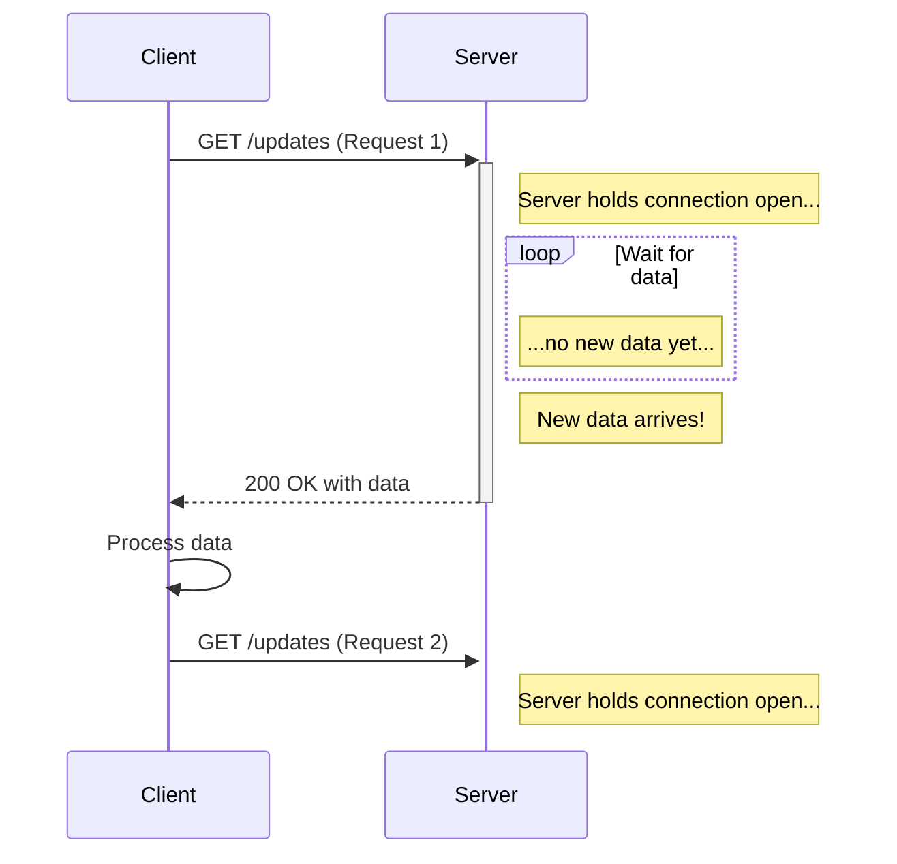
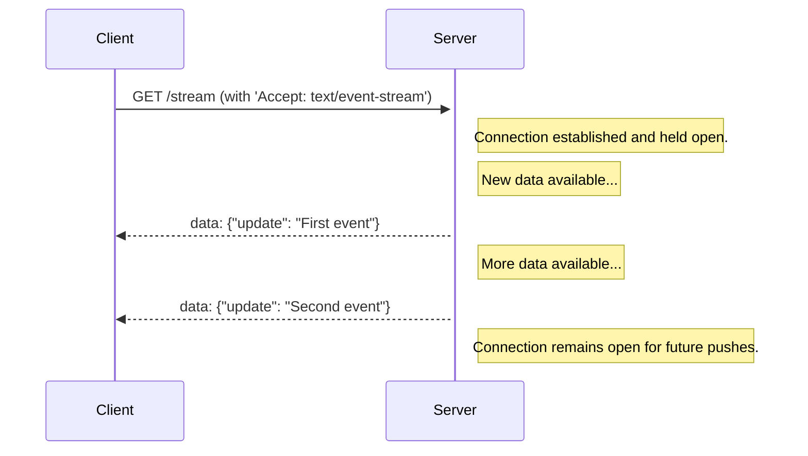
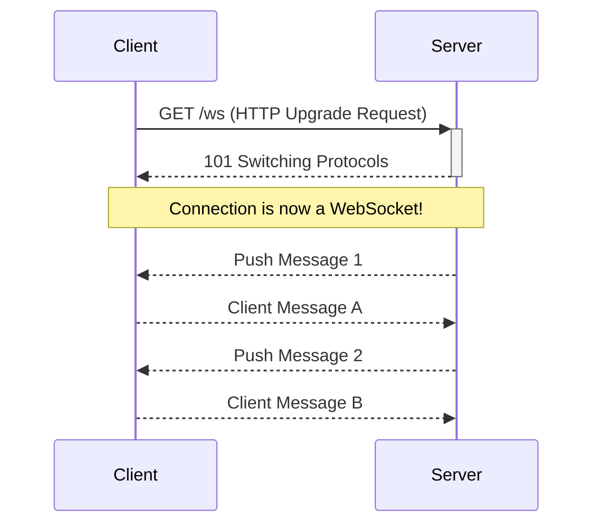

In the modern web, the expectation for instant updates is no longer a luxury—it's a core feature. Whether it's a chat application, a live stock ticker, a collaborative document editor, or a notification system, users expect data to appear on their screens the moment it's generated. This is the domain of **Real-Time Messaging**.

Unlike the traditional request-response model of HTTP, where the client must ask the server for new information, real-time technologies create a persistent or long-lived connection that allows the server to *push* data to the client proactively.

This article explores the three primary techniques for achieving real-time communication: **WebSockets**, **Server-Sent Events (SSE)**, and **Long Polling**. We'll compare their architectures, analyze their trade-offs, and provide practical Go examples to illustrate their implementation.

### The Spectrum of Real-Time Communication

Before diving into the specific technologies, it's helpful to understand where they fit on a spectrum of real-time capabilities.

```mermaid
graph LR
    A[Polling] --> B(Long Polling)
    B --> C(Server-Sent Events)
    C --> D(WebSockets)

    subgraph Less Real-Time
        A
    end

    subgraph More Real-Time
        D
    end

    note for A "Client pulls periodically"
    note for B "Client pulls, server holds connection"
    note for C "Server pushes (one-way)"
    note for D "Server & Client push/pull (two-way)"
```

### 1. Long Polling: The "Patient" Request

Long Polling is a clever enhancement of traditional polling. Instead of the client repeatedly asking "Is there anything new?" every few seconds, it makes a request and the server holds that request open until it actually has new data to send.

**How it Works:**
1.  The client sends an HTTP request to the server.
2.  The server does not immediately respond. It holds the connection open.
3.  When new data is available for that client, the server sends the data in the response and closes the connection.
4.  The client receives the data, processes it, and immediately opens a new long-polling request to the server.
5.  If no new data becomes available within a certain timeout period (e.g., 30 seconds), the server responds with an empty response, and the client immediately re-establishes the connection.

**Architecture Diagram:**


**Pros:**
*   **Simple to Implement**: It's built on standard HTTP and requires no special protocols.
*   **Universal Browser Support**: Works in virtually all browsers, even very old ones.

**Cons:**
*   **High Overhead**: Each message requires a new HTTP connection, complete with headers, which can be inefficient.
*   **Latency**: There's always a small delay between receiving a message and establishing the next connection.
*   **Scalability Issues**: Holding many open connections can be resource-intensive on the server, although less so than rapid polling.

**Go Example for Long Polling:**
This example shows a server that holds a request for up to 30 seconds, responding as soon as a message is available.

```go
package main

import (
    "fmt"
    "log"
    "net/http"
    "sync"
    "time"
)

// A channel to broadcast messages to all waiting clients.
var messageChan = make(chan string)

// A mutex to protect access to the message channel.
var mu sync.Mutex

func updatesHandler(w http.ResponseWriter, r *http.Request) {
    log.Println("Client connected for long polling.")
    
    // Set headers for long polling
    w.Header().Set("Content-Type", "text/plain")
    w.Header().Set("Cache-Control", "no-cache")
    w.Header().Set("Connection", "keep-alive")

    // Wait for a message or a timeout
    select {
    case msg := <-messageChan:
        fmt.Fprintf(w, "New message: %s", msg)
        log.Println("Sent message to client.")
    case <-time.After(30 * time.Second):
        // No message received, send a 204 No Content response
        w.WriteHeader(http.StatusNoContent)
        log.Println("Client timed out.")
    }
}

// A separate function to simulate broadcasting a message
func broadcastMessage() {
    for {
        time.Sleep(10 * time.Second)
        mu.Lock()
        // Non-blocking send to avoid getting stuck if no clients are listening
        select {
        case messageChan <- fmt.Sprintf("The time is %v", time.Now()):
            log.Println("Broadcasted a new message.")
        default:
            // If the channel is full or no one is listening, just drop it.
        }
        mu.Unlock()
    }
}

func main() {
    http.HandleFunc("/updates", updatesHandler)
    
    go broadcastMessage()

    log.Println("Starting server on :8080")
    if err := http.ListenAndServe(":8080", nil); err != nil {
        log.Fatal(err)
    }
}
```

### 2. Server-Sent Events (SSE): One-Way Server Push

Server-Sent Events provide a standardized, efficient way for a server to push data to a client over a single, long-lived HTTP connection. It's a **one-way** communication channel: server to client.

**How it Works:**
1.  The client creates an `EventSource` object in JavaScript, pointing to a server endpoint.
2.  The browser establishes a persistent HTTP connection to that endpoint.
3.  The server keeps this connection open and sends data to the client in a specific `text/event-stream` format whenever new data is available.
4.  The browser automatically handles connection retries and parses the incoming events.

**Architecture Diagram:**


**Pros:**
*   **Efficient**: Uses a single, long-lived connection, avoiding the overhead of Long Polling.
*   **Simple API**: The browser's `EventSource` API is very easy to use and handles reconnections automatically.
*   **Standardized**: It's an official HTML5 standard.

**Cons:**
*   **One-Way Communication**: The client cannot send data to the server over the SSE connection. A separate HTTP request is needed for that.
*   **No Binary Support**: SSE is limited to UTF-8 text.
*   **Connection Limit**: Browsers limit the number of concurrent SSE connections per domain (typically around 6).

**Go Example for SSE:**
This server pushes a timestamp to the client every 2 seconds.

```go
package main

import (
    "fmt"
    "log"
    "net/http"
    "time"
)

func streamHandler(w http.ResponseWriter, r *http.Request) {
    // Set headers for SSE
    w.Header().Set("Content-Type", "text/event-stream")
    w.Header().Set("Cache-Control", "no-cache")
    w.Header().Set("Connection", "keep-alive")

    flusher, ok := w.(http.Flusher)
    if !ok {
        http.Error(w, "Streaming unsupported!", http.StatusInternalServerError)
        return
    }

    log.Println("Client connected for SSE.")

    // Keep the connection open and send events
    for {
        select {
        case <-r.Context().Done():
            log.Println("Client disconnected.")
            return
        default:
            // The 'data:' prefix is part of the SSE format
            fmt.Fprintf(w, "data: The server time is %v\n\n", time.Now())
            flusher.Flush() // Send the data to the client
            time.Sleep(2 * time.Second)
        }
    }
}

func main() {
    http.HandleFunc("/stream", streamHandler)

    log.Println("Starting server on :8080")
    if err := http.ListenAndServe(":8080", nil); err != nil {
        log.Fatal(err)
    }
}
```

### 3. WebSockets: Full Duplex Communication

WebSockets provide a **full-duplex (two-way)** communication channel over a single, long-lived TCP connection. It's a separate protocol from HTTP (`ws://` or `wss://`), but the initial handshake is done over HTTP.

**How it Works:**
1.  The client sends a special HTTP "Upgrade" request to the server.
2.  If the server supports WebSockets, it agrees to "upgrade" the connection from HTTP to the WebSocket protocol.
3.  Once upgraded, the TCP connection remains open, and both the client and server can send messages to each other at any time, with very low latency and overhead.

**Architecture Diagram:**


**Pros:**
*   **Full-Duplex**: True two-way communication.
*   **Low Latency**: After the initial handshake, message overhead is minimal (as little as 2 bytes), making it extremely fast.
*   **Efficient**: Maintains a single connection for the entire session.
*   **Supports Binary Data**: Can transmit text (UTF-8) and binary data.

**Cons:**
*   **More Complex**: Requires more complex server-side implementation compared to SSE or Long Polling.
*   **Firewall/Proxy Issues**: Some older corporate firewalls or proxies may not support the WebSocket protocol, although this is becoming less common.

**Go Example for WebSockets:**
This example uses the popular `gorilla/websocket` library to create a simple echo server.

```go
package main

import (
    "log"
    "net/http"

    "github.com/gorilla/websocket"
)

var upgrader = websocket.Upgrader{
    ReadBufferSize:  1024,
    WriteBufferSize: 1024,
    // Allow connections from any origin for this example
    CheckOrigin: func(r *http.Request) bool { return true },
}

func wsHandler(w http.ResponseWriter, r *http.Request) {
    conn, err := upgrader.Upgrade(w, r, nil)
    if err != nil {
        log.Println(err)
        return
    }
    defer conn.Close()

    log.Println("Client connected via WebSocket.")

    for {
        // Read message from client
        messageType, p, err := conn.ReadMessage()
        if err != nil {
            log.Println("Client disconnected:", err)
            return
        }

        log.Printf("Received message: %s", p)

        // Echo the message back to the client
        if err := conn.WriteMessage(messageType, p); err != nil {
            log.Println("Error writing message:", err)
            return
        }
    }
}

func main() {
    http.HandleFunc("/ws", wsHandler)

    log.Println("Starting server on :8080")
    if err := http.ListenAndServe(":8080", nil); err != nil {
        log.Fatal(err)
    }
}
```
*(To run this, you'll need to `go get github.com/gorilla/websocket`)*

### Comparison and When to Use What

| Feature | Long Polling | Server-Sent Events (SSE) | WebSockets |
| :--- | :--- | :--- | :--- |
| **Direction** | Server to Client (effectively) | **One-Way** (Server to Client) | **Two-Way** (Full-Duplex) |
| **Protocol** | HTTP | HTTP | WebSocket (`ws://`) |
| **Overhead** | High (new connection per message) | Low (single connection) | Very Low (single connection) |
| **Latency** | Moderate | Low | Very Low |
| **Binary Support**| No | No | **Yes** |
| **Auto Reconnect**| Manual implementation | **Built-in** (`EventSource`) | Manual implementation |
| **Best For** | Legacy systems, simple notifications. | News feeds, stock tickers, status updates. | Chat apps, online gaming, collaborative editing. |

**Decision Flowchart:**

```mermaid
graph TD
    A{Need to send data from Client to Server?}
    A -- Yes --> B{Need very low latency or binary data?}
    A -- No --> C{Server-Sent Events (SSE)}

    B -- Yes --> D{WebSockets}
    B -- No --> E{Consider SSE + separate HTTP requests}

    subgraph Recommendation
        C
        D
    end
```

### Conclusion

Choosing the right real-time messaging technology is a critical system design decision that depends entirely on your application's requirements.
*   Use **Long Polling** only as a fallback or for legacy systems where other options are not feasible.
*   Use **Server-Sent Events (SSE)** when you need a simple, efficient way for the server to push text-based updates to the client, such as for news feeds, status updates, or notifications. It's the simplest and often best choice for one-way data flow.
*   Use **WebSockets** when you require true, low-latency, two-way communication between the client and server. It is the most powerful and flexible option, making it the standard for chat, multiplayer games, and real-time collaboration tools.