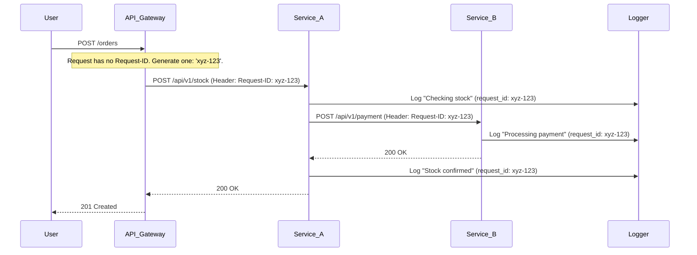

In a monolithic application, tracing a user's action is relatively simple. You can follow the logs in a single service to see the entire sequence of events. But in a microservices architecture, a single user action can trigger a cascade of calls across dozens of services. When something goes wrong, how do you trace that single action through a sea of disconnected logs? The answer is **Request ID Tracking**.

A request ID (also known as a correlation ID or trace ID) is a unique identifier assigned to a request at the very first point of entry into your system. This ID is then passed along to every downstream service that the request touches. By ensuring every log entry and metric related to that request includes this ID, you can instantly filter and correlate all related activities, providing a clear, end-to-end view of the entire operation.

This post explores the importance of request ID tracking, best practices for implementation, and a practical Go example of a middleware that handles it automatically.

### Why is Request ID Tracking Essential?

1.  **Centralized Logging & Debugging**: When logs from all services are aggregated into a central platform (like ELK Stack, Splunk, or Datadog), you can filter by a single request ID to see the complete, ordered story of a request across all services. This turns debugging from a needle-in-a-haystack problem into a straightforward analysis.
2.  **Distributed Tracing**: Request IDs are the foundation of distributed tracing. Tools like Jaeger and Zipkin use these IDs (often as part of a larger trace context) to visualize the flow of requests, measure latency at each step, and identify performance bottlenecks.
3.  **Error Correlation**: When an error occurs in a downstream service, the request ID allows you to trace back to the original user request that caused it, providing crucial context for understanding the failure.
4.  **Auditing and Analytics**: It allows you to analyze the behavior of specific user requests, audit critical operations, and understand how different parts of your system interact.

### The Journey of a Request ID

A request ID should be generated as early as possible and propagated consistently.

**Diagram: Visualizing Request ID Propagation**



### Best Practices for Implementation

1.  **Generate at the Edge**: The request ID should be generated at the first point of contact, typically the API gateway, load balancer, or the first service that receives the external request.
2.  **Honor Incoming IDs**: If an incoming request already has a request ID (e.g., from an upstream service or a client that generated one), your service should use it instead of creating a new one. This preserves the end-to-end trace.
3.  **Use Standard Headers**: Propagate the ID using a standard HTTP header. While `X-Request-ID` is a common de-facto standard, the official `Trace Context` W3C standard recommends using headers like `traceparent` and `tracestate` for more structured tracing information.
4.  **Inject into Context**: In your application code, the request ID should be stored in the request's context (`context.Context` in Go) so that it's easily accessible to any function, logger, or downstream client call without needing to pass it as a function parameter.
5.  **Log Everything with the ID**: Configure your logger to automatically include the request ID in every log message produced during the request's lifecycle.

### Go Example: A Request ID Middleware

A middleware is the perfect place to implement this logic. It can inspect incoming requests, generate or retrieve the ID, inject it into the context, and add it to response headers.

Let's create a simple `requestid` middleware in Go.

```go
package main

import (
	"context"
	"fmt"
	"net/http"

	"github.com/google/uuid"
)

// CtxKey is a custom type for our context key to avoid collisions.
type CtxKey string

const RequestIDKey CtxKey = "requestID"
const RequestIDHeader = "X-Request-ID"

// RequestIDMiddleware generates or retrieves a request ID and injects it into the context.
func RequestIDMiddleware(next http.Handler) http.Handler {
	return http.HandlerFunc(func(w http.ResponseWriter, r *http.Request) {
		// 1. Get request ID from header
		requestID := r.Header.Get(RequestIDHeader)

		// 2. Generate a new ID if one is not provided
		if requestID == "" {
			requestID = uuid.New().String()
		}

		// 3. Add the ID to the response header
		w.Header().Set(RequestIDHeader, requestID)

		// 4. Create a new context with the request ID
		ctx := context.WithValue(r.Context(), RequestIDKey, requestID)

		// 5. Call the next handler with the new context
		next.ServeHTTP(w, r.WithContext(ctx))
	})
}
```

Now, let's create a logger that knows how to extract the request ID from the context.

```go
// Logger is a simple logger that includes the request ID from the context.
func Logger(ctx context.Context, message string) {
	requestID, ok := ctx.Value(RequestIDKey).(string)
	if !ok {
		requestID = "unknown"
	}
	fmt.Printf("[Request-ID: %s] %s\n", requestID, message)
}
```

Finally, let's create a handler that uses this logger.

```go
// myHandler simulates a handler that does some work and logs its progress.
func myHandler(w http.ResponseWriter, r *http.Request) {
	// The request ID is available via the context.
	ctx := r.Context()
	
	Logger(ctx, "Handler started.")

	// Simulate calling another service
	callDownstreamService(ctx)

	Logger(ctx, "Handler finished.")
	w.WriteHeader(http.StatusOK)
	w.Write([]byte("Request processed successfully!"))
}

// callDownstreamService simulates making an HTTP call to another service.
func callDownstreamService(ctx context.Context) {
	requestID, _ := ctx.Value(RequestIDKey).(string)
	
	// Create a new request
	req, _ := http.NewRequestWithContext(ctx, "GET", "http://downstream-service/api/data", nil)
	
	// Propagate the request ID in the header
	req.Header.Set(RequestIDHeader, requestID)
	
	Logger(ctx, fmt.Sprintf("Calling downstream service with header %s: %s", RequestIDHeader, requestID))
	// In a real app, you would execute this request:
	// client := &http.Client{}
	// _, err := client.Do(req)
}

func main() {
	mux := http.NewServeMux()
	
	finalHandler := http.HandlerFunc(myHandler)
	mux.Handle("/api/resource", RequestIDMiddleware(finalHandler))

	fmt.Println("Server starting on port 8080...")
	if err := http.ListenAndServe(":8080", mux); err != nil {
		fmt.Println("Server failed to start:", err)
	}
}
```

**How to Test It:**

1.  **First Request (No ID)**:
    ```bash
    curl -v http://localhost:8080/api/resource
    ```
    You will see a new `X-Request-ID` in the response headers, and the server logs will be prefixed with this new ID.

2.  **Second Request (With ID)**:
    ```bash
    curl -v http://localhost:8080/api/resource -H "X-Request-ID: my-custom-id-123"
    ```
    The response header will contain `my-custom-id-123`, and the server logs will be prefixed with it, demonstrating that the middleware correctly honored the incoming ID.

### Conclusion

Request ID tracking is a simple yet incredibly powerful pattern for achieving observability in a distributed architecture. By consistently generating, propagating, and logging a unique identifier for each request, you transform your disconnected logs into a coherent, end-to-end narrative. This dramatically simplifies debugging, performance analysis, and error correlation. Implementing this pattern with a middleware is a straightforward way to ensure every request is traceable, making your system more transparent, reliable, and easier to maintain.
