In distributed systems, transient failures are a fact of life. A service might be temporarily unavailable, a network connection might drop, or a database might be momentarily overloaded. A naive approach would be to fail the entire operation immediately. A much better approach is to **retry**.

Retrying a failed operation can significantly improve the resilience and availability of your application. However, a poorly implemented retry mechanism can make things worse, leading to "retry storms" that overwhelm already struggling services. This post provides a practical guide to implementing robust retry mechanisms, covering strategies from simple retries to exponential backoff with jitter, complete with Go examples.

### Why Retries are Essential (and Dangerous)

**The Good**: Retries are your first line of defense against transient failures. By automatically re-attempting a failed operation, you can mask temporary issues from the end-user, making your system appear more reliable.

**The Bad**: If not handled carefully, retries can be dangerous. Imagine a service is slowing down. Thousands of clients start retrying their requests aggressively. This flood of retries, added to the normal traffic, can push the struggling service over the edge, causing a complete outage. This is known as a **retry storm**.

The key is to retry *smartly*.

### Retry Strategies

Let's explore the most common retry strategies, from the simplest to the most robust.

#### 1. Simple Retry

This is the most basic strategy: if an operation fails, wait for a fixed interval and try again, up to a certain number of attempts.

-   **Pros**: Simple to implement.
-   **Cons**: Ineffective if the service needs more time to recover. Multiple clients retrying at the same fixed intervals can cause synchronized, thundering herd-style traffic.

#### 2. Exponential Backoff

Instead of waiting for a fixed interval, the wait time between retries increases exponentially with each failed attempt. For example, wait 1s, then 2s, then 4s, and so on.

-   **Pros**: Gives a struggling service progressively more time to recover. It's a significant improvement over simple retries.
-   **Cons**: Can still lead to synchronized retries. If multiple clients experience a failure at the same time, they will all retry in synchronized waves (at 1s, 2s, 4s, etc.), which can still cause traffic spikes.

#### 3. Exponential Backoff with Jitter

This is the gold standard. It builds on exponential backoff by adding a small, random amount of time (`jitter`) to each backoff interval. This randomness breaks the synchronization between clients, spreading the retry attempts out over time and preventing traffic spikes.

-   **Full Jitter**: The wait time is a random value between 0 and the current exponential backoff interval.
-   **Equal Jitter**: The wait time is the current exponential backoff interval divided by two, plus a random value up to that same amount.

-   **Pros**: Highly effective at preventing retry storms by desynchronizing client retries.
-   **Cons**: Slightly more complex to implement, but the resilience gains are well worth it.

### Visualizing the Strategies

This Mermaid diagram shows how different retry strategies spread out requests over time.

```mermaid
gantt
    title Retry Strategies Comparison
    dateFormat  X
    axisFormat %s

    section Simple Retry (Fixed Interval)
    Attempt 1 : 0, 1
    Attempt 2 : 2, 1
    Attempt 3 : 4, 1
    
    section Exponential Backoff
    Attempt 1 : 0, 1
    Attempt 2 : 2, 1
    Attempt 3 : 5, 1
    
    section Exponential Backoff with Jitter
    Attempt 1 : 0, 1
    Attempt 2 : 2.7, 1
    Attempt 3 : 6.2, 1
```


*Note: The jittered values are illustrative examples of randomized delays.*

### Go Example: Implementing Retry Logic

Let's write a flexible `Retry` function in Go that can execute an operation with a specified retry strategy.

First, the core `Retry` function.

```go
package main

import (
	"fmt"
	"math"
	"math/rand"
	"time"
)

// Operation is a function that can be retried.
type Operation func() error

// Retry executes an operation with a given backoff strategy.
func Retry(op Operation, maxRetries int, backoffStrategy func(int) time.Duration) error {
	var err error
	for i := 0; i < maxRetries; i++ {
		err = op()
		if err == nil {
			return nil // Success
		}

		fmt.Printf("Attempt %d failed: %v\n", i+1, err)

		if i < maxRetries-1 {
			wait := backoffStrategy(i + 1)
			fmt.Printf("Waiting for %v before retrying...\n", wait)
			time.Sleep(wait)
		}
	}
	return fmt.Errorf("operation failed after %d retries: %w", maxRetries, err)
}
```

Now, let's define our backoff strategies as functions.

```go
const baseBackoff = 100 * time.Millisecond

// SimpleBackoff waits for a fixed duration.
func SimpleBackoff(attempt int) time.Duration {
	return baseBackoff
}

// ExponentialBackoff increases the wait time exponentially.
func ExponentialBackoff(attempt int) time.Duration {
	return baseBackoff * time.Duration(math.Pow(2, float64(attempt-1)))
}

// ExponentialBackoffWithJitter adds randomness to the exponential backoff.
func ExponentialBackoffWithJitter(attempt int) time.Duration {
	expBackoff := baseBackoff * time.Duration(math.Pow(2, float64(attempt-1)))
	// Full Jitter: random duration between 0 and expBackoff
	return time.Duration(rand.Int63n(int64(expBackoff)))
}
```

Finally, let's simulate a fallible operation and use our `Retry` function.

```go
// fallibleOperation simulates an operation that might fail.
func fallibleOperation() error {
	// 50% chance of failure
	if rand.Intn(2) == 0 {
		return fmt.Errorf("transient error")
	}
	fmt.Println("Operation succeeded!")
	return nil
}

func main() {
	rand.Seed(time.Now().UnixNano())

	fmt.Println("--- Using Simple Retry ---")
	Retry(fallibleOperation, 5, SimpleBackoff)

	fmt.Println("\n--- Using Exponential Backoff ---")
	Retry(fallibleOperation, 5, ExponentialBackoff)

	fmt.Println("\n--- Using Exponential Backoff with Jitter ---")
	Retry(fallibleOperation, 5, ExponentialBackoffWithJitter)
}
```

### The Critical Link: Retries and Idempotency

Retries are safe only if the operation being retried is **idempotent**. An idempotent operation is one that can be performed multiple times with the same result as performing it once.

-   **Safe to Retry**: `GET /users/123`, `DELETE /users/123`.
-   **Dangerous to Retry**: `POST /orders` (might create two orders), `PATCH /wallet -d '{"amount": -10}'` (might charge the user twice).

If you must retry a non-idempotent operation, you **must** make it idempotent first. This is typically done using an `Idempotency-Key` sent by the client. The server tracks these keys and ensures that the operation for a given key is only executed once. When a retry occurs with the same key, the server simply returns the cached response from the first successful attempt.

### Conclusion

Smart retry mechanisms are a cornerstone of resilient distributed systems. While simple retries are easy to implement, they can be dangerous under load. **Exponential backoff with jitter** is the recommended strategy for building robust, scalable applications, as it effectively prevents retry storms by desynchronizing client requests.

Always remember the crucial partnership between retries and idempotency. Blindly retrying non-idempotent operations can corrupt data and lead to severe bugs. By combining a smart backoff strategy with idempotent API design, you can build systems that gracefully handle the transient failures inherent in a distributed world, leading to higher availability and a better user experience.
