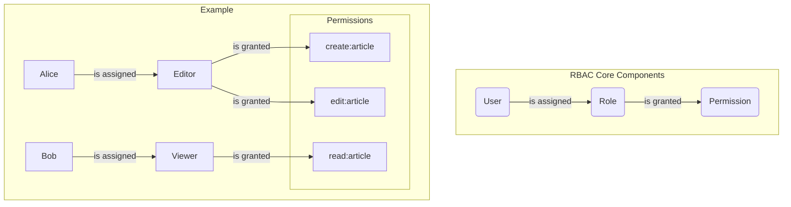

## System Design: An Introduction to Role-Based Access Control (RBAC)

Once a user is authenticated, the next critical question is: "What is this user allowed to do?" This is the domain of **authorization**. While authentication confirms identity, authorization determines permissions.

One of the most widely adopted models for managing permissions is **Role-Based Access Control (RBAC)**. RBAC simplifies permission management by assigning permissions to roles instead of directly to users. This post explores the core concepts of RBAC, its advantages, and how to implement a basic system.

### What is RBAC?

RBAC is a security model that restricts system access to authorized users based on their roles within an organization. Instead of assigning permissions one by one to each user, you assign users to roles, and each role is granted a set of permissions.

The core components of RBAC are:
1.  **Users:** The individuals interacting with the system (e.g., Alice, Bob).
2.  **Roles:** Job functions or titles that define a level of authority (e.g., `admin`, `editor`, `viewer`).
3.  **Permissions:** The specific actions that can be performed on resources (e.g., `create_article`, `delete_user`, `read_dashboard`).
4.  **Resources:** The objects within the system that permissions apply to (e.g., articles, users, dashboards).

The fundamental relationship is:
-   A user is assigned one or more roles.
-   A role is granted one or more permissions.
-   Therefore, a user acquires the permissions of the roles they are assigned.



In this example, Alice, as an `Editor`, can create and edit articles. Bob, as a `Viewer`, can only read them. If a new user, Carol, joins as an editor, you simply assign her the `Editor` role, and she instantly inherits all the necessary permissions. You don't have to manually assign each permission to her.

### Benefits of RBAC

-   **Simplified Administration:** Managing roles is far easier than managing permissions for every individual user, especially in large organizations. When an employee changes jobs, you just change their role assignment.
-   **Improved Security:** RBAC enforces the principle of least privilege. Users are only granted the permissions necessary to perform their job functions, reducing the potential for unauthorized actions.
-   **Scalability:** The model scales well as the number of users and resources grows.
-   **Auditing and Compliance:** It's easier to audit who has access to what by reviewing role definitions and assignments. This helps in meeting regulatory and compliance requirements.

### Limitations of RBAC

While powerful, RBAC has its limitations:
-   **Role Explosion:** In complex systems, you might end up with a huge number of very specific roles, which can become difficult to manage.
-   **Static Nature:** RBAC is not well-suited for context-dependent permissions. For example, "a user can edit a document *only if* they are the document's owner and it's currently in 'draft' status." This kind of dynamic rule is difficult to express with standard RBAC.
-   **Toxic Combinations:** A user assigned multiple roles might inadvertently gain an excessive level of permissions.

For more dynamic and fine-grained control, organizations often turn to **Attribute-Based Access Control (ABAC)**, which we will cover in the next post.

### Implementing a Simple RBAC System in Go

Let's build a basic RBAC system in Go. We'll define structures for users, roles, and permissions and create a function to check if a user has a specific permission.

```go
package main

import (
	"fmt"
	"sync"
)

// Permission is a string representing an action (e.g., "articles:create").
type Permission string

// Role defines a set of permissions.
type Role struct {
	Name        string
	Permissions map[Permission]bool
}

// User has a set of assigned roles.
type User struct {
	Name  string
	Roles map[string]bool // Map of role names
}

// RbacSystem manages roles and user assignments.
type RbacSystem struct {
	sync.RWMutex
	Roles map[string]Role
	Users map[string]User
}

func NewRbacSystem() *RbacSystem {
	return &RbacSystem{
		Roles: make(map[string]Role),
		Users: make(map[string]User),
	}
}

// AddRole creates a new role.
func (rs *RbacSystem) AddRole(name string) {
	rs.Lock()
	defer rs.Unlock()
	rs.Roles[name] = Role{Name: name, Permissions: make(map[Permission]bool)}
}

// GrantPermission adds a permission to a role.
func (rs *RbacSystem) GrantPermission(roleName string, perm Permission) {
	rs.Lock()
	defer rs.Unlock()
	if role, ok := rs.Roles[roleName]; ok {
		role.Permissions[perm] = true
	}
}

// AddUser creates a new user.
func (rs *RbacSystem) AddUser(name string) {
	rs.Lock()
	defer rs.Unlock()
	rs.Users[name] = User{Name: name, Roles: make(map[string]bool)}
}

// AssignRole gives a user a role.
func (rs *RbacSystem) AssignRole(userName, roleName string) {
	rs.Lock()
	defer rs.Unlock()
	if user, ok := rs.Users[userName]; ok {
		user.Roles[roleName] = true
	}
}

// CheckPermission verifies if a user has a specific permission.
func (rs *RbacSystem) CheckPermission(userName string, perm Permission) bool {
	rs.RLock()
	defer rs.RUnlock()

	user, ok := rs.Users[userName]
	if !ok {
		return false
	}

	// Iterate through the user's roles.
	for roleName := range user.Roles {
		if role, ok := rs.Roles[roleName]; ok {
			// Check if the role has the permission.
			if role.Permissions[perm] {
				return true
			}
		}
	}

	return false
}

func main() {
	rbac := NewRbacSystem()

	// 1. Define roles
	rbac.AddRole("admin")
	rbac.AddRole("editor")
	rbac.AddRole("viewer")

	// 2. Grant permissions to roles
	rbac.GrantPermission("admin", "users:delete")
	rbac.GrantPermission("editor", "articles:create")
	rbac.GrantPermission("editor", "articles:edit")
	rbac.GrantPermission("viewer", "articles:read")
	// Admins can also do what editors do (simple hierarchy)
	rbac.GrantPermission("admin", "articles:create")
	rbac.GrantPermission("admin", "articles:edit")
	rbac.GrantPermission("admin", "articles:read")


	// 3. Create users
	rbac.AddUser("Alice")
	rbac.AddUser("Bob")
	rbac.AddUser("Charlie")

	// 4. Assign roles to users
	rbac.AssignRole("Alice", "admin")
	rbac.AssignRole("Bob", "editor")
	rbac.AssignRole("Charlie", "viewer")

	// 5. Check permissions
	fmt.Printf("Can Alice delete users? %v\n", rbac.CheckPermission("Alice", "users:delete"))       // true
	fmt.Printf("Can Bob create articles? %v\n", rbac.CheckPermission("Bob", "articles:create"))     // true
	fmt.Printf("Can Charlie edit articles? %v\n", rbac.CheckPermission("Charlie", "articles:edit")) // false
	fmt.Printf("Can Charlie read articles? %v\n", rbac.CheckPermission("Charlie", "articles:read")) // true
	fmt.Printf("Can Bob delete users? %v\n", rbac.CheckPermission("Bob", "users:delete"))           // false
}
```

This example demonstrates the core logic. In a real-world application, this data would be stored in a database with tables for `users`, `roles`, `permissions`, and join tables for `user_roles` and `role_permissions`.

### Conclusion

RBAC is a foundational model for authorization that brings simplicity, security, and scalability to permission management. By abstracting permissions into roles, it allows administrators to manage access at a high level, aligning with organizational structure and the principle of least privilege. While it has limitations in highly dynamic environments, it remains the go-to solution for a vast number of applications.

In our next post, we will explore **Attribute-Based Access Control (ABAC)**, a more powerful and flexible model that makes authorization decisions based on attributes of the user, resource, and environment.
---
