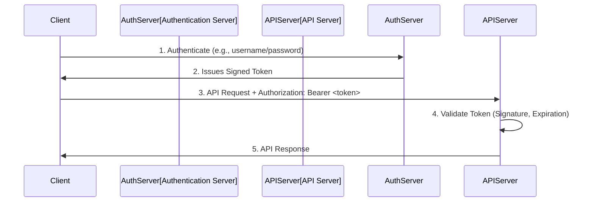

In a world of microservices and single-page applications, APIs are the backbone of modern software. They are also a primary target for attackers. A poorly designed API can expose sensitive data, allow unauthorized actions, and compromise an entire system. Therefore, designing APIs with security as a core principle is not optional—it's essential.

This article covers fundamental patterns for designing secure APIs, with a focus on **token-based authentication**, **fine-grained authorization with scopes**, and other critical best practices.

### Authentication vs. Authorization

First, it's crucial to understand the difference between these two concepts:

*   **Authentication**: This is the process of verifying who a user is. It answers the question, "Are you who you say you are?" This is typically done with a username/password, a biometric scan, or a token.
*   **Authorization**: This is the process of verifying what a user is allowed to do. It answers the question, "Are you allowed to perform this action?" This happens *after* authentication.

A secure API must handle both correctly.

### The Modern Approach: Token-Based Authentication

In traditional web applications, sessions were often managed on the server. The server would create a session ID, store it, and send it to the client as a cookie. For modern, stateless APIs, a better approach is **token-based authentication**.

**How it works:**

1.  A user authenticates with a credential (e.g., username/password).
2.  The server validates the credential and issues a **signed token**. This token contains information (claims) about the user, such as their user ID and an expiration time.
3.  The client stores this token (e.g., in memory or `localStorage`) and includes it in the `Authorization` header of every subsequent API request.
4.  The API server receives the request, validates the token's signature and expiration, and if valid, processes the request.

This approach is **stateless** because the server doesn't need to store any session information. All the necessary data is in the token itself, making it ideal for distributed systems and microservices.



### Choosing a Token Format: JWT vs. PASETO

#### JSON Web Tokens (JWT)

JWTs are the most common format for API tokens. A JWT consists of three parts separated by dots: `header.payload.signature`.

*   **Header**: Contains metadata about the token, like the signing algorithm (`alg`).
*   **Payload**: Contains the claims, such as `user_id`, `exp` (expiration time), and other data.
*   **Signature**: The header and payload are signed with a secret key. This ensures the token hasn't been tampered with.

**The Problem with JWTs**: The JWT standard is notoriously flexible, which has led to security pitfalls. For example, the `alg` header parameter could be manipulated by an attacker to `none`, tricking some poorly implemented libraries into accepting an unsigned token. While these issues are fixable, they represent a "baggage of design flaws."

#### PASETO (Platform-Agnostic Security Tokens)

PASETO is a modern alternative to JWT that aims to be "secure by default." It offers two main modes:

1.  **Local (Symmetric Encryption)**: The token is encrypted with a shared secret key. The contents are confidential and cannot be read by the client. This is useful for tokens that stay within your own backend systems.
2.  **Public (Asymmetric Signature)**: The token is signed with a private key, and anyone with the public key can verify it. The contents are not encrypted but are authenticated. This is similar to a JWT and is ideal for public-facing APIs.

PASETO avoids the algorithm-switching vulnerabilities of JWT by having versioned protocols (e.g., `v2.local` for symmetric, `v2.public` for asymmetric). It provides a much safer and simpler starting point for token-based security.

### Authorization: Scopes and Claims

Once a user is authenticated, you need to determine if they are authorized to perform the requested action. Hardcoding user roles in your API logic is brittle. A more flexible pattern is to use **scopes**, a concept popularized by OAuth2.

*   **Scopes**: Scopes define specific permissions (e.g., `read:profile`, `write:posts`, `delete:posts`).
*   **Claims**: When a token is issued, it should include a `scope` claim that lists the permissions granted to the user for that session.

**Example Workflow:**

1.  A user logs in. The authentication server determines their permissions based on their role or other attributes.
2.  The server issues a token with a `scope` claim: `{"scope": "read:profile write:posts"}`.
3.  The user tries to access the endpoint `DELETE /api/posts/123`.
4.  The API server validates the token and checks its claims. It sees that the token has the `read:profile` and `write:posts` scopes, but not the required `delete:posts` scope.
5.  The server rejects the request with a `403 Forbidden` status code.

This pattern decouples your authorization logic from user roles and allows for very fine-grained access control.

### Other Essential API Security Patterns

1.  **Use HTTPS Everywhere (TLS)**: All API traffic must be encrypted using TLS to prevent eavesdropping and man-in-the-middle attacks. There is no excuse for not using HTTPS.
2.  **Input Validation**: Never trust client input. Use a validation library or schema (like JSON Schema) to ensure that all incoming data conforms to the expected format, type, and range. This is your first line of defense against injection attacks and other malformed data.
3.  **Rate Limiting and Throttling**: Protect your API from denial-of-service (DoS) attacks and abuse by implementing rate limiting. This can be done based on IP address, user ID, or API key. A common strategy is the **token bucket algorithm**.
4.  **Proper Error Handling**: Don't leak internal system details in error messages. Instead of "FATAL: connection refused to database at 10.0.1.50", return a generic `500 Internal Server Error` with a correlation ID that can be used to look up the detailed error in your logs.
5.  **Security Headers**: Use HTTP headers to enhance security.
    *   `Content-Security-Policy`: Mitigates XSS.
    *   `Strict-Transport-Security`: Enforces the use of HTTPS.
    *   `X-Content-Type-Options: nosniff`: Prevents the browser from MIME-sniffing a response away from the declared content-type.

### Go Example: API Middleware for Token Validation and Scopes

This example shows how to use Go middleware to protect an API endpoint. The middleware checks for a valid token and verifies that it has the required scope.

```go
package main

import (
	"context"
	"fmt"
	"log"
	"net/http"
	"strings"
)

// A mock token validation function. In a real app, this would
// validate a JWT or PASETO token signature and expiration.
func validateToken(token string) (map[string]string, bool) {
	// For this demo, we'll use a simple "token:scope" format.
	parts := strings.Split(token, ":")
	if len(parts) != 2 {
		return nil, false
	}
	
	// "database" of valid tokens and their scopes
	validTokens := map[string]string{
		"user123_token": "read:profile write:posts",
		"admin456_token": "read:profile write:posts delete:posts",
	}

	scopes, ok := validTokens[parts[0]]
	if !ok {
		return nil, false
	}

	claims := map[string]string{"sub": parts[0], "scope": scopes}
	return claims, true
}

// authMiddleware checks for a valid token.
func authMiddleware(next http.Handler) http.Handler {
	return http.HandlerFunc(func(w http.ResponseWriter, r *http.Request) {
		authHeader := r.Header.Get("Authorization")
		if authHeader == "" {
			http.Error(w, "Forbidden", http.StatusForbidden)
			return
		}

		tokenString := strings.TrimPrefix(authHeader, "Bearer ")
		claims, ok := validateToken(tokenString)
		if !ok {
			http.Error(w, "Forbidden", http.StatusForbidden)
			return
		}

		// Add claims to the request context for later use
		ctx := context.WithValue(r.Context(), "claims", claims)
		next.ServeHTTP(w, r.WithContext(ctx))
	})
}

// requireScope checks if the token has a specific scope.
func requireScope(requiredScope string, next http.Handler) http.Handler {
	return http.HandlerFunc(func(w http.ResponseWriter, r *http.Request) {
		claims, ok := r.Context().Value("claims").(map[string]string)
		if !ok {
			http.Error(w, "Forbidden", http.StatusForbidden)
			return
		}

		scopes := strings.Fields(claims["scope"])
		for _, scope := range scopes {
			if scope == requiredScope {
				next.ServeHTTP(w, r)
				return
			}
		}

		http.Error(w, "Forbidden: insufficient scope", http.StatusForbidden)
	})
}

func main() {
	// A public endpoint
	http.HandleFunc("/api/health", func(w http.ResponseWriter, r *http.Request) {
		fmt.Fprintln(w, "API is healthy")
	})

	// A protected endpoint that requires the "delete:posts" scope
	deletePostHandler := http.HandlerFunc(func(w http.ResponseWriter, r *http.Request) {
		claims := r.Context().Value("claims").(map[string]string)
		fmt.Fprintf(w, "Post deleted by user %s", claims["sub"])
	})

	// Chain the middleware
	protectedDelete := authMiddleware(requireScope("delete:posts", deletePostHandler))
	http.Handle("/api/posts/123", protectedDelete)

	fmt.Println("Starting server on http://localhost:8080")
	log.Fatal(http.ListenAndServe(":8080", nil))
}
```
**How to test it:**
```bash
# Test public endpoint (works)
curl http://localhost:8080/api/health

# Try to access protected endpoint without a token (fails)
curl -v http://localhost:8080/api/posts/123

# Use a token with insufficient scope (fails)
curl -v -H "Authorization: Bearer user123_token" http://localhost:8080/api/posts/123

# Use a token with the correct scope (works)
curl -v -H "Authorization: Bearer admin456_token" http://localhost:8080/api/posts/123
```

### Conclusion

Secure API design is a multi-layered process. It starts with strong, token-based authentication (preferably using a modern format like PASETO) and flexible, fine-grained authorization using scopes. On top of that, you must layer other critical defenses: enforce TLS, validate all input, implement rate limiting, handle errors gracefully, and use security headers. By integrating these patterns into your design process, you can build APIs that are not only functional and scalable but also resilient to attack.