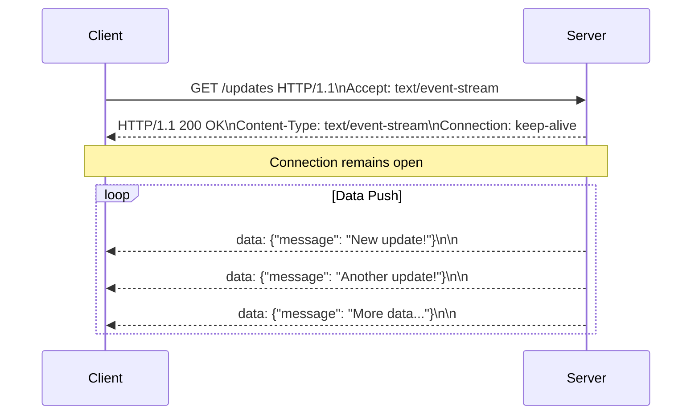

## System Design: Real-Time Updates with Server-Sent Events (SSE)

Not all real-time applications require the full complexity of a bidirectional protocol like [WebSockets](/blog/system-design/system-design-websocket-protocol-deep-dive). Sometimes, you just need the server to push updates to the client—think news feeds, stock tickers, or notification alerts. For these scenarios, **Server-Sent Events (SSE)** provide a simple, efficient, and web-friendly solution.

SSE is a standard that allows a server to send an unlimited stream of text-based data to a client over a single, long-lived HTTP connection. It's a one-way street: server-to-client.

### How SSE Works

The magic of SSE lies in its simplicity and its use of standard HTTP.

1.  **The Connection:** The client initiates a regular HTTP request to a specific endpoint on the server. A crucial header is `Accept: text/event-stream`.
2.  **The Server's Response:** The server responds with a special content type, `Content-Type: text/event-stream`, and keeps the connection open. It does not close the connection after sending the initial headers.
3.  **The Event Stream:** The server can now send "events" to the client whenever new data is available. These events are just plain text messages formatted in a specific way. The client, through the browser's `EventSource` API, automatically parses these messages.



### The Event Stream Format

The data sent by the server is a stream of UTF-8 encoded text. Each event is a block of text followed by two newline characters (`\n\n`). Each block can contain several fields.

The most common fields are:
-   `data`: The actual message payload. You can have multiple `data` lines for a multi-line message.
-   `event`: An optional name for the event. This allows you to send different types of events over the same stream, which the client can listen for specifically.
-   `id`: An optional unique ID for the event. If the connection drops, the browser will automatically try to reconnect and will send the last received `id` in a `Last-Event-ID` header. This allows the server to resume the stream from where it left off.
-   `retry`: Specifies how long (in milliseconds) the client should wait before attempting to reconnect if the connection is lost.

**Example Event Stream:**

```
// A simple message
data: This is a message.

// A multi-line message
data: First line.
data: Second line.

// A named event with an ID
id: 123
event: user-login
data: {"username": "alice", "timestamp": 1664200000}

// Set a reconnection timeout
retry: 10000
```

### Go Example: A Simple Time-Streaming Server

Let's build a Go server that streams the current time to the client every two seconds using SSE.

```go
package main

import (
	"fmt"
	"log"
	"net/http"
	"time"
)

func timeHandler(w http.ResponseWriter, r *http.Request) {
	// Set the required headers for SSE
	w.Header().Set("Content-Type", "text/event-stream")
	w.Header().Set("Cache-Control", "no-cache")
	w.Header().Set("Connection", "keep-alive")

	// Flusher is needed to push data to the client as it's written
	flusher, ok := w.(http.Flusher)
	if !ok {
		http.Error(w, "Streaming unsupported!", http.StatusInternalServerError)
		return
	}

	log.Println("Client connected")
	
	// Close the connection when the client disconnects
	r.Context().Done()
	
	// Send the current time every 2 seconds
	ticker := time.NewTicker(2 * time.Second)
	defer ticker.Stop()

	for {
		select {
		case t := <-ticker.C:
			// Format the event and write it to the response writer
			// The `\n\n` is crucial to signal the end of an event
			fmt.Fprintf(w, "data: %s\n\n", t.Format(time.RFC1123))
			
			// Flush the data to the client
			flusher.Flush()
		case <-r.Context().Done():
			log.Println("Client disconnected")
			return
		}
	}
}

func main() {
	http.HandleFunc("/time", timeHandler)
	
	// Simple HTML page to test the SSE endpoint
	http.HandleFunc("/", func(w http.ResponseWriter, r *http.Request) {
		html := `
			<!DOCTYPE html>
			<html>
				<head>
					<title>SSE Time Stream</title>
				</head>
				<body>
					<h1>Current Server Time:</h1>
					<div id="time"></div>
					<script>
						const timeDiv = document.getElementById('time');
						const eventSource = new EventSource('/time');
						
						// The 'message' event is the default event if no 'event:' name is specified
						eventSource.onmessage = function(event) {
							timeDiv.textContent = event.data;
						};

						eventSource.onerror = function(err) {
							console.error("EventSource failed:", err);
							timeDiv.textContent = "Connection lost. Trying to reconnect...";
						};
					</script>
				</body>
			</html>
		`
		w.Header().Set("Content-Type", "text/html")
		fmt.Fprint(w, html)
	})

	log.Println("Server starting on :8080")
	log.Fatal(http.ListenAndServe(":8080", nil))
}
```

**To run this:**
1.  Save the code as `main.go` and run it: `go run .`
2.  Open your web browser and navigate to `http://localhost:8080`.
3.  You will see the server time updating every two seconds without refreshing the page.

### SSE vs. WebSockets

Choosing between SSE and WebSockets depends entirely on your communication needs.

| Feature                | Server-Sent Events (SSE)                               | WebSockets                                             |
| ---------------------- | ------------------------------------------------------ | ------------------------------------------------------ |
| **Directionality**     | Unidirectional (Server to Client)                      | **Bidirectional** (Full-Duplex)                        |
| **Transport**          | Standard HTTP/HTTPS                                    | Upgraded HTTP connection (custom framing over TCP)     |
| **Data Type**          | Text only (UTF-8)                                      | Text and **Binary**                                    |
| **Connection Limit**   | Subject to browser's max HTTP connections (usually ~6 per domain) | A single connection is sufficient for many streams |
| **Automatic Reconnection** | **Built-in**. The browser handles it automatically. | Must be implemented manually in client-side code.      |
| **Error Handling**     | Simple `onerror` event in the `EventSource` API.       | More complex; requires handling different close codes. |
| **Simplicity**         | Very simple to implement on both client and server.    | More complex handshake and framing protocol.           |

**When to choose SSE:**
-   You only need to push data from the server to the client.
-   Examples: News feeds, live sports scores, notifications, monitoring dashboards.
-   You want a simple, HTTP-based solution with automatic reconnection.

**When to choose WebSockets:**
-   You need true, two-way communication.
-   Examples: Chat applications, multiplayer games, collaborative editing.
-   You need to send binary data.

### Conclusion

Server-Sent Events are a powerful yet often overlooked technology for building real-time web applications. By leveraging a simple, text-based protocol over standard HTTP, SSE provides an elegant and efficient way for servers to push data to clients. For any application that requires unidirectional data flow from server to client, SSE offers a lighter-weight, simpler alternative to WebSockets, complete with built-in browser support for features like automatic reconnection.
---
