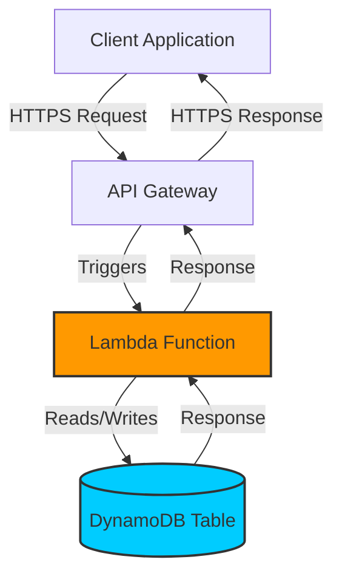

Serverless computing represents a major evolution in cloud-native architecture. It allows you to build and run applications and services without thinking about servers. With serverless, the cloud provider is responsible for executing a piece of code by dynamically allocating the resources, and you only pay for the resources used to run the code. You don't need to provision, scale, or manage any servers, so you can focus solely on your application's logic.

The core of the serverless paradigm is **Function-as-a-Service (FaaS)**, where application logic is run in stateless compute containers that are event-triggered, ephemeral, and fully managed by the cloud provider. AWS Lambda is the most prominent example of a FaaS offering.

However, "serverless" is broader than just FaaS. It also includes managed services for databases (e.g., Amazon DynamoDB, Aurora Serverless), messaging (e.g., Amazon SQS), and APIs (e.g., Amazon API Gateway) that also abstract away the underlying infrastructure.

### Key Benefits of Serverless

1.  **No Server Management**: This is the most significant benefit. You never have to provision, patch, or manage servers, which dramatically reduces operational overhead.
2.  **Pay-per-Use**: You are billed based on the number of requests and the precise time your code is executing, down to the millisecond. When your code isn't running, you pay nothing. This can be extremely cost-effective for applications with variable or infrequent traffic.
3.  **Automatic Scaling**: The cloud provider automatically scales your application in response to demand. Whether you have one request per day or thousands per second, the provider handles the scaling seamlessly.
4.  **Increased Developer Velocity**: By abstracting away infrastructure concerns, developers can focus on writing business logic and delivering features faster.

### Common Serverless Architectural Patterns

Serverless is not a silver bullet, but it excels in specific use cases. Let's explore some common architectural patterns.

#### 1. The Event-Driven API Backend

This is one of the most popular serverless patterns. An API Gateway acts as the "front door," receiving HTTP requests and routing them to the appropriate Lambda function to execute the business logic. The function then interacts with other services, like a serverless database (e.g., DynamoDB).

**Diagram: Serverless API Backend**



This pattern is ideal for REST APIs, mobile backends, and web applications where the traffic can be unpredictable.

#### 2. Event-Driven Data Processing

Serverless is exceptionally well-suited for processing streams of data or reacting to events. For example, a Lambda function can be triggered whenever a new file is uploaded to an object storage service like Amazon S3.

A common use case is image thumbnail generation.

**Diagram: S3 Thumbnail Generation**

```mermaid
graph TD
    User[User] -- "1. Uploads full-size image" --> S3_Source[S3 Bucket (Source)]
    S3_Source -- "2. Triggers event" --> Lambda[Resize Image Function]
    Lambda -- "3. Writes thumbnail" --> S3_Dest[S3 Bucket (Thumbnails)]
    User -- "4. Loads thumbnail" --> S3_Dest

    style Lambda fill:#f90,stroke:#333,stroke-width:2px
```

This pattern is powerful for ETL jobs, real-time file processing, and building reactive systems.

#### 3. Scheduled Tasks (Cron Jobs)

Instead of running a dedicated server just to execute a task on a schedule, you can use a cloud service (like Amazon EventBridge) to trigger a Lambda function at a specified interval. This is perfect for generating nightly reports, running cleanup scripts, or performing periodic data synchronization.

**Diagram: Scheduled Lambda Function**

```mermaid
graph TD
    Scheduler[Amazon EventBridge (Cron Rule)] -- "Triggers every 24h" --> Lambda[Generate Report Function]
    Lambda -- "Fetches data" --> DB[(Database)]
    Lambda -- "Saves report" --> S3[S3 Bucket]

    style Lambda fill:#f90,stroke:#333,stroke-width:2px
```

### Practical Go Example: A Simple AWS Lambda Function

Let's create a basic "hello world" API using Go, AWS Lambda, and API Gateway. This function will take a name in a JSON request and return a greeting.

**Prerequisites:**
*   Go installed
*   An AWS account
*   AWS SAM CLI or Serverless Framework (for deployment)

**The Go Code (`main.go`):**

We'll use the `aws-lambda-go` package, which provides the necessary interfaces for a Go function to run on Lambda.

```go
package main

import (
	"context"
	"encoding/json"
	"fmt"
	"github.com/aws/aws-lambda-go/events"
	"github.com/aws/aws-lambda-go/lambda"
)

// Request is the input struct for our Lambda function.
// It expects a JSON body like: {"name": "World"}
type Request struct {
	Name string `json:"name"`
}

// Response is the output struct for our Lambda function.
// It will be serialized into a JSON response.
type Response struct {
	Message string `json:"message"`
}

// HandleRequest is the core logic of our function.
// It takes a request from API Gateway and returns a response.
func HandleRequest(ctx context.Context, request events.APIGatewayProxyRequest) (events.APIGatewayProxyResponse, error) {
	// Log the request body for debugging
	fmt.Printf("Received request body: %s\n", request.Body)

	var req Request
	// Unmarshal the JSON request body into our Request struct
	err := json.Unmarshal([]byte(request.Body), &req)
	if err != nil {
		// If there's an error, return a 400 Bad Request response
		return events.APIGatewayProxyResponse{
			StatusCode: 400,
			Body:       "Invalid request body",
		}, nil
	}

	// If no name is provided, default to "World"
	if req.Name == "" {
		req.Name = "World"
	}

	// Create our response message
	res := Response{
		Message: fmt.Sprintf("Hello, %s!", req.Name),
	}

	// Marshal the Response struct into a JSON string
	body, err := json.Marshal(res)
	if err != nil {
		return events.APIGatewayProxyResponse{StatusCode: 500}, err
	}

	// Return a successful 200 OK response
	return events.APIGatewayProxyResponse{
		StatusCode: 200,
		Headers:    map[string]string{"Content-Type": "application/json"},
		Body:       string(body),
	}, nil
}

func main() {
	// The lambda.Start function is provided by the aws-lambda-go library.
	// It takes our handler function and starts the Lambda execution loop.
	lambda.Start(HandleRequest)
}
```

**Deployment (Conceptual using AWS SAM `template.yaml`):**

An AWS SAM (Serverless Application Model) template describes the resources for your serverless application.

```yaml
AWSTemplateFormatVersion: '2010-09-09'
Transform: AWS::Serverless-2016-10-31
Description: A simple hello-world serverless application

Resources:
  HelloWorldFunction:
    Type: AWS::Serverless::Function
    Properties:
      Handler: main # The compiled Go binary
      Runtime: go1.x
      CodeUri: . # Path to the code
      Events:
        ApiEvent:
          Type: Api
          Properties:
            Path: /hello
            Method: post
```

After deploying this, you would get an API Gateway endpoint. Sending a POST request to `/hello` with the body `{"name": "Alice"}` would return `{"message": "Hello, Alice!"}`.

### Challenges and Considerations

Serverless is powerful, but it's not without its challenges:

*   **Cold Starts**: When a function is invoked for the first time or after a period of inactivity, the cloud provider needs to provision a container and load your code. This initial delay is known as a "cold start" and can add latency to requests.
*   **Statelessness**: FaaS functions are stateless. You cannot store data in memory between invocations. Any required state must be persisted in an external store like a database or cache.
*   **Debugging and Monitoring**: Debugging a distributed, event-driven system can be more complex than a monolith. You need robust logging and distributed tracing tools (like AWS X-Ray) to understand the flow of execution.
*   **Vendor Lock-in**: Because serverless offerings are highly integrated with a provider's ecosystem, migrating a serverless application from one cloud to another can be difficult.

### Conclusion

Serverless computing is a transformative approach to building applications in the cloud. By abstracting away infrastructure management, it enables developers to build and scale applications with unprecedented speed and cost-efficiency. While it introduces new challenges like cold starts and statelessness, its benefits make it an ideal choice for a wide range of use cases, from API backends and data processing pipelines to scheduled tasks. As a key component of the cloud-native toolkit, serverless patterns are essential for any modern system designer to understand.