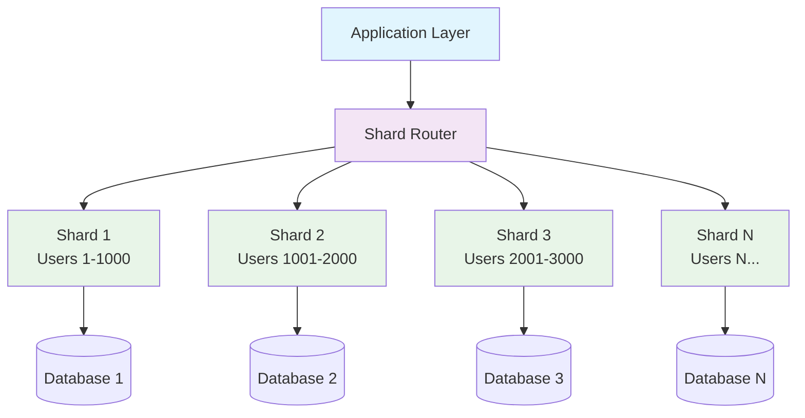
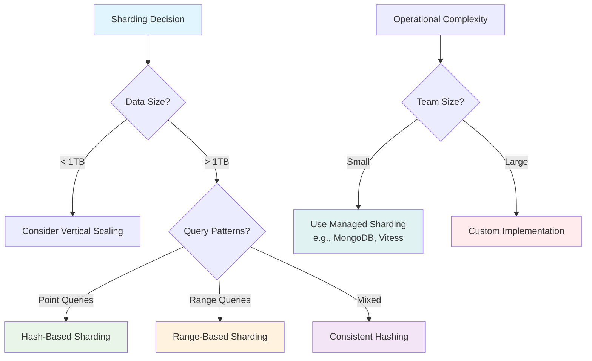

# System Design Fundamentals: Database Sharding

Database sharding is a horizontal partitioning strategy that splits large databases into smaller, more manageable pieces called shards. Each shard is an independent database that contains a subset of the total data, allowing systems to scale beyond single-server limitations.

## What is Sharding?

Sharding distributes data across multiple database instances, with each instance (shard) holding a portion of the total dataset. This approach enables horizontal scaling and improved performance for large-scale applications.



## Sharding Strategies

### 1. Range-Based Sharding

Data is partitioned based on ranges of a shard key value.

```go
// Range-Based Sharding Implementation
package main

import (
    "database/sql"
    "fmt"
    "sync"
    "errors"
    
    _ "github.com/lib/pq"
)

type ShardRange struct {
    Min       int64
    Max       int64
    ShardID   string
    DB        *sql.DB
}

type RangeBasedShardManager struct {
    ranges    []ShardRange
    mutex     sync.RWMutex
}

func NewRangeBasedShardManager() *RangeBasedShardManager {
    return &RangeBasedShardManager{
        ranges: make([]ShardRange, 0),
    }
}

func (sm *RangeBasedShardManager) AddShard(min, max int64, shardID, connectionString string) error {
    db, err := sql.Open("postgres", connectionString)
    if err != nil {
        return fmt.Errorf("failed to connect to shard %s: %w", shardID, err)
    }
    
    // Test connection
    if err := db.Ping(); err != nil {
        return fmt.Errorf("failed to ping shard %s: %w", shardID, err)
    }
    
    sm.mutex.Lock()
    defer sm.mutex.Unlock()
    
    shard := ShardRange{
        Min:     min,
        Max:     max,
        ShardID: shardID,
        DB:      db,
    }
    
    sm.ranges = append(sm.ranges, shard)
    
    fmt.Printf("Added shard %s for range [%d, %d]\n", shardID, min, max)
    return nil
}

func (sm *RangeBasedShardManager) GetShard(key int64) (*ShardRange, error) {
    sm.mutex.RLock()
    defer sm.mutex.RUnlock()
    
    for i := range sm.ranges {
        if key >= sm.ranges[i].Min && key <= sm.ranges[i].Max {
            return &sm.ranges[i], nil
        }
    }
    
    return nil, fmt.Errorf("no shard found for key %d", key)
}

func (sm *RangeBasedShardManager) Insert(userID int64, name, email string) error {
    shard, err := sm.GetShard(userID)
    if err != nil {
        return err
    }
    
    query := `INSERT INTO users (id, name, email) VALUES ($1, $2, $3)`
    _, err = shard.DB.Exec(query, userID, name, email)
    if err != nil {
        return fmt.Errorf("insert failed on shard %s: %w", shard.ShardID, err)
    }
    
    fmt.Printf("Inserted user %d into shard %s\n", userID, shard.ShardID)
    return nil
}

func (sm *RangeBasedShardManager) Query(userID int64) (map[string]interface{}, error) {
    shard, err := sm.GetShard(userID)
    if err != nil {
        return nil, err
    }
    
    query := `SELECT id, name, email FROM users WHERE id = $1`
    row := shard.DB.QueryRow(query, userID)
    
    var id int64
    var name, email string
    
    err = row.Scan(&id, &name, &email)
    if err != nil {
        if err == sql.ErrNoRows {
            return nil, fmt.Errorf("user %d not found", userID)
        }
        return nil, fmt.Errorf("query failed on shard %s: %w", shard.ShardID, err)
    }
    
    result := map[string]interface{}{
        "id":    id,
        "name":  name,
        "email": email,
    }
    
    fmt.Printf("Queried user %d from shard %s\n", userID, shard.ShardID)
    return result, nil
}

func (sm *RangeBasedShardManager) Update(userID int64, updates map[string]interface{}) error {
    shard, err := sm.GetShard(userID)
    if err != nil {
        return err
    }
    
    // Build dynamic update query
    query := "UPDATE users SET "
    args := make([]interface{}, 0)
    argPosition := 1
    
    for key, value := range updates {
        if argPosition > 1 {
            query += ", "
        }
        query += fmt.Sprintf("%s = $%d", key, argPosition)
        args = append(args, value)
        argPosition++
    }
    
    query += fmt.Sprintf(" WHERE id = $%d", argPosition)
    args = append(args, userID)
    
    _, err = shard.DB.Exec(query, args...)
    if err != nil {
        return fmt.Errorf("update failed on shard %s: %w", shard.ShardID, err)
    }
    
    fmt.Printf("Updated user %d on shard %s\n", userID, shard.ShardID)
    return nil
}

func (sm *RangeBasedShardManager) Delete(userID int64) error {
    shard, err := sm.GetShard(userID)
    if err != nil {
        return err
    }
    
    query := `DELETE FROM users WHERE id = $1`
    result, err := shard.DB.Exec(query, userID)
    if err != nil {
        return fmt.Errorf("delete failed on shard %s: %w", shard.ShardID, err)
    }
    
    rowsAffected, _ := result.RowsAffected()
    if rowsAffected == 0 {
        return fmt.Errorf("user %d not found", userID)
    }
    
    fmt.Printf("Deleted user %d from shard %s\n", userID, shard.ShardID)
    return nil
}

// Range query across multiple shards
func (sm *RangeBasedShardManager) RangeQuery(minID, maxID int64) ([]map[string]interface{}, error) {
    sm.mutex.RLock()
    defer sm.mutex.RUnlock()
    
    results := make([]map[string]interface{}, 0)
    var mu sync.Mutex
    var wg sync.WaitGroup
    var queryError error
    
    // Find all shards that overlap with the range
    for _, shard := range sm.ranges {
        if shard.Max < minID || shard.Min > maxID {
            continue
        }
        
        wg.Add(1)
        go func(s ShardRange) {
            defer wg.Done()
            
            query := `SELECT id, name, email FROM users WHERE id >= $1 AND id <= $2`
            rows, err := s.DB.Query(query, minID, maxID)
            if err != nil {
                queryError = err
                return
            }
            defer rows.Close()
            
            for rows.Next() {
                var id int64
                var name, email string
                
                if err := rows.Scan(&id, &name, &email); err != nil {
                    queryError = err
                    return
                }
                
                result := map[string]interface{}{
                    "id":    id,
                    "name":  name,
                    "email": email,
                }
                
                mu.Lock()
                results = append(results, result)
                mu.Unlock()
            }
        }(shard)
    }
    
    wg.Wait()
    
    if queryError != nil {
        return nil, queryError
    }
    
    fmt.Printf("Range query [%d, %d] returned %d results\n", minID, maxID, len(results))
    return results, nil
}

func (sm *RangeBasedShardManager) Close() {
    sm.mutex.Lock()
    defer sm.mutex.Unlock()
    
    for _, shard := range sm.ranges {
        shard.DB.Close()
    }
}
```

### 2. Hash-Based Sharding

Data is distributed using a hash function on the shard key.

```go
// Hash-Based Sharding Implementation
package main

import (
    "crypto/md5"
    "database/sql"
    "encoding/binary"
    "fmt"
    "sync"
)

type HashShard struct {
    ShardID string
    DB      *sql.DB
}

type HashBasedShardManager struct {
    shards      []HashShard
    numShards   int
    mutex       sync.RWMutex
}

func NewHashBasedShardManager(numShards int) *HashBasedShardManager {
    return &HashBasedShardManager{
        shards:    make([]HashShard, numShards),
        numShards: numShards,
    }
}

func (sm *HashBasedShardManager) AddShard(index int, shardID, connectionString string) error {
    if index < 0 || index >= sm.numShards {
        return fmt.Errorf("invalid shard index %d", index)
    }
    
    db, err := sql.Open("postgres", connectionString)
    if err != nil {
        return fmt.Errorf("failed to connect to shard %s: %w", shardID, err)
    }
    
    if err := db.Ping(); err != nil {
        return fmt.Errorf("failed to ping shard %s: %w", shardID, err)
    }
    
    sm.mutex.Lock()
    defer sm.mutex.Unlock()
    
    sm.shards[index] = HashShard{
        ShardID: shardID,
        DB:      db,
    }
    
    fmt.Printf("Added shard %s at index %d\n", shardID, index)
    return nil
}

func (sm *HashBasedShardManager) hashKey(key string) uint32 {
    hash := md5.Sum([]byte(key))
    return binary.BigEndian.Uint32(hash[:4])
}

func (sm *HashBasedShardManager) GetShardIndex(key string) int {
    hashValue := sm.hashKey(key)
    return int(hashValue % uint32(sm.numShards))
}

func (sm *HashBasedShardManager) GetShard(key string) (*HashShard, error) {
    sm.mutex.RLock()
    defer sm.mutex.RUnlock()
    
    index := sm.GetShardIndex(key)
    
    if sm.shards[index].DB == nil {
        return nil, fmt.Errorf("shard at index %d not initialized", index)
    }
    
    return &sm.shards[index], nil
}

func (sm *HashBasedShardManager) Insert(userID, name, email string) error {
    shard, err := sm.GetShard(userID)
    if err != nil {
        return err
    }
    
    query := `INSERT INTO users (user_id, name, email) VALUES ($1, $2, $3)`
    _, err = shard.DB.Exec(query, userID, name, email)
    if err != nil {
        return fmt.Errorf("insert failed on shard %s: %w", shard.ShardID, err)
    }
    
    fmt.Printf("Inserted user %s into shard %s\n", userID, shard.ShardID)
    return nil
}

func (sm *HashBasedShardManager) Query(userID string) (map[string]interface{}, error) {
    shard, err := sm.GetShard(userID)
    if err != nil {
        return nil, err
    }
    
    query := `SELECT user_id, name, email FROM users WHERE user_id = $1`
    row := shard.DB.QueryRow(query, userID)
    
    var id, name, email string
    
    err = row.Scan(&id, &name, &email)
    if err != nil {
        if err == sql.ErrNoRows {
            return nil, fmt.Errorf("user %s not found", userID)
        }
        return nil, fmt.Errorf("query failed on shard %s: %w", shard.ShardID, err)
    }
    
    result := map[string]interface{}{
        "user_id": id,
        "name":    name,
        "email":   email,
    }
    
    fmt.Printf("Queried user %s from shard %s\n", userID, shard.ShardID)
    return result, nil
}

func (sm *HashBasedShardManager) Update(userID string, updates map[string]interface{}) error {
    shard, err := sm.GetShard(userID)
    if err != nil {
        return err
    }
    
    query := "UPDATE users SET "
    args := make([]interface{}, 0)
    argPosition := 1
    
    for key, value := range updates {
        if argPosition > 1 {
            query += ", "
        }
        query += fmt.Sprintf("%s = $%d", key, argPosition)
        args = append(args, value)
        argPosition++
    }
    
    query += fmt.Sprintf(" WHERE user_id = $%d", argPosition)
    args = append(args, userID)
    
    _, err = shard.DB.Exec(query, args...)
    if err != nil {
        return fmt.Errorf("update failed on shard %s: %w", shard.ShardID, err)
    }
    
    fmt.Printf("Updated user %s on shard %s\n", userID, shard.ShardID)
    return nil
}

func (sm *HashBasedShardManager) Delete(userID string) error {
    shard, err := sm.GetShard(userID)
    if err != nil {
        return err
    }
    
    query := `DELETE FROM users WHERE user_id = $1`
    result, err := shard.DB.Exec(query, userID)
    if err != nil {
        return fmt.Errorf("delete failed on shard %s: %w", shard.ShardID, err)
    }
    
    rowsAffected, _ := result.RowsAffected()
    if rowsAffected == 0 {
        return fmt.Errorf("user %s not found", userID)
    }
    
    fmt.Printf("Deleted user %s from shard %s\n", userID, shard.ShardID)
    return nil
}

// Scatter-gather query across all shards
func (sm *HashBasedShardManager) SearchByName(namePattern string) ([]map[string]interface{}, error) {
    sm.mutex.RLock()
    defer sm.mutex.RUnlock()
    
    results := make([]map[string]interface{}, 0)
    var mu sync.Mutex
    var wg sync.WaitGroup
    var queryError error
    
    // Query all shards in parallel
    for _, shard := range sm.shards {
        if shard.DB == nil {
            continue
        }
        
        wg.Add(1)
        go func(s HashShard) {
            defer wg.Done()
            
            query := `SELECT user_id, name, email FROM users WHERE name LIKE $1`
            rows, err := s.DB.Query(query, "%"+namePattern+"%")
            if err != nil {
                queryError = err
                return
            }
            defer rows.Close()
            
            for rows.Next() {
                var userID, name, email string
                
                if err := rows.Scan(&userID, &name, &email); err != nil {
                    queryError = err
                    return
                }
                
                result := map[string]interface{}{
                    "user_id": userID,
                    "name":    name,
                    "email":   email,
                }
                
                mu.Lock()
                results = append(results, result)
                mu.Unlock()
            }
        }(shard)
    }
    
    wg.Wait()
    
    if queryError != nil {
        return nil, queryError
    }
    
    fmt.Printf("Search for '%s' returned %d results across all shards\n", namePattern, len(results))
    return results, nil
}

func (sm *HashBasedShardManager) GetShardDistribution() map[string]int {
    sm.mutex.RLock()
    defer sm.mutex.RUnlock()
    
    distribution := make(map[string]int)
    
    for _, shard := range sm.shards {
        if shard.DB == nil {
            continue
        }
        
        var count int
        query := `SELECT COUNT(*) FROM users`
        err := shard.DB.QueryRow(query).Scan(&count)
        if err == nil {
            distribution[shard.ShardID] = count
        }
    }
    
    return distribution
}

func (sm *HashBasedShardManager) Close() {
    sm.mutex.Lock()
    defer sm.mutex.Unlock()
    
    for _, shard := range sm.shards {
        if shard.DB != nil {
            shard.DB.Close()
        }
    }
}
```

### 3. Consistent Hashing for Sharding

Consistent hashing minimizes data movement when shards are added or removed.

```go
// Consistent Hashing Shard Manager
package main

import (
    "crypto/md5"
    "database/sql"
    "encoding/binary"
    "fmt"
    "sort"
    "sync"
)

type ConsistentHashNode struct {
    ShardID string
    DB      *sql.DB
}

type ConsistentHashRing struct {
    nodes           map[uint32]*ConsistentHashNode
    sortedKeys      []uint32
    virtualNodes    int
    mutex           sync.RWMutex
}

func NewConsistentHashRing(virtualNodes int) *ConsistentHashRing {
    return &ConsistentHashRing{
        nodes:        make(map[uint32]*ConsistentHashNode),
        sortedKeys:   make([]uint32, 0),
        virtualNodes: virtualNodes,
    }
}

func (chr *ConsistentHashRing) hash(key string) uint32 {
    hash := md5.Sum([]byte(key))
    return binary.BigEndian.Uint32(hash[:4])
}

func (chr *ConsistentHashRing) AddNode(shardID, connectionString string) error {
    db, err := sql.Open("postgres", connectionString)
    if err != nil {
        return fmt.Errorf("failed to connect to shard %s: %w", shardID, err)
    }
    
    if err := db.Ping(); err != nil {
        return fmt.Errorf("failed to ping shard %s: %w", shardID, err)
    }
    
    chr.mutex.Lock()
    defer chr.mutex.Unlock()
    
    node := &ConsistentHashNode{
        ShardID: shardID,
        DB:      db,
    }
    
    // Add virtual nodes
    for i := 0; i < chr.virtualNodes; i++ {
        virtualKey := fmt.Sprintf("%s:%d", shardID, i)
        hashValue := chr.hash(virtualKey)
        chr.nodes[hashValue] = node
        chr.sortedKeys = append(chr.sortedKeys, hashValue)
    }
    
    // Sort keys for binary search
    sort.Slice(chr.sortedKeys, func(i, j int) bool {
        return chr.sortedKeys[i] < chr.sortedKeys[j]
    })
    
    fmt.Printf("Added shard %s with %d virtual nodes\n", shardID, chr.virtualNodes)
    return nil
}

func (chr *ConsistentHashRing) RemoveNode(shardID string) error {
    chr.mutex.Lock()
    defer chr.mutex.Unlock()
    
    // Remove all virtual nodes
    keysToRemove := make([]uint32, 0)
    var nodeToClose *sql.DB
    
    for hash, node := range chr.nodes {
        if node.ShardID == shardID {
            keysToRemove = append(keysToRemove, hash)
            nodeToClose = node.DB
        }
    }
    
    if len(keysToRemove) == 0 {
        return fmt.Errorf("shard %s not found", shardID)
    }
    
    // Remove from maps
    for _, key := range keysToRemove {
        delete(chr.nodes, key)
    }
    
    // Rebuild sorted keys
    chr.sortedKeys = make([]uint32, 0, len(chr.nodes))
    for key := range chr.nodes {
        chr.sortedKeys = append(chr.sortedKeys, key)
    }
    sort.Slice(chr.sortedKeys, func(i, j int) bool {
        return chr.sortedKeys[i] < chr.sortedKeys[j]
    })
    
    // Close database connection
    if nodeToClose != nil {
        nodeToClose.Close()
    }
    
    fmt.Printf("Removed shard %s\n", shardID)
    return nil
}

func (chr *ConsistentHashRing) GetNode(key string) (*ConsistentHashNode, error) {
    chr.mutex.RLock()
    defer chr.mutex.RUnlock()
    
    if len(chr.sortedKeys) == 0 {
        return nil, errors.New("no shards available")
    }
    
    hashValue := chr.hash(key)
    
    // Binary search for the first node with hash >= key hash
    idx := sort.Search(len(chr.sortedKeys), func(i int) bool {
        return chr.sortedKeys[i] >= hashValue
    })
    
    // Wrap around if necessary
    if idx >= len(chr.sortedKeys) {
        idx = 0
    }
    
    node := chr.nodes[chr.sortedKeys[idx]]
    return node, nil
}

func (chr *ConsistentHashRing) Insert(userID, name, email string) error {
    node, err := chr.GetNode(userID)
    if err != nil {
        return err
    }
    
    query := `INSERT INTO users (user_id, name, email) VALUES ($1, $2, $3)`
    _, err = node.DB.Exec(query, userID, name, email)
    if err != nil {
        return fmt.Errorf("insert failed on shard %s: %w", node.ShardID, err)
    }
    
    fmt.Printf("Inserted user %s into shard %s\n", userID, node.ShardID)
    return nil
}

func (chr *ConsistentHashRing) Query(userID string) (map[string]interface{}, error) {
    node, err := chr.GetNode(userID)
    if err != nil {
        return nil, err
    }
    
    query := `SELECT user_id, name, email FROM users WHERE user_id = $1`
    row := node.DB.QueryRow(query, userID)
    
    var id, name, email string
    
    err = row.Scan(&id, &name, &email)
    if err != nil {
        if err == sql.ErrNoRows {
            return nil, fmt.Errorf("user %s not found", userID)
        }
        return nil, fmt.Errorf("query failed on shard %s: %w", node.ShardID, err)
    }
    
    result := map[string]interface{}{
        "user_id": id,
        "name":    name,
        "email":   email,
    }
    
    fmt.Printf("Queried user %s from shard %s\n", userID, node.ShardID)
    return result, nil
}

// Simulate resharding - move data when a node is added
func (chr *ConsistentHashRing) RebalanceData(oldShardID, newShardID string) error {
    fmt.Printf("Starting rebalance from %s to %s\n", oldShardID, newShardID)
    
    chr.mutex.RLock()
    var oldNode, newNode *ConsistentHashNode
    
    for _, node := range chr.nodes {
        if node.ShardID == oldShardID {
            oldNode = node
        } else if node.ShardID == newShardID {
            newNode = node
        }
    }
    chr.mutex.RUnlock()
    
    if oldNode == nil || newNode == nil {
        return errors.New("shard not found for rebalancing")
    }
    
    // Get all data from old shard
    query := `SELECT user_id, name, email FROM users`
    rows, err := oldNode.DB.Query(query)
    if err != nil {
        return err
    }
    defer rows.Close()
    
    movedCount := 0
    
    for rows.Next() {
        var userID, name, email string
        if err := rows.Scan(&userID, &name, &email); err != nil {
            return err
        }
        
        // Check if this record should be moved to the new shard
        targetNode, err := chr.GetNode(userID)
        if err != nil {
            continue
        }
        
        if targetNode.ShardID == newShardID {
            // Insert into new shard
            insertQuery := `INSERT INTO users (user_id, name, email) VALUES ($1, $2, $3)`
            _, err = newNode.DB.Exec(insertQuery, userID, name, email)
            if err != nil {
                fmt.Printf("Failed to insert %s into new shard: %v\n", userID, err)
                continue
            }
            
            // Delete from old shard
            deleteQuery := `DELETE FROM users WHERE user_id = $1`
            _, err = oldNode.DB.Exec(deleteQuery, userID)
            if err != nil {
                fmt.Printf("Failed to delete %s from old shard: %v\n", userID, err)
                continue
            }
            
            movedCount++
        }
    }
    
    fmt.Printf("Rebalance complete: moved %d records\n", movedCount)
    return nil
}

func (chr *ConsistentHashRing) GetDistribution() map[string]int {
    chr.mutex.RLock()
    defer chr.mutex.RUnlock()
    
    distribution := make(map[string]int)
    processedShards := make(map[string]bool)
    
    for _, node := range chr.nodes {
        if processedShards[node.ShardID] {
            continue
        }
        processedShards[node.ShardID] = true
        
        var count int
        query := `SELECT COUNT(*) FROM users`
        err := node.DB.QueryRow(query).Scan(&count)
        if err == nil {
            distribution[node.ShardID] = count
        }
    }
    
    return distribution
}

func (chr *ConsistentHashRing) Close() {
    chr.mutex.Lock()
    defer chr.mutex.Unlock()
    
    closedDBs := make(map[*sql.DB]bool)
    
    for _, node := range chr.nodes {
        if !closedDBs[node.DB] {
            node.DB.Close()
            closedDBs[node.DB] = true
        }
    }
}
```

## Shard Key Selection

### Guidelines for Choosing a Shard Key

```go
// Shard Key Analyzer
package main

import (
    "fmt"
    "math"
)

type ShardKeyMetrics struct {
    Cardinality      int     // Number of unique values
    Distribution     float64 // Standard deviation of data distribution
    QueryPatternFit  float64 // 0-1 score of how well key fits query patterns
    GrowthPattern    string  // "uniform", "skewed", "time-based"
}

type ShardKeyAnalyzer struct{}

func NewShardKeyAnalyzer() *ShardKeyAnalyzer {
    return &ShardKeyAnalyzer{}
}

func (ska *ShardKeyAnalyzer) AnalyzeKey(keyName string, metrics ShardKeyMetrics) {
    fmt.Printf("\n=== Shard Key Analysis: %s ===\n", keyName)
    
    score := 0.0
    recommendations := make([]string, 0)
    
    // Analyze cardinality
    if metrics.Cardinality < 100 {
        fmt.Println("❌ Cardinality: LOW (< 100 unique values)")
        recommendations = append(recommendations, "Consider composite key for better distribution")
    } else if metrics.Cardinality < 10000 {
        fmt.Println("⚠️  Cardinality: MEDIUM (100-10k unique values)")
        score += 0.5
        recommendations = append(recommendations, "Monitor hotspots carefully")
    } else {
        fmt.Println("✅ Cardinality: HIGH (> 10k unique values)")
        score += 1.0
    }
    
    // Analyze distribution
    if metrics.Distribution < 0.1 {
        fmt.Println("✅ Distribution: EXCELLENT (very uniform)")
        score += 1.0
    } else if metrics.Distribution < 0.3 {
        fmt.Println("⚠️  Distribution: GOOD (mostly uniform)")
        score += 0.7
    } else {
        fmt.Println("❌ Distribution: POOR (highly skewed)")
        recommendations = append(recommendations, "Consider using hash of the key instead")
    }
    
    // Analyze query pattern fit
    if metrics.QueryPatternFit > 0.8 {
        fmt.Println("✅ Query Pattern Fit: EXCELLENT")
        score += 1.0
    } else if metrics.QueryPatternFit > 0.5 {
        fmt.Println("⚠️  Query Pattern Fit: MODERATE")
        score += 0.5
        recommendations = append(recommendations, "May require scatter-gather queries")
    } else {
        fmt.Println("❌ Query Pattern Fit: POOR")
        recommendations = append(recommendations, "Most queries will hit multiple shards")
    }
    
    // Analyze growth pattern
    fmt.Printf("Growth Pattern: %s\n", metrics.GrowthPattern)
    if metrics.GrowthPattern == "skewed" || metrics.GrowthPattern == "time-based" {
        recommendations = append(recommendations, "Plan for periodic rebalancing")
    }
    
    // Final score
    finalScore := (score / 3.0) * 100
    fmt.Printf("\nOverall Score: %.1f/100\n", finalScore)
    
    if finalScore >= 80 {
        fmt.Println("✅ RECOMMENDED as shard key")
    } else if finalScore >= 50 {
        fmt.Println("⚠️  ACCEPTABLE but with caveats")
    } else {
        fmt.Println("❌ NOT RECOMMENDED as shard key")
    }
    
    if len(recommendations) > 0 {
        fmt.Println("\nRecommendations:")
        for _, rec := range recommendations {
            fmt.Printf("  • %s\n", rec)
        }
    }
}

func (ska *ShardKeyAnalyzer) CompareKeys(keys map[string]ShardKeyMetrics) string {
    fmt.Println("\n=== Comparing Multiple Shard Key Candidates ===\n")
    
    bestKey := ""
    bestScore := 0.0
    
    for keyName, metrics := range keys {
        score := ska.calculateScore(metrics)
        fmt.Printf("%s: Score %.1f/100\n", keyName, score)
        
        if score > bestScore {
            bestScore = score
            bestKey = keyName
        }
    }
    
    fmt.Printf("\nRecommended shard key: %s (score: %.1f/100)\n", bestKey, bestScore)
    return bestKey
}

func (ska *ShardKeyAnalyzer) calculateScore(metrics ShardKeyMetrics) float64 {
    score := 0.0
    
    // Cardinality score
    if metrics.Cardinality > 10000 {
        score += 33.3
    } else if metrics.Cardinality > 100 {
        score += 16.7
    }
    
    // Distribution score
    if metrics.Distribution < 0.1 {
        score += 33.3
    } else if metrics.Distribution < 0.3 {
        score += 23.3
    }
    
    // Query pattern score
    score += metrics.QueryPatternFit * 33.3
    
    return score
}

// Example usage
func main() {
    analyzer := NewShardKeyAnalyzer()
    
    // Analyze individual keys
    userIDMetrics := ShardKeyMetrics{
        Cardinality:     1000000,
        Distribution:    0.05,
        QueryPatternFit: 0.9,
        GrowthPattern:   "uniform",
    }
    analyzer.AnalyzeKey("user_id", userIDMetrics)
    
    emailMetrics := ShardKeyMetrics{
        Cardinality:     1000000,
        Distribution:    0.08,
        QueryPatternFit: 0.6,
        GrowthPattern:   "uniform",
    }
    analyzer.AnalyzeKey("email_hash", emailMetrics)
    
    timestampMetrics := ShardKeyMetrics{
        Cardinality:     50000,
        Distribution:    0.5,
        QueryPatternFit: 0.4,
        GrowthPattern:   "time-based",
    }
    analyzer.AnalyzeKey("created_at", timestampMetrics)
    
    // Compare multiple keys
    candidates := map[string]ShardKeyMetrics{
        "user_id":    userIDMetrics,
        "email_hash": emailMetrics,
        "created_at": timestampMetrics,
    }
    
    analyzer.CompareKeys(candidates)
}
```

## Cross-Shard Operations

### Distributed Transactions Across Shards

```go
// Two-Phase Commit for Cross-Shard Transactions
package main

import (
    "database/sql"
    "fmt"
    "sync"
    "time"
)

type TransactionState string

const (
    TxStatePreparing TransactionState = "preparing"
    TxStatePrepared  TransactionState = "prepared"
    TxStateCommitted TransactionState = "committed"
    TxStateAborted   TransactionState = "aborted"
)

type DistributedTransaction struct {
    TxID              string
    Participants      map[string]*sql.Tx
    State             TransactionState
    CoordinatorShardID string
    mutex             sync.Mutex
}

type DistributedTransactionManager struct {
    shardManager interface{} // Can be any shard manager
    transactions map[string]*DistributedTransaction
    mutex        sync.RWMutex
}

func NewDistributedTransactionManager(sm interface{}) *DistributedTransactionManager {
    return &DistributedTransactionManager{
        shardManager: sm,
        transactions: make(map[string]*DistributedTransaction),
    }
}

func (dtm *DistributedTransactionManager) BeginTransaction(txID string, shardIDs []string) (*DistributedTransaction, error) {
    dtm.mutex.Lock()
    defer dtm.mutex.Unlock()
    
    if _, exists := dtm.transactions[txID]; exists {
        return nil, fmt.Errorf("transaction %s already exists", txID)
    }
    
    dtx := &DistributedTransaction{
        TxID:         txID,
        Participants: make(map[string]*sql.Tx),
        State:        TxStatePreparing,
    }
    
    // Begin transaction on all participating shards
    for _, shardID := range shardIDs {
        // Get shard database (implementation depends on shard manager type)
        // For this example, we'll simulate it
        fmt.Printf("Beginning transaction on shard %s\n", shardID)
        // tx, err := shard.DB.Begin()
        // dtx.Participants[shardID] = tx
    }
    
    dtm.transactions[txID] = dtx
    return dtx, nil
}

func (dtm *DistributedTransactionManager) Prepare(txID string) error {
    dtm.mutex.RLock()
    dtx, exists := dtm.transactions[txID]
    dtm.mutex.RUnlock()
    
    if !exists {
        return fmt.Errorf("transaction %s not found", txID)
    }
    
    dtx.mutex.Lock()
    defer dtx.mutex.Unlock()
    
    fmt.Printf("Phase 1: Preparing transaction %s\n", txID)
    
    // Send prepare message to all participants
    var wg sync.WaitGroup
    errors := make(chan error, len(dtx.Participants))
    
    for shardID, tx := range dtx.Participants {
        wg.Add(1)
        go func(id string, transaction *sql.Tx) {
            defer wg.Done()
            
            // Simulate prepare operation
            fmt.Printf("  Shard %s: PREPARE\n", id)
            time.Sleep(100 * time.Millisecond)
            
            // In real implementation, would execute:
            // _, err := tx.Exec("PREPARE TRANSACTION '" + txID + "'")
            // if err != nil {
            //     errors <- err
            // }
        }(shardID, tx)
    }
    
    wg.Wait()
    close(errors)
    
    // Check for any errors
    for err := range errors {
        if err != nil {
            dtx.State = TxStateAborted
            return fmt.Errorf("prepare failed: %w", err)
        }
    }
    
    dtx.State = TxStatePrepared
    fmt.Printf("Phase 1: All shards prepared successfully\n")
    return nil
}

func (dtm *DistributedTransactionManager) Commit(txID string) error {
    dtm.mutex.RLock()
    dtx, exists := dtm.transactions[txID]
    dtm.mutex.RUnlock()
    
    if !exists {
        return fmt.Errorf("transaction %s not found", txID)
    }
    
    dtx.mutex.Lock()
    defer dtx.mutex.Unlock()
    
    if dtx.State != TxStatePrepared {
        return fmt.Errorf("transaction not in prepared state")
    }
    
    fmt.Printf("Phase 2: Committing transaction %s\n", txID)
    
    // Send commit message to all participants
    var wg sync.WaitGroup
    
    for shardID, tx := range dtx.Participants {
        wg.Add(1)
        go func(id string, transaction *sql.Tx) {
            defer wg.Done()
            
            fmt.Printf("  Shard %s: COMMIT\n", id)
            time.Sleep(50 * time.Millisecond)
            
            // In real implementation:
            // _, err := tx.Exec("COMMIT PREPARED '" + txID + "'")
            // if err != nil {
            //     log.Printf("Commit failed on shard %s: %v", id, err)
            // }
        }(shardID, tx)
    }
    
    wg.Wait()
    
    dtx.State = TxStateCommitted
    fmt.Printf("Phase 2: All shards committed successfully\n")
    
    // Clean up
    dtm.mutex.Lock()
    delete(dtm.transactions, txID)
    dtm.mutex.Unlock()
    
    return nil
}

func (dtm *DistributedTransactionManager) Rollback(txID string) error {
    dtm.mutex.RLock()
    dtx, exists := dtm.transactions[txID]
    dtm.mutex.RUnlock()
    
    if !exists {
        return fmt.Errorf("transaction %s not found", txID)
    }
    
    dtx.mutex.Lock()
    defer dtx.mutex.Unlock()
    
    fmt.Printf("Rolling back transaction %s\n", txID)
    
    var wg sync.WaitGroup
    
    for shardID, tx := range dtx.Participants {
        wg.Add(1)
        go func(id string, transaction *sql.Tx) {
            defer wg.Done()
            
            fmt.Printf("  Shard %s: ROLLBACK\n", id)
            
            if dtx.State == TxStatePrepared {
                // Rollback prepared transaction
                // _, err := tx.Exec("ROLLBACK PREPARED '" + txID + "'")
            } else {
                // Regular rollback
                // tx.Rollback()
            }
        }(shardID, tx)
    }
    
    wg.Wait()
    
    dtx.State = TxStateAborted
    
    // Clean up
    dtm.mutex.Lock()
    delete(dtm.transactions, txID)
    dtm.mutex.Unlock()
    
    return nil
}

// Example: Transfer money between users on different shards
func (dtm *DistributedTransactionManager) TransferMoney(fromUserID, toUserID string, amount float64) error {
    txID := fmt.Sprintf("transfer-%d", time.Now().UnixNano())
    
    // Determine which shards are involved
    shardIDs := []string{"shard-1", "shard-2"} // Simplified
    
    // Begin distributed transaction
    dtx, err := dtm.BeginTransaction(txID, shardIDs)
    if err != nil {
        return err
    }
    
    // Execute operations on each shard
    // ... (business logic would go here)
    
    // Prepare phase
    err = dtm.Prepare(txID)
    if err != nil {
        dtm.Rollback(txID)
        return err
    }
    
    // Commit phase
    err = dtm.Commit(txID)
    if err != nil {
        // At this point, some shards might have committed
        // This is where you'd need recovery mechanisms
        return err
    }
    
    fmt.Printf("Money transfer completed successfully\n")
    return nil
}

func main() {
    fmt.Println("=== Distributed Transaction Demo ===\n")
    
    dtm := NewDistributedTransactionManager(nil)
    
    // Simulate a cross-shard transaction
    err := dtm.TransferMoney("user1", "user2", 100.0)
    if err != nil {
        fmt.Printf("Transaction failed: %v\n", err)
    }
}
```

## Shard Management and Rebalancing

```go
// Shard Manager with Rebalancing
package main

import (
    "fmt"
    "sync"
    "time"
)

type ShardStatus struct {
    ShardID       string
    IsHealthy     bool
    RecordCount   int64
    StorageUsedGB float64
    CPUUsage      float64
    LastChecked   time.Time
}

type ShardManagerWithRebalancing struct {
    shards          map[string]*ShardStatus
    thresholds      RebalanceThresholds
    mutex           sync.RWMutex
    isRebalancing   bool
    rebalanceMutex  sync.Mutex
}

type RebalanceThresholds struct {
    MaxStorageGB      float64
    MaxRecordCount    int64
    SkewThreshold     float64 // Maximum allowed difference in distribution
}

func NewShardManagerWithRebalancing() *ShardManagerWithRebalancing {
    return &ShardManagerWithRebalancing{
        shards: make(map[string]*ShardStatus),
        thresholds: RebalanceThresholds{
            MaxStorageGB:   1000.0,
            MaxRecordCount: 10000000,
            SkewThreshold:  0.3, // 30% skew allowed
        },
    }
}

func (sm *ShardManagerWithRebalancing) AddShard(shardID string) {
    sm.mutex.Lock()
    defer sm.mutex.Unlock()
    
    sm.shards[shardID] = &ShardStatus{
        ShardID:       shardID,
        IsHealthy:     true,
        RecordCount:   0,
        StorageUsedGB: 0,
        CPUUsage:      0,
        LastChecked:   time.Now(),
    }
    
    fmt.Printf("Added shard %s\n", shardID)
}

func (sm *ShardManagerWithRebalancing) UpdateShardMetrics(shardID string, recordCount int64, storageGB, cpuUsage float64) {
    sm.mutex.Lock()
    defer sm.mutex.Unlock()
    
    if shard, exists := sm.shards[shardID]; exists {
        shard.RecordCount = recordCount
        shard.StorageUsedGB = storageGB
        shard.CPUUsage = cpuUsage
        shard.LastChecked = time.Now()
    }
}

func (sm *ShardManagerWithRebalancing) CheckRebalanceNeeded() bool {
    sm.mutex.RLock()
    defer sm.mutex.RUnlock()
    
    if len(sm.shards) < 2 {
        return false
    }
    
    var totalRecords int64
    var totalStorage float64
    var maxRecords int64
    var minRecords int64 = 1<<63 - 1
    
    for _, shard := range sm.shards {
        if !shard.IsHealthy {
            continue
        }
        
        totalRecords += shard.RecordCount
        totalStorage += shard.StorageUsedGB
        
        if shard.RecordCount > maxRecords {
            maxRecords = shard.RecordCount
        }
        if shard.RecordCount < minRecords {
            minRecords = shard.RecordCount
        }
        
        // Check if any shard exceeds thresholds
        if shard.RecordCount > sm.thresholds.MaxRecordCount {
            fmt.Printf("⚠️  Shard %s exceeds max record count: %d > %d\n", 
                shard.ShardID, shard.RecordCount, sm.thresholds.MaxRecordCount)
            return true
        }
        
        if shard.StorageUsedGB > sm.thresholds.MaxStorageGB {
            fmt.Printf("⚠️  Shard %s exceeds max storage: %.2fGB > %.2fGB\n", 
                shard.ShardID, shard.StorageUsedGB, sm.thresholds.MaxStorageGB)
            return true
        }
    }
    
    // Check for skew in distribution
    avgRecords := float64(totalRecords) / float64(len(sm.shards))
    maxSkew := float64(maxRecords-minRecords) / avgRecords
    
    if maxSkew > sm.thresholds.SkewThreshold {
        fmt.Printf("⚠️  Data skew detected: %.2f%% > %.2f%%\n", 
            maxSkew*100, sm.thresholds.SkewThreshold*100)
        return true
    }
    
    return false
}

func (sm *ShardManagerWithRebalancing) TriggerRebalance() error {
    sm.rebalanceMutex.Lock()
    defer sm.rebalanceMutex.Unlock()
    
    if sm.isRebalancing {
        return fmt.Errorf("rebalancing already in progress")
    }
    
    sm.isRebalancing = true
    defer func() { sm.isRebalancing = false }()
    
    fmt.Println("\n🔄 Starting shard rebalancing...")
    
    // Step 1: Calculate target distribution
    sm.mutex.RLock()
    totalRecords := int64(0)
    healthyShards := 0
    
    for _, shard := range sm.shards {
        if shard.IsHealthy {
            totalRecords += shard.RecordCount
            healthyShards++
        }
    }
    sm.mutex.RUnlock()
    
    if healthyShards == 0 {
        return fmt.Errorf("no healthy shards available")
    }
    
    targetRecordsPerShard := totalRecords / int64(healthyShards)
    fmt.Printf("Target records per shard: %d\n", targetRecordsPerShard)
    
    // Step 2: Identify source and destination shards
    rebalancePlan := sm.createRebalancePlan(targetRecordsPerShard)
    
    // Step 3: Execute rebalancing
    for _, move := range rebalancePlan {
        fmt.Printf("Moving %d records from %s to %s\n", 
            move.RecordCount, move.FromShard, move.ToShard)
        
        // Simulate data movement
        time.Sleep(100 * time.Millisecond)
        
        // Update metrics
        sm.mutex.Lock()
        if fromShard, exists := sm.shards[move.FromShard]; exists {
            fromShard.RecordCount -= move.RecordCount
        }
        if toShard, exists := sm.shards[move.ToShard]; exists {
            toShard.RecordCount += move.RecordCount
        }
        sm.mutex.Unlock()
    }
    
    fmt.Println("✅ Rebalancing completed successfully")
    return nil
}

type RebalanceMove struct {
    FromShard   string
    ToShard     string
    RecordCount int64
}

func (sm *ShardManagerWithRebalancing) createRebalancePlan(targetRecords int64) []RebalanceMove {
    sm.mutex.RLock()
    defer sm.mutex.RUnlock()
    
    plan := make([]RebalanceMove, 0)
    
    // Identify over-loaded and under-loaded shards
    overLoaded := make([]string, 0)
    underLoaded := make([]string, 0)
    
    for shardID, shard := range sm.shards {
        if !shard.IsHealthy {
            continue
        }
        
        if shard.RecordCount > targetRecords*110/100 { // 10% tolerance
            overLoaded = append(overLoaded, shardID)
        } else if shard.RecordCount < targetRecords*90/100 {
            underLoaded = append(underLoaded, shardID)
        }
    }
    
    // Create moves from over-loaded to under-loaded shards
    for _, fromShardID := range overLoaded {
        fromShard := sm.shards[fromShardID]
        excess := fromShard.RecordCount - targetRecords
        
        for _, toShardID := range underLoaded {
            if excess <= 0 {
                break
            }
            
            toShard := sm.shards[toShardID]
            deficit := targetRecords - toShard.RecordCount
            
            if deficit <= 0 {
                continue
            }
            
            moveCount := excess
            if deficit < excess {
                moveCount = deficit
            }
            
            plan = append(plan, RebalanceMove{
                FromShard:   fromShardID,
                ToShard:     toShardID,
                RecordCount: moveCount,
            })
            
            excess -= moveCount
        }
    }
    
    return plan
}

func (sm *ShardManagerWithRebalancing) MonitorAndRebalance(checkInterval time.Duration) {
    ticker := time.NewTicker(checkInterval)
    defer ticker.Stop()
    
    for range ticker.C {
        if sm.CheckRebalanceNeeded() {
            fmt.Println("\n⚠️  Rebalancing required")
            if err := sm.TriggerRebalance(); err != nil {
                fmt.Printf("Rebalancing failed: %v\n", err)
            }
        } else {
            fmt.Println("✅ Shards are balanced")
        }
        
        sm.PrintShardStatus()
    }
}

func (sm *ShardManagerWithRebalancing) PrintShardStatus() {
    sm.mutex.RLock()
    defer sm.mutex.RUnlock()
    
    fmt.Println("\n📊 Current Shard Status:")
    fmt.Println("----------------------------------------")
    
    for shardID, shard := range sm.shards {
        status := "✅"
        if !shard.IsHealthy {
            status = "❌"
        }
        
        fmt.Printf("%s %s: Records=%d, Storage=%.2fGB, CPU=%.1f%%\n",
            status, shardID, shard.RecordCount, shard.StorageUsedGB, shard.CPUUsage)
    }
    
    fmt.Println("----------------------------------------")
}

func main() {
    fmt.Println("=== Shard Rebalancing Demo ===\n")
    
    manager := NewShardManagerWithRebalancing()
    
    // Add shards
    manager.AddShard("shard-1")
    manager.AddShard("shard-2")
    manager.AddShard("shard-3")
    
    // Simulate uneven data distribution
    manager.UpdateShardMetrics("shard-1", 15000, 150.0, 45.0)
    manager.UpdateShardMetrics("shard-2", 5000, 50.0, 20.0)
    manager.UpdateShardMetrics("shard-3", 3000, 30.0, 15.0)
    
    manager.PrintShardStatus()
    
    // Check if rebalancing is needed
    if manager.CheckRebalanceNeeded() {
        manager.TriggerRebalance()
    }
    
    manager.PrintShardStatus()
}
```

## Best Practices and Trade-offs

### Sharding Decision Matrix



## Conclusion

Database sharding is a powerful technique for achieving horizontal scalability. Key takeaways:

- **Choose the right sharding strategy**: Range-based for range queries, hash-based for uniform distribution, consistent hashing for dynamic scaling
- **Select shard keys carefully**: High cardinality, uniform distribution, and query pattern alignment are crucial
- **Plan for cross-shard operations**: Implement distributed transactions or design around single-shard operations
- **Monitor and rebalance**: Regularly check for hotspots and data skew, implement automated rebalancing
- **Consider alternatives first**: Vertical scaling, read replicas, and caching may solve your problem without sharding complexity
- **Use proven tools**: Consider managed solutions like Vitess, Citus, or MongoDB sharding before building custom solutions

Sharding adds significant operational complexity, so implement it only when other scaling approaches are exhausted.