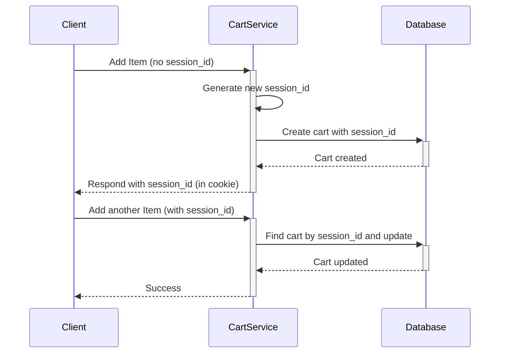
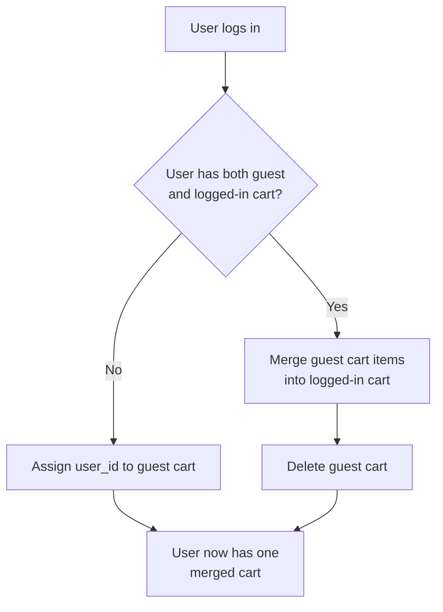

The shopping cart is the heart of any e-commerce website. It's the virtual basket where users collect items they intend to purchase. While it seems like a simple feature, designing a shopping cart system that is scalable, persistent, and provides a seamless user experience presents several interesting challenges.

This article explores the key design considerations for building a robust shopping cart service, including data modeling, managing carts for both guest and logged-in users, and handling potential race conditions.

### Core Requirements of a Shopping Cart

A good shopping cart system must satisfy several requirements:
1.  **Persistence**: A user's cart should persist between sessions. If a user adds items to their cart, closes the browser, and comes back a day later, their items should still be there.
2.  **Guest & Logged-in Experience**: The system must handle carts for both anonymous (guest) users and authenticated (logged-in) users.
3.  **Seamless Transition**: When a guest user with items in their cart logs in or creates an account, their cart should be seamlessly merged with any existing cart they might have had.
4.  **Scalability**: The system must handle millions of concurrent carts, especially during peak shopping seasons like Black Friday.
5.  **Accuracy**: The cart must accurately reflect the items, quantities, and prices.

### Data Modeling the Shopping Cart

The choice of data model is a critical first step. A shopping cart is essentially a collection of items, each with a specific quantity and price at the time it was added.

A common approach is to use two main tables in a relational database or two document types in a NoSQL database: `Carts` and `CartItems`.

**Relational Schema:**

*   **`carts` table**:
    *   `cart_id` (Primary Key, e.g., UUID)
    *   `user_id` (Foreign Key, nullable for guest carts)
    *   `session_id` (String, for identifying guest carts)
    *   `created_at` (Timestamp)
    *   `updated_at` (Timestamp)

*   **`cart_items` table**:
    *   `cart_item_id` (Primary Key)
    *   `cart_id` (Foreign Key to `carts`)
    *   `product_id` (String/UUID)
    *   `quantity` (Integer)
    *   `price_at_add` (Decimal, to lock the price)
    *   `added_at` (Timestamp)

**Why store `price_at_add`?**
Product prices can change. Storing the price at the moment the user adds the item to the cart prevents surprises at checkout. The system should, however, notify the user if the price has changed since they added it.

**NoSQL (Document) Model:**

In a NoSQL database like MongoDB or DynamoDB, you might model the cart as a single document, embedding the items within it.

```json
{
  "cart_id": "uuid-1234",
  "user_id": "user-abc", // null for guests
  "session_id": "session-xyz",
  "updated_at": "2024-11-04T10:00:00Z",
  "items": [
    {
      "product_id": "prod-001",
      "quantity": 2,
      "price_at_add": 19.99
    },
    {
      "product_id": "prod-002",
      "quantity": 1,
      "price_at_add": 49.99
    }
  ]
}
```
This model is often preferred for its performance, as you can retrieve an entire cart in a single read operation. However, it can have limitations on the maximum document size, which might be a concern for users who add hundreds of items to their cart.

### Managing Guest vs. Logged-in Carts

This is the most interesting part of the design. How do you link a cart to a user who hasn't identified themselves yet?

**1. The Guest Cart Flow:**
*   When a new, anonymous user first visits the site and adds an item to their cart, the system has no `user_id`.
*   The backend generates a unique `session_id` (a secure, random string) and stores it in a cookie or in the browser's local storage.
*   A new cart is created in the database with a `null` `user_id` and the generated `session_id`.
*   For all subsequent actions (adding/removing items), the client sends this `session_id` with its requests, allowing the backend to retrieve the correct cart.

**Architecture for Guest Carts:**


**2. The Login/Merge Flow:**
This is the crucial transition point. A guest user with items in their cart decides to log in.

*   **Scenario A: The user has no pre-existing cart.**
    1.  The user logs in. The client now has both a `session_id` (from the guest session) and a `user_id`.
    2.  The client makes a request to a `/cart/merge` endpoint, providing both IDs.
    3.  The backend finds the guest cart using the `session_id` and simply updates its `user_id` field. The `session_id` can now be cleared. The guest cart has been "claimed" by the logged-in user.

*   **Scenario B: The user has both a guest cart AND an old, logged-in cart.**
    1.  The user logs in. The backend now knows about two carts for this user: the current guest cart (identified by `session_id`) and a persistent cart from a previous session (identified by `user_id`).
    2.  The system must define a **merge strategy**. A common strategy is to merge the guest cart *into* the logged-in cart.
    3.  The backend retrieves both carts. It iterates through the items in the guest cart and adds them to the logged-in cart. If an item already exists, it might sum the quantities.
    4.  After the merge is complete, the guest cart is deleted.

**Merge Logic Diagram:**


### Handling Concurrency and Race Conditions

What happens if a user has the same shopping cart open in two different browser tabs and tries to update the quantity of the same item at the same time?

*   **Tab 1**: `UPDATE cart_items SET quantity = 2 WHERE item_id = 'item-xyz'`
*   **Tab 2**: `UPDATE cart_items SET quantity = 3 WHERE item_id = 'item-xyz'`

If these run concurrently, the final quantity could be 2 or 3, depending on which update finishes last. This is a classic **last-write-wins** problem, which is often undesirable.

**Solutions:**

1.  **Optimistic Locking**: This is a common and effective pattern.
    *   Add a `version` number column to the `carts` or `cart_items` table.
    *   When a client fetches the cart, it also receives the current `version` number.
    *   When it sends an update, it includes the `version` number it has.
    *   The `UPDATE` query becomes: `UPDATE cart_items SET quantity = 3, version = version + 1 WHERE item_id = 'item-xyz' AND version = <client_version>`.
    *   This query will only succeed if the `version` number in the database still matches the one the client has. If another process updated the item in the meantime, the version number will have changed, and the update will fail (affecting 0 rows).
    *   The client that receives the failure can then re-fetch the latest cart data and either retry the operation or inform the user that the cart was updated elsewhere.

2.  **Atomic Operations**: Instead of setting a new quantity, use atomic increments/decrements.
    *   Instead of `SET quantity = 3`, the client could send a request to `increment quantity by 1`.
    *   The backend would then run `UPDATE cart_items SET quantity = quantity + 1 WHERE item_id = 'item-xyz'`.
    *   This is safer but less flexible, as it doesn't handle all types of updates.

### Go Example: A Simple Cart Service

This conceptual Go code outlines the main components of a cart service, focusing on the data structures and the merge logic.

```go
package main

import (
    "fmt"
    "log"
    "sync"
)

// Using the NoSQL document model for this example
type CartItem struct {
    ProductID   string  `json:"product_id"`
    Quantity    int     `json:"quantity"`
    PriceAtAdd  float64 `json:"price_at_add"`
}

type Cart struct {
    CartID    string     `json:"cart_id"`
    UserID    string     `json:"user_id,omitempty"`
    SessionID string     `json:"session_id,omitempty"`
    Items     map[string]CartItem `json:"items"`
}

// In-memory store to simulate a database
var cartStore = struct {
    sync.RWMutex
    carts map[string]*Cart
}{carts: make(map[string]*Cart)}

// GetCart retrieves a cart by user or session ID.
func GetCart(userID, sessionID string) *Cart {
    cartStore.RLock()
    defer cartStore.RUnlock()

    // Logged-in user takes precedence
    if userID != "" {
        for _, c := range cartStore.carts {
            if c.UserID == userID {
                return c
            }
        }
    }
    
    if sessionID != "" {
        for _, c := range cartStore.carts {
            if c.SessionID == sessionID {
                return c
            }
        }
    }
    return nil
}

// MergeCarts handles the logic of merging a guest cart into a user's cart.
func MergeCarts(userID, sessionID string) (*Cart, error) {
    log.Printf("Attempting to merge cart for user '%s' and session '%s'", userID, sessionID)

    userCart := GetCart(userID, "")
    guestCart := GetCart("", sessionID)

    if guestCart == nil {
        log.Println("No guest cart to merge.")
        return userCart, nil
    }

    if userCart == nil {
        log.Println("No existing user cart. Claiming guest cart.")
        cartStore.Lock()
        guestCart.UserID = userID
        guestCart.SessionID = "" // Clear session ID
        cartStore.Unlock()
        return guestCart, nil
    }

    log.Println("Both user and guest carts exist. Merging...")
    cartStore.Lock()
    defer cartStore.Unlock()

    for prodID, guestItem := range guestCart.Items {
        if userItem, exists := userCart.Items[prodID]; exists {
            // Item exists in both carts, sum quantities
            userItem.Quantity += guestItem.Quantity
            userCart.Items[prodID] = userItem
            log.Printf("Merged item %s: new quantity %d", prodID, userItem.Quantity)
        } else {
            // Item only in guest cart, add it to user cart
            userCart.Items[prodID] = guestItem
            log.Printf("Added new item %s from guest cart", prodID)
        }
    }

    // Delete the old guest cart
    delete(cartStore.carts, guestCart.CartID)
    log.Printf("Deleted guest cart %s", guestCart.CartID)

    return userCart, nil
}

func main() {
    // 1. A guest user adds items to their cart
    guestCart := &Cart{
        CartID:    "cart-guest-1",
        SessionID: "session-abc",
        Items:     map[string]CartItem{"prod-001": {ProductID: "prod-001", Quantity: 1, PriceAtAdd: 10.0}},
    }
    cartStore.carts[guestCart.CartID] = guestCart
    fmt.Printf("Initial guest cart: %+v\n\n", guestCart)

    // 2. The user previously had a logged-in cart from another device
    userCart := &Cart{
        CartID: "cart-user-1",
        UserID: "user-123",
        Items:  map[string]CartItem{
            "prod-001": {ProductID: "prod-001", Quantity: 1, PriceAtAdd: 10.0},
            "prod-002": {ProductID: "prod-002", Quantity: 1, PriceAtAdd: 50.0},
        },
    }
    cartStore.carts[userCart.CartID] = userCart
    fmt.Printf("Initial user cart: %+v\n\n", userCart)

    // 3. The guest user now logs in as "user-123"
    finalCart, _ := MergeCarts("user-123", "session-abc")
    fmt.Printf("\nFinal merged cart: %+v\n", finalCart)
    fmt.Printf("Total carts in store: %d\n", len(cartStore.carts))
}
```

### Conclusion

Designing a shopping cart system requires careful consideration of the user journey, especially the transition from a guest to a logged-in user. By using a flexible data model, managing sessions effectively, and implementing a clear merge strategy, you can provide a seamless experience. Furthermore, employing techniques like optimistic locking is crucial for handling concurrency and ensuring data integrity in a high-traffic e-commerce environment.