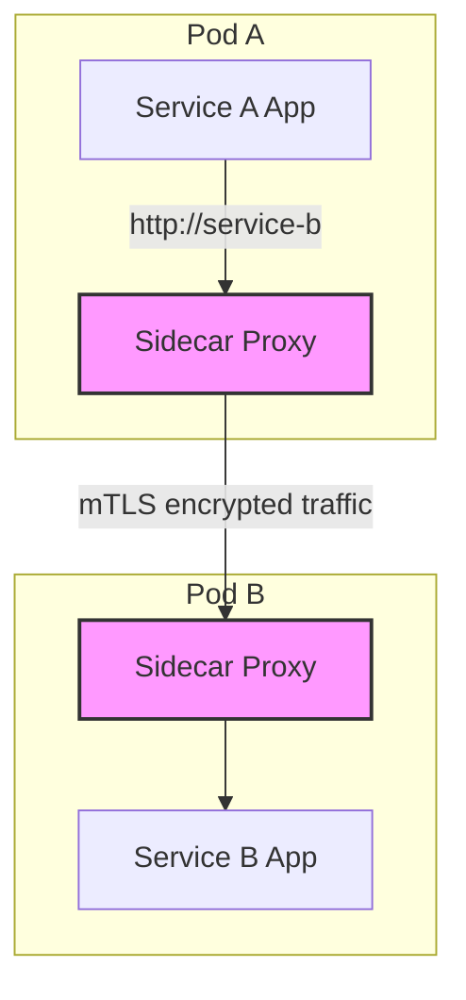

In a microservices architecture, individual services need to handle a host of complex networking tasks: service discovery, retries, timeouts, circuit breaking, security (TLS), and observability (metrics and tracing). Implementing this logic directly within each service leads to a nightmare of boilerplate code, duplicated effort, and language-specific library maintenance.

The **Sidecar Pattern** provides an elegant solution to this problem. It involves deploying a companion container (the "sidecar") alongside each service container in a shared execution context (like a Kubernetes Pod). This sidecar is a proxy that intercepts all network traffic to and from the main service, abstracting away the complex networking logic. It is the foundational pattern that makes the service mesh possible.

### How Does the Sidecar Pattern Work?

The key idea is that your main application container contains only the business logic. It knows nothing about the complex network environment it's running in. When it wants to communicate with another service, it makes a simple, unencrypted call to what it thinks is the target service (e.g., `http://service-b`).

However, this call is intercepted by the sidecar proxy running in the same pod. The sidecar then handles all the heavy lifting:

1.  **Service Discovery**: Finds the actual network location of a healthy `service-b` instance.
2.  **Load Balancing**: If there are multiple instances of `service-b`, it intelligently balances the load between them.
3.  **Security**: It can automatically upgrade the simple HTTP call to a secure, mutually authenticated TLS (mTLS) connection.
4.  **Reliability**: It can automatically retry the request if it fails, or open a circuit breaker if `service-b` is unresponsive.
5.  **Observability**: It records detailed metrics, logs, and traces for the call before sending it on.

The response from `service-b` follows the same path in reverse, flowing through the recipient's sidecar and then the original caller's sidecar before finally reaching the main application.

**Diagram: Sidecar Traffic Interception**



### Benefits of the Sidecar Pattern

1.  **Separation of Concerns**: It cleanly separates business logic from networking and observability logic. Your application developers can focus on writing features, while a platform team can focus on managing the service mesh and its sidecars.
2.  **Language Independence**: The networking logic is implemented once in the sidecar proxy (e.g., Envoy, Linkerd-proxy). Your microservices can be written in any language (Go, Python, Java, etc.) without needing language-specific libraries for resilience or security. This is a huge advantage in a polyglot environment.
3.  **Reduced Code Duplication**: Instead of every service implementing its own retry or timeout logic, this is handled consistently by the sidecar.
4.  **Centralized Management**: Because the sidecars are configured by a central control plane (in a service mesh), you can update routing rules, security policies, and telemetry configuration across your entire fleet of services without redeploying the applications themselves.
5.  **Consistency**: It ensures that policies for security, reliability, and observability are applied uniformly to all services in the mesh.

### Conceptual Go Example

Let's illustrate how a service might interact with its sidecar. In this conceptual example, our `PaymentService` wants to call a `FraudCheckService`. The `PaymentService` simply makes a call to `localhost`, where it expects the sidecar to be listening.

```go
package main

import (
	"fmt"
	"io/ioutil"
	"net/http"
	"time"
)

// This represents our main application container (e.g., PaymentService).
func main() {
	// The application is configured to talk to its sidecar, which runs on localhost.
	// The sidecar is responsible for finding and securely connecting to the FraudCheckService.
	sidecarAddress := "http://localhost:9000"
	
	// The application thinks it's calling "fraud-check-service", but the sidecar
	// will intercept this and handle the actual routing.
	targetService := "fraud-check-service"
	
	// Simulate making a request every 5 seconds.
	for {
		fmt.Println("PaymentService: Attempting to call FraudCheckService...")
		
		// Create a request that the sidecar will handle.
		req, err := http.NewRequest("POST", fmt.Sprintf("%s/check", sidecarAddress), nil)
		if err != nil {
			fmt.Printf("Error creating request: %v\n", err)
			time.Sleep(5 * time.Second)
			continue
		}
		
		// The application tells the sidecar which service it actually wants to reach.
		// In a real service mesh, this is often done via host headers or other metadata.
		req.Host = targetService
		
		client := &http.Client{Timeout: 2 * time.Second}
		resp, err := client.Do(req)
		if err != nil {
			// This error could be from the sidecar itself (e.g., circuit breaker open).
			fmt.Printf("Error calling service via sidecar: %v\n", err)
		} else {
			body, _ := ioutil.ReadAll(resp.Body)
			fmt.Printf("PaymentService: Received response: StatusCode=%d, Body=%s\n", resp.StatusCode, string(body))
			resp.Body.Close()
		}
		
		time.Sleep(5 * time.Second)
	}
}

// --- In a separate process, the Sidecar Proxy would be running ---
// Below is a mock of what the sidecar and the downstream service might do.

func startMockSidecarAndFraudService() {
	// Mock FraudCheckService
	http.HandleFunc("/fraud-check", func(w http.ResponseWriter, r *http.Request) {
		fmt.Println("  -> FraudCheckService: Received request, processing...")
		w.WriteHeader(http.StatusOK)
		w.Write([]byte(`{"status": "approved"}`))
	})
	go http.ListenAndServe(":9001", nil) // Runs on port 9001

	// Mock Sidecar Proxy
	http.HandleFunc("/check", func(w http.ResponseWriter, r *http.Request) {
		target := r.Host
		fmt.Printf("  -> Sidecar: Intercepted request for host '%s'\n", target)
		
		// Here, the sidecar would do service discovery, load balancing, mTLS, etc.
		// For our mock, we'll just call the real service directly.
		if target == "fraud-check-service" {
			resp, err := http.Post("http://localhost:9001/fraud-check", "application/json", r.Body)
			if err != nil {
				http.Error(w, "Upstream service unavailable", http.StatusServiceUnavailable)
				return
			}
			defer resp.Body.Close()
			
			body, _ := ioutil.ReadAll(resp.Body)
			w.WriteHeader(resp.StatusCode)
			w.Write(body)
		} else {
			http.Error(w, "Service not found", http.StatusNotFound)
		}
	})
	// The sidecar listens on a port that the main app calls.
	http.ListenAndServe(":9000", nil)
}

/*
To run this conceptual example:
1. Create a new Go project.
2. Put the main() function in one file.
3. Put startMockSidecarAndFraudService() in another file and call it from a separate main().
4. Run both main programs. You will see the PaymentService logging its calls,
   which are intercepted by the mock sidecar and forwarded to the mock fraud service.
*/
```

### Drawbacks and Considerations

-   **Increased Latency**: Every call now involves two extra network hops (service -> sidecar -> other sidecar -> other service). While these hops are on the local loopback interface and are very fast, they do add a small amount of latency.
-   **Resource Overhead**: Each sidecar consumes its own CPU and memory resources. Deploying a sidecar for every service instance can significantly increase the overall resource consumption of your cluster.
-   **Operational Complexity**: The sidecar pattern is almost always implemented as part of a larger service mesh. This adds a new, complex piece of infrastructure that needs to be deployed, managed, and monitored.

### Conclusion

The sidecar pattern is a powerful enabler for modern microservices architectures. By abstracting complex networking concerns out of the application and into a co-located proxy, it allows for greater consistency, security, and observability, all while freeing developers to focus on business logic. While it introduces some latency and resource overhead, the benefits of language independence and centralized control often make it an essential pattern for managing the complexity of a large-scale service mesh. It is the engine that drives the data plane and makes the promises of a service mesh a reality.