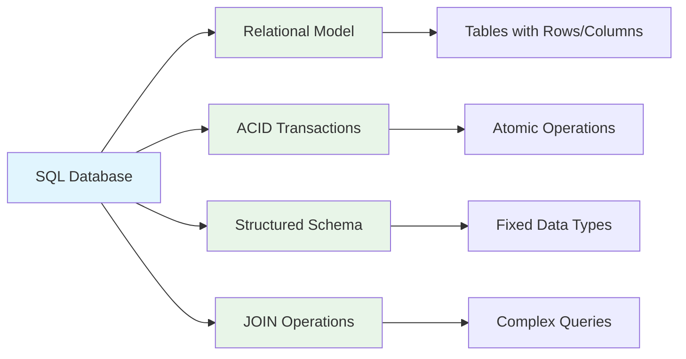
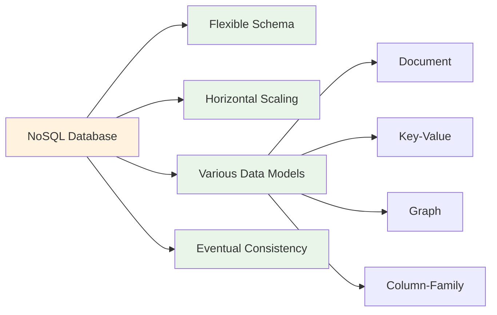
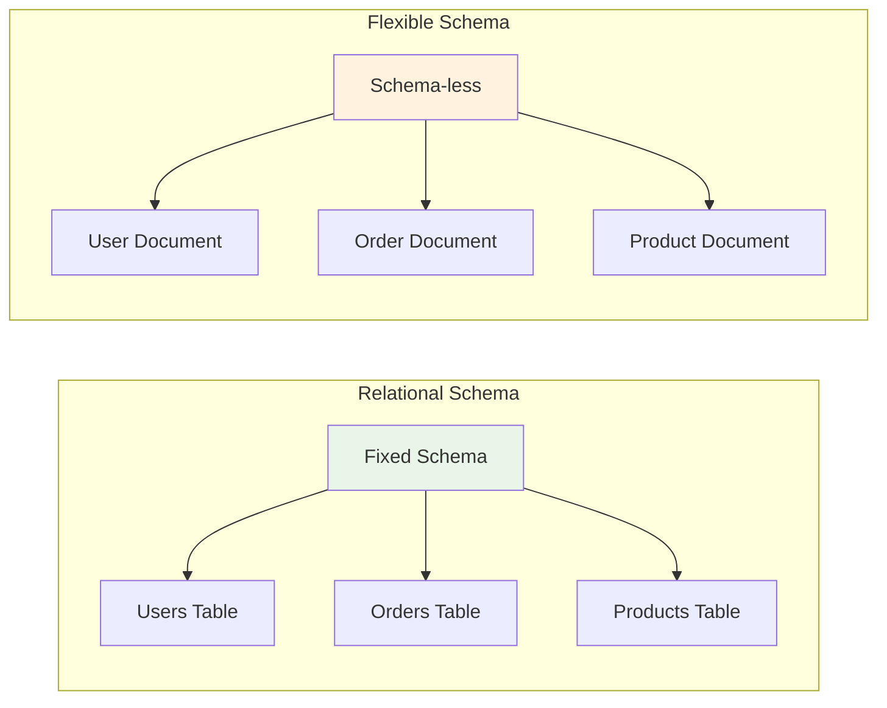
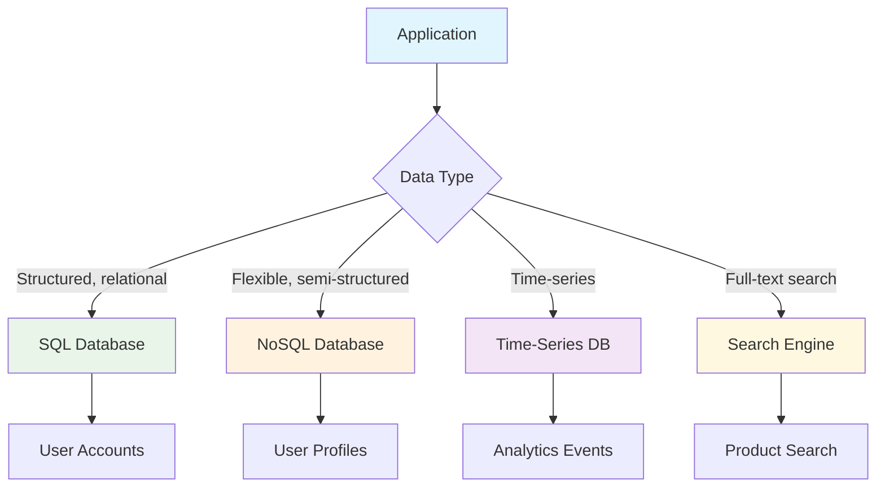

# System Design: SQL vs NoSQL - Choosing the Right Database

Choosing the right database technology is one of the most critical decisions in system design. The choice between SQL (relational) and NoSQL (non-relational) databases impacts your application's performance, scalability, and development approach. Understanding the fundamental differences and trade-offs between these two paradigms is essential for building robust, scalable systems.

## SQL Databases Overview

SQL (Structured Query Language) databases have been the foundation of data storage for decades. They follow the relational model, where data is organized into tables with defined schemas and relationships.

### Key Characteristics

- **Schema**: Predefined schema with fixed data types
- **ACID Compliance**: Transactions follow ACID properties (Atomicity, Consistency, Isolation, Durability)
- **Joins**: Support for complex queries using JOIN operations
- **Consistency**: Strong consistency guarantees
- **Maturity**: Well-established tools, documentation, and expertise



### Common SQL Databases
- PostgreSQL
- MySQL
- Oracle
- Microsoft SQL Server
- SQLite

### SQL Code Example

```sql
-- Create tables for an e-commerce system
CREATE TABLE users (
    id SERIAL PRIMARY KEY,
    email VARCHAR(255) UNIQUE NOT NULL,
    name VARCHAR(255) NOT NULL,
    created_at TIMESTAMP DEFAULT CURRENT_TIMESTAMP
);

CREATE TABLE products (
    id SERIAL PRIMARY KEY,
    name VARCHAR(255) NOT NULL,
    price DECIMAL(10, 2) NOT NULL,
    category_id INT,
    created_at TIMESTAMP DEFAULT CURRENT_TIMESTAMP
);

CREATE TABLE orders (
    id SERIAL PRIMARY KEY,
    user_id INT REFERENCES users(id),
    total_amount DECIMAL(10, 2) NOT NULL,
    status VARCHAR(50) DEFAULT 'pending',
    created_at TIMESTAMP DEFAULT CURRENT_TIMESTAMP
);

-- Complex query joining multiple tables
SELECT 
    u.name as customer_name,
    o.total_amount,
    o.created_at,
    COUNT(oi.id) as item_count
FROM users u
JOIN orders o ON u.id = o.user_id
JOIN order_items oi ON o.id = oi.order_id
WHERE o.created_at > '2023-01-01'
GROUP BY u.id, o.id
ORDER BY o.total_amount DESC
LIMIT 10;
```

## NoSQL Databases Overview

NoSQL databases were designed to address specific challenges with traditional SQL databases, particularly around scalability, flexibility, and performance for certain types of applications.

### Key Characteristics

- **Schema Flexibility**: Dynamic or schema-less design
- **Scale**: Horizontal scaling across distributed systems
- **Performance**: Optimized for specific access patterns
- **CAP Trade-offs**: Often prioritizes availability over consistency
- **Variety**: Multiple data models for different use cases



### Types of NoSQL Databases

#### Document Databases
- Store data in document formats (JSON, BSON, XML)
- Examples: MongoDB, Couchbase
- Best for: Content management, catalogs, user profiles

#### Key-Value Stores
- Simple key-value pair storage
- Examples: Redis, DynamoDB, Riak
- Best for: Caching, sessions, feature flags

#### Graph Databases
- Store relationships as first-class entities
- Examples: Neo4j, Amazon Neptune
- Best for: Social networks, recommendation engines, fraud detection

#### Column-Family Stores
- Store data by columns rather than rows
- Examples: Cassandra, HBase
- Best for: Time-series data, analytics, IoT

### NoSQL Code Examples

```go
// MongoDB Document Database Example
package main

import (
    "context"
    "fmt"
    "log"
    "time"

    "go.mongodb.org/mongo-driver/bson"
    "go.mongodb.org/mongo-driver/bson/primitive"
    "go.mongodb.org/mongo-driver/mongo"
    "go.mongodb.org/mongo-driver/mongo/options"
)

// User document structure
type User struct {
    ID        primitive.ObjectID `bson:"_id,omitempty"`
    Email     string             `bson:"email"`
    Name      string             `bson:"name"`
    Address   Address           `bson:"address"`
    Preferences []string        `bson:"preferences"`
    CreatedAt time.Time         `bson:"created_at"`
}

type Address struct {
    Street  string `bson:"street"`
    City    string `bson:"city"`
    Country string `bson:"country"`
}

// Product document structure
type Product struct {
    ID          primitive.ObjectID `bson:"_id,omitempty"`
    Name        string             `bson:"name"`
    Price       float64            `bson:"price"`
    Categories  []string           `bson:"categories"`
    Attributes  map[string]interface{} `bson:"attributes"`
    Inventory   int                `bson:"inventory"`
    CreatedAt   time.Time          `bson:"created_at"`
}

func main() {
    // Connect to MongoDB
    client, err := mongo.Connect(context.TODO(), options.Client().ApplyURI("mongodb://localhost:27017"))
    if err != nil {
        log.Fatal(err)
    }
    defer client.Disconnect(context.TODO())

    collection := client.Database("ecommerce").Collection("users")

    // Insert a user document
    user := User{
        Name:  "John Doe",
        Email: "john@example.com",
        Address: Address{
            Street:  "123 Main St",
            City:    "San Francisco",
            Country: "USA",
        },
        Preferences: []string{"email_notifications", "dark_mode"},
        CreatedAt:   time.Now(),
    }

    result, err := collection.InsertOne(context.TODO(), user)
    if err != nil {
        log.Fatal(err)
    }

    fmt.Printf("Inserted user with ID: %v\n", result.InsertedID)

    // Query users with specific preferences
    filter := bson.M{"preferences": bson.M{"$in": []string{"dark_mode"}}}
    cursor, err := collection.Find(context.TODO(), filter)
    if err != nil {
        log.Fatal(err)
    }
    defer cursor.Close(context.TODO())

    var users []User
    if err = cursor.All(context.TODO(), &users); err != nil {
        log.Fatal(err)
    }

    fmt.Printf("Found %d users with dark mode preference\n", len(users))
}

// Redis Key-Value Store Example
package main

import (
    "context"
    "encoding/json"
    "fmt"
    "log"
    "time"

    "github.com/go-redis/redis/v8"
)

type Session struct {
    UserID    string    `json:"user_id"`
    Token     string    `json:"token"`
    ExpiresAt time.Time `json:"expires_at"`
    Data      map[string]interface{} `json:"data"`
}

func main() {
    rdb := redis.NewClient(&redis.Options{
        Addr:     "localhost:6379",
        Password: "", // no password set
        DB:       0,  // use default DB
    })
    defer rdb.Close()

    ctx := context.Background()

    // Store user session
    session := Session{
        UserID:    "user_123",
        Token:     "session_token_abc",
        ExpiresAt: time.Now().Add(24 * time.Hour),
        Data: map[string]interface{}{
            "last_login": time.Now().Unix(),
            "preferences": map[string]string{
                "theme": "dark",
                "lang":  "en",
            },
        },
    }

    sessionJSON, err := json.Marshal(session)
    if err != nil {
        log.Fatal(err)
    }

    // Set with expiration
    err = rdb.SetEX(ctx, "session:"+session.Token, sessionJSON, 24*time.Hour).Err()
    if err != nil {
        log.Fatal(err)
    }

    fmt.Println("Session stored in Redis")

    // Retrieve session
    sessionData, err := rdb.Get(ctx, "session:"+session.Token).Result()
    if err != nil {
        log.Fatal(err)
    }

    var retrievedSession Session
    err = json.Unmarshal([]byte(sessionData), &retrievedSession)
    if err != nil {
        log.Fatal(err)
    }

    fmt.Printf("Retrieved session for user: %s\n", retrievedSession.UserID)
}
```

## Key Differences

### Schema Design



| Aspect | SQL | NoSQL |
|--------|-----|-------|
| Schema | Fixed, predefined | Flexible, dynamic |
| Data Relationships | Foreign keys, JOINs | Embedded or referenced |
| Data Consistency | ACID transactions | Eventual or strong consistency |
| Scalability | Vertical (scale up) | Horizontal (scale out) |
| Query Language | Standardized SQL | Varies by database |
| ACID Guarantees | Full ACID compliance | Partial or optional ACID |

## When to Choose SQL

### Choose SQL when:

- **Complex Transactions**: Your application requires complex, multi-step transactions with strong consistency guarantees
- **Structured Data**: You have well-defined, stable data structures with clear relationships
- **Complex Queries**: You frequently perform complex queries with JOINs, aggregations, and reporting
- **Relational Data**: Your data has inherently relational characteristics that map well to tables
- **Regulatory Requirements**: You need full ACID compliance for financial or legal reasons
- **Mature Ecosystem**: You need extensive tooling, reporting, and analysis capabilities

```go
// SQL Example: Complex financial transaction
package main

import (
    "database/sql"
    "fmt"
    "log"

    _ "github.com/lib/pq" // PostgreSQL driver
)

func processFinancialTransaction(db *sql.DB, fromAccount, toAccount string, amount float64) error {
    // Start a transaction to ensure atomicity
    tx, err := db.Begin()
    if err != nil {
        return err
    }
    defer tx.Rollback() // Rollback if not committed

    // Check source account balance
    var fromBalance float64
    err = tx.QueryRow("SELECT balance FROM accounts WHERE account_number = $1", fromAccount).Scan(&fromBalance)
    if err != nil {
        return err
    }

    if fromBalance < amount {
        return fmt.Errorf("insufficient funds")
    }

    // Update source account
    _, err = tx.Exec("UPDATE accounts SET balance = balance - $1 WHERE account_number = $2", amount, fromAccount)
    if err != nil {
        return err
    }

    // Update destination account
    _, err = tx.Exec("UPDATE accounts SET balance = balance + $1 WHERE account_number = $2", amount, toAccount)
    if err != nil {
        return err
    }

    // Log the transaction
    _, err = tx.Exec("INSERT INTO transaction_log (from_account, to_account, amount, timestamp) VALUES ($1, $2, $3, NOW())",
        fromAccount, toAccount, amount)
    if err != nil {
        return err
    }

    // Commit the transaction - all changes are applied atomically
    return tx.Commit()
}

func main() {
    db, err := sql.Open("postgres", "user=myuser dbname=mydb sslmode=disable")
    if err != nil {
        log.Fatal(err)
    }
    defer db.Close()

    // Process a financial transaction
    err = processFinancialTransaction(db, "ACC001", "ACC002", 100.50)
    if err != nil {
        log.Fatal("Transaction failed:", err)
    }

    fmt.Println("Transaction completed successfully")
}
```

## When to Choose NoSQL

### Choose NoSQL when:

- **Rapid Development**: You need to iterate quickly with evolving data requirements
- **Big Data & Analytics**: Handling large volumes of data with analytical workloads
- **Global Distribution**: Your application needs to span multiple geographic regions
- **Variable Data Structures**: Dealing with semi-structured or unstructured data
- **High Scalability**: Need to scale horizontally with large amounts of data
- **Performance**: Need high-speed access for specific access patterns
- **IoT & Time-series Data**: Handling large volumes of time-stamped data

```go
// NoSQL Example: Flexible document structure for user profiles
package main

import (
    "context"
    "fmt"
    "log"
    "time"

    "go.mongodb.org/mongo-driver/bson"
    "go.mongodb.org/mongo-driver/bson/primitive"
    "go.mongodb.org/mongo-driver/mongo"
    "go.mongodb.org/mongo-driver/mongo/options"
)

// Flexible user profile that can evolve over time
type UserProfile struct {
    ID        primitive.ObjectID `bson:"_id,omitempty"`
    UserID    string             `bson:"user_id"`
    Profile   map[string]interface{} `bson:"profile"`
    Metadata  map[string]interface{} `bson:"metadata"`
    CreatedAt time.Time          `bson:"created_at"`
    UpdatedAt time.Time          `bson:"updated_at"`
}

func main() {
    client, err := mongo.Connect(context.TODO(), options.Client().ApplyURI("mongodb://localhost:27017"))
    if err != nil {
        log.Fatal(err)
    }
    defer client.Disconnect(context.TODO())

    collection := client.Database("userdb").Collection("profiles")

    // Different user profiles with different data structures
    user1 := UserProfile{
        UserID: "user_001",
        Profile: map[string]interface{}{
            "name": "John Doe",
            "age":  30,
            "location": map[string]string{
                "city":    "San Francisco",
                "country": "USA",
            },
            "interests": []string{"technology", "music", "travel"},
            "preferences": map[string]interface{}{
                "email_notifications": true,
                "theme":              "dark",
            },
        },
        Metadata: map[string]interface{}{
            "created_via":    "web",
            "last_login":     time.Now(),
            "session_count":  15,
            "referral_code":  "ABC123",
        },
        CreatedAt: time.Now(),
        UpdatedAt: time.Now(),
    }

    user2 := UserProfile{
        UserID: "user_002",
        Profile: map[string]interface{}{
            "full_name": "Jane Smith", // Different field name
            "birth_year": 1990,
            "location": map[string]interface{}{
                "city":        "London",
                "country":     "UK",
                "coordinates": []float64{-0.1278, 51.5074}, // Different location format
            },
            "hobbies": []string{"reading", "photography"}, // Different field name
            "settings": map[string]interface{}{ // Different preferences structure
                "email_notifications": map[string]bool{
                    "marketing":  false,
                    "promotions": true,
                },
                "theme": "light",
            },
        },
        Metadata: map[string]interface{}{
            "created_via":   "mobile_app",
            "login_count":   42,
            "loyalty_level": "gold",
        },
        CreatedAt: time.Now(),
        UpdatedAt: time.Now(),
    }

    // Insert both users with different structures
    _, err = collection.InsertMany(context.TODO(), []interface{}{user1, user2})
    if err != nil {
        log.Fatal(err)
    }

    fmt.Println("User profiles inserted successfully")

    // Query users with specific interests (flexible schema query)
    filter := bson.M{
        "profile.interests": bson.M{"$in": []string{"technology", "photography"}},
    }
    
    cursor, err := collection.Find(context.TODO(), filter)
    if err != nil {
        log.Fatal(err)
    }
    defer cursor.Close(context.TODO())

    var results []UserProfile
    if err = cursor.All(context.TODO(), &results); err != nil {
        log.Fatal(err)
    }

    fmt.Printf("Found %d users with matching interests\n", len(results))
}
```

## Hybrid Approaches

Modern systems often use both SQL and NoSQL databases to leverage the strengths of each:



### Polyglot Persistence

Using multiple database technologies in the same application:

- **SQL** for financial transactions, user management
- **Document DB** for user profiles, product catalogs  
- **Key-Value Store** for sessions, caching
- **Graph DB** for social features, recommendations
- **Time-Series DB** for analytics, monitoring
- **Search Engine** for product search, document search

## Performance Considerations

### SQL Performance
- Query optimization with proper indexing
- Table normalization vs. denormalization trade-offs
- Connection pooling for high concurrency
- Read replicas for read-heavy workloads

### NoSQL Performance
- Schema design for query patterns
- Sharding strategy for horizontal scaling
- Memory management for caching layers
- Consistency level selection

## Choosing the Right Approach

The decision between SQL and NoSQL should be based on your specific requirements:

1. **Start with requirements**: What does your data look like and how will you access it?
2. **Consider relationships**: How important are data relationships and constraints?
3. **Think about scale**: What are your expected data volumes and user loads?
4. **Factor in consistency**: How important is strong consistency vs. availability?
5. **Consider team expertise**: What databases is your team familiar with?

Many successful applications use a combination of both approaches, choosing the right tool for each specific use case within the system.

## Conclusion

The SQL vs NoSQL debate isn't about choosing one over the other in all cases. Modern system design often involves a thoughtful combination of different database technologies, each chosen for its specific strengths. 

The key is to understand your application's requirements, data patterns, scaling needs, and consistency requirements. Start with the data model that best fits your domain, and consider how the data will be accessed and modified over time. Performance, scalability, and maintainability should all factor into your decision.

Remember that database choice is just one piece of the system design puzzle - focus on solving your actual business problems rather than following trends.