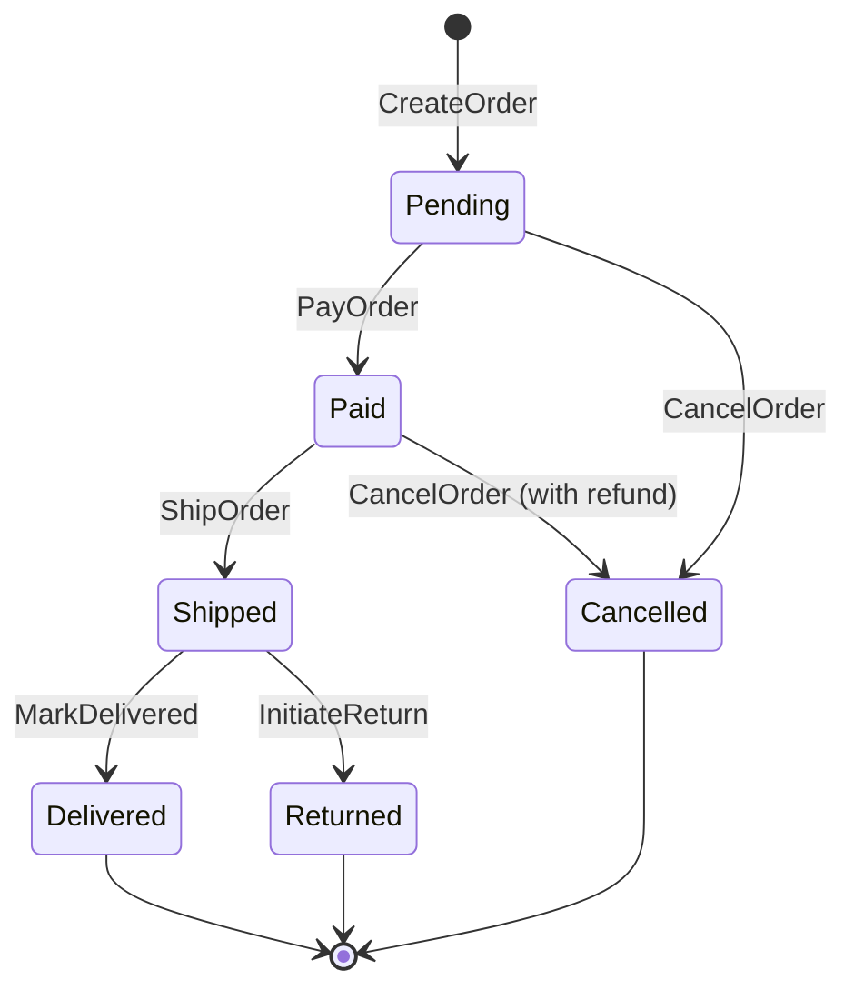

In many applications, objects and processes have a complex lifecycle. An e-commerce order, for example, isn't just "created"; it moves through a series of distinct stages: `Pending`, `Paid`, `Shipped`, `Delivered`, and potentially `Cancelled` or `Returned`. Managing the transitions between these stages can quickly become a tangled mess of `if/else` statements, leading to bugs and making the system difficult to understand and maintain.

A much cleaner and more robust solution is to use a **State Machine Pattern**. A state machine provides a formal, visual, and enforceable way to model the lifecycle of an object, ensuring that it can only exist in valid states and can only transition between them in predefined ways. This post dives into the state machine pattern and shows how to implement it with a practical Go example.

### What is a State Machine?

A state machine is a behavioral pattern that allows an object to change its behavior when its internal state changes. It can be formally defined by four main components:

1.  **States**: A finite set of conditions that an object can be in. For an order, this could be `Pending`, `Paid`, `Shipped`, etc. An object can only be in one state at any given time.
2.  **Events**: Triggers that can cause a state transition. Events might be user actions (`PayOrder`), system events (`PaymentFailed`), or the completion of a process.
3.  **Transitions**: Rules that define how the object moves from one state to another in response to an event. For example, when a `Pending` order receives a `PayOrder` event, it transitions to the `Paid` state. A transition is a one-way path from a source state to a target state.
4.  **Actions**: Operations that are executed when a transition occurs. Actions can be of two types:
    *   **Entry/Exit Actions**: Executed when entering or leaving a state.
    *   **Transition Actions**: Executed during the transition itself.

By modeling a lifecycle as a state machine, you make the rules explicit and prevent invalid operations, such as shipping an order that hasn't been paid for.

### Visualizing a State Machine

State machines are inherently visual, making them easy to understand and communicate. A Mermaid diagram is a perfect tool for this.

**Diagram: E-Commerce Order Lifecycle**



This diagram clearly shows the valid states and the events that trigger transitions between them. It serves as both documentation and a blueprint for implementation.

### Implementing a State Machine in Go

Let's implement a state machine in Go to manage the lifecycle of an e-commerce order. We'll define the states, events, and a simple state machine structure that can process events and manage transitions.

First, let's define our states and events using constants for clarity and type safety.

```go
package main

import (
	"fmt"
	"time"
)

// State represents a state in our state machine.
type State string

// Event represents an event that can trigger a state transition.
type Event string

// Define the possible states and events
const (
	StatePending   State = "Pending"
	StatePaid      State = "Paid"
	StateShipped   State = "Shipped"
	StateDelivered State = "Delivered"
	StateCancelled State = "Cancelled"
	StateReturned  State = "Returned"

	EventCreateOrder   Event = "CreateOrder"
	EventPayOrder      Event = "PayOrder"
	EventShipOrder     Event = "ShipOrder"
	EventMarkDelivered Event = "MarkDelivered"
	EventCancelOrder   Event = "CancelOrder"
	EventInitiateReturn Event = "InitiateReturn"
)
```

Next, we'll define the `Order` and the `StateMachine`.

```go
// Order represents our object with a lifecycle.
type Order struct {
	ID    string
	State State
	// ... other order details
}

// Transition defines a valid state transition.
type Transition struct {
	From  State
	Event Event
	To    State
}

// StateMachine manages the state and transitions of an order.
type StateMachine struct {
	transitions []Transition
}

func NewOrderStateMachine() *StateMachine {
	return &StateMachine{
		transitions: []Transition{
			{From: StatePending, Event: EventPayOrder, To: StatePaid},
			{From: StatePending, Event: EventCancelOrder, To: StateCancelled},
			{From: StatePaid, Event: EventShipOrder, To: StateShipped},
			{From: StatePaid, Event: EventCancelOrder, To: StateCancelled},
			{From: StateShipped, Event: EventMarkDelivered, To: StateDelivered},
			{From: StateShipped, Event: EventInitiateReturn, To: StateReturned},
		},
	}
}

// Trigger attempts to transition the order's state based on an event.
func (sm *StateMachine) Trigger(order *Order, event Event) error {
	for _, t := range sm.transitions {
		if t.From == order.State && t.Event == event {
			fmt.Printf("Transitioning Order %s from %s to %s on event %s\n", order.ID, order.State, t.To, event)
			order.State = t.To
			// Here you would execute any transition actions (e.g., call a payment service)
			return nil
		}
	}
	return fmt.Errorf("invalid transition: cannot apply event '%s' to state '%s'", event, order.State)
}
```

Finally, let's see it in action in our `main` function.

```go
func main() {
	sm := NewOrderStateMachine()

	// Create a new order
	order := &Order{
		ID:    fmt.Sprintf("order-%d", time.Now().Unix()),
		State: StatePending, // Initial state
	}
	fmt.Printf("New Order %s created in state: %s\n", order.ID, order.State)

	// --- Simulate a successful order flow ---
	fmt.Println("\n--- Happy Path ---")
	
	// 1. Pay for the order
	if err := sm.Trigger(order, EventPayOrder); err != nil {
		fmt.Println("Error:", err)
	}
	
	// 2. Ship the order
	if err := sm.Trigger(order, EventShipOrder); err != nil {
		fmt.Println("Error:", err)
	}

	// 3. Mark as delivered
	if err := sm.Trigger(order, EventMarkDelivered); err != nil {
		fmt.Println("Error:", err)
	}
	fmt.Printf("Final state: %s\n", order.State)


	// --- Simulate an invalid transition ---
	fmt.Println("\n--- Invalid Transition Example ---")
	
	// Create another order
	order2 := &Order{ID: "order-invalid", State: StatePending}
	fmt.Printf("New Order %s created in state: %s\n", order2.ID, order2.State)

	// Try to ship a pending order (which is not allowed)
	if err := sm.Trigger(order2, EventShipOrder); err != nil {
		fmt.Println("Error:", err)
	}
	fmt.Printf("Final state: %s\n", order2.State)
}
```

When you run this code, the first order will successfully transition through `Pending` -> `Paid` -> `Shipped` -> `Delivered`. The second order will correctly fail when we try to ship it from the `Pending` state, demonstrating how the state machine enforces the rules of our defined lifecycle.

### Benefits of Using a State Machine

1.  **Clarity and Readability**: The logic governing an object's lifecycle is centralized and explicit, not scattered across various methods and services. The state diagram itself is excellent documentation.
2.  **Robustness**: It makes invalid states and transitions impossible. This prevents a whole class of bugs related to inconsistent state.
3.  **Maintainability**: Adding a new state or transition is straightforward. You update the state diagram and the transition rules in one place.
4.  **Testability**: You can easily write unit tests for each valid and invalid transition, ensuring the logic is correct.

### Conclusion

The State Machine pattern is a powerful tool for taming complexity in systems where objects have a well-defined lifecycle. By formally defining states, events, and transitions, you create a system that is more robust, easier to understand, and simpler to maintain. Whether you're modeling an order, a user account, a document in a publishing workflow, or any other process with distinct stages, a state machine can bring clarity and reliability to your design.
