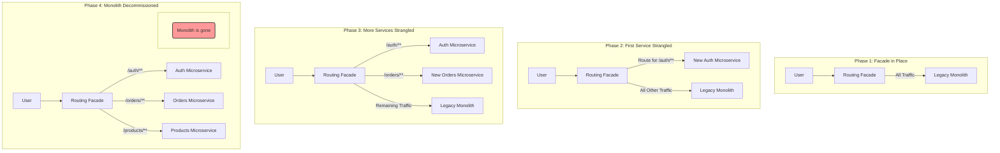

## System Design: The Strangler Fig Pattern

Rewriting a large, legacy monolithic application is one of the most daunting challenges in software engineering. A "big-bang" rewrite, where you attempt to replace the entire system at once, is notoriously risky, often leading to project delays, budget overruns, or outright failure. The **Strangler Fig Pattern** offers a safer, more incremental alternative.

Named by Martin Fowler, the pattern is inspired by the strangler fig plant, which begins its life on an established tree and gradually grows its roots downwards, eventually enveloping and replacing the original tree. In software, this translates to building a new system around the edges of the old one, gradually redirecting functionality until the old system is "strangled" and can be decommissioned.

### The Core Idea: Intercept and Redirect

The pattern relies on placing a routing facade or proxy between users and the legacy monolith. This facade is the key to incrementally migrating functionality.

1.  **Initial State:** The facade is put in place, but it does nothing but pass all traffic directly to the monolith. The system functions as it always has, but now you have a critical interception point.
2.  **Identify a Seam:** You identify a specific, well-defined piece of functionality in the monolith that you want to extract into a new, modern microservice. This could be user authentication, product search, or order processing.
3.  **Build the New Service:** You develop and deploy the new microservice completely independently of the monolith.
4.  **Strangle (Redirect Traffic):** You update the routing logic in the facade. Now, any request for the functionality you've extracted is redirected to the new microservice instead of the monolith. All other traffic continues to flow to the old system.
5.  **Repeat:** You repeat this process—identify, build, and strangle—for other parts of the monolith. Over time, more and more functionality is handled by new microservices.
6.  **Decommission:** Eventually, all the monolith's features have been replaced. The old system is no longer receiving any traffic and can be safely shut down.

### Visualizing the Strangler Fig Pattern



### Key Components

-   **The Facade (or Proxy):** This is the most critical piece. It can be implemented using off-the-shelf technologies like an API Gateway (e.g., NGINX, Kong, AWS API Gateway) or a custom-built reverse proxy. Its job is to inspect incoming requests (e.g., by URL path, headers) and route them to the correct destination—either the monolith or a new microservice.
-   **The Asset Capture Layer:** This refers to the events and data streams that need to be shared between the old and new systems. For example, if a new "Orders" microservice is created, it might need to read product data that still lives in the monolith's database. This often involves techniques like database triggers, change data capture (CDC), or dual-writes to keep data synchronized during the transition.
-   **The New Microservices:** These are the modern, independently deployable services that will eventually replace the monolith's functionality.

### Go Example: A Conceptual Routing Facade

This example demonstrates a simple HTTP server in Go that acts as a routing facade. It inspects the URL path and decides whether to proxy the request to the legacy monolith or a new microservice.

```go
package main

import (
	"log"
	"net/http"
	"net/http/httputil"
	"net/url"
	"strings"
)

// newReverseProxy creates a new reverse proxy for a given target URL.
func newReverseProxy(target string) *httputil.ReverseProxy {
	url, err := url.Parse(target)
	if err != nil {
		log.Fatalf("Failed to parse target URL: %v", err)
	}
	return httputil.NewSingleHostReverseProxy(url)
}

// facadeHandler is the core of the Strangler Fig pattern.
// It inspects the request and routes it to the appropriate backend.
func facadeHandler(monolithProxy, newServiceProxy http.Handler) http.HandlerFunc {
	return func(w http.ResponseWriter, r *http.Request) {
		log.Printf("Facade received request for: %s", r.URL.Path)

		// This is the "strangling" logic.
		// If the path is for our new feature, route to the new service.
		if strings.HasPrefix(r.URL.Path, "/api/v2/users") {
			log.Println("Routing to new user service")
			newServiceProxy.ServeHTTP(w, r)
			return
		}

		// Otherwise, pass the request to the legacy monolith.
		log.Println("Routing to monolith")
		monolithProxy.ServeHTTP(w, r)
	}
}

func main() {
	// Define the locations of our legacy and new systems.
	// In a real setup, these would be different servers/containers.
	const monolithURL = "http://localhost:8081"
	const newUserServiceURL = "http://localhost:8082"

	// Create the reverse proxies for each backend.
	monolithProxy := newReverseProxy(monolithURL)
	newServiceProxy := newReverseProxy(newUserServiceURL)

	// Set up dummy backend servers to simulate the monolith and new service.
	go startMonolithServer(monolithURL)
	go startNewUserService(newUserServiceURL)

	// The facade listens on the main entry point for all traffic.
	facade := http.NewServeMux()
	facade.HandleFunc("/", facadeHandler(monolithProxy, newServiceProxy))

	log.Println("Strangler Fig Facade listening on :8080")
	if err := http.ListenAndServe(":8080", facade); err != nil {
		log.Fatal(err)
	}
}

// --- Helper functions to simulate backend servers ---

func startMonolithServer(addr string) {
	mux := http.NewServeMux()
	mux.HandleFunc("/", func(w http.ResponseWriter, r *http.Request) {
		w.WriteHeader(http.StatusOK)
		w.Write([]byte("Response from the LEGACY MONOLITH for " + r.URL.Path))
	})
	// Extract port from address
	parts := strings.Split(addr, ":")
	port := ":" + parts[len(parts)-1]
	log.Printf("Monolith server starting on %s", port)
	http.ListenAndServe(port, mux)
}

func startNewUserService(addr string) {
	mux := http.NewServeMux()
	mux.HandleFunc("/api/v2/users", func(w http.ResponseWriter, r *http.Request) {
		w.WriteHeader(http.StatusOK)
		w.Write([]byte("Response from the NEW USER MICROSERVICE"))
	})
	// Extract port from address
	parts := strings.Split(addr, ":")
	port := ":" + parts[len(parts)-1]
	log.Printf("New User Service starting on %s", port)
	http.ListenAndServe(port, mux)
}
```
**To run this example:**
1. Save the code as `main.go`.
2. Run `go run main.go`.
3. Open your browser or use `curl`:
   - `curl http://localhost:8080/some/old/path` will return `Response from the LEGACY MONOLITH...`
   - `curl http://localhost:8080/api/v2/users` will return `Response from the NEW USER MICROSERVICE`

### Benefits of the Strangler Fig Pattern

-   **Reduced Risk:** By migrating one piece at a time, you limit the blast radius of any potential failures. A problem in the new service can be quickly mitigated by reverting the routing rule in the facade.
-   **Incremental Value:** You can deliver value to users and the business much faster than with a multi-year rewrite project. Each new service can be released as soon as it's ready.
-   **Easier to Manage:** Smaller, focused microservices are easier to develop, test, and deploy than a massive monolith.
-   **Technology Evolution:** It provides a practical way to adopt new technologies, languages, and frameworks without being constrained by the choices made in the legacy system.

### Conclusion

The Strangler Fig Pattern is a powerful and proven strategy for modernizing legacy systems. It transforms a high-risk, all-or-nothing rewrite into a manageable, incremental process. By carefully choosing where to place the facade and how to redirect traffic, teams can safely navigate the complex journey from monolith to microservices, ensuring the system remains stable and delivers value throughout the transition.
---
