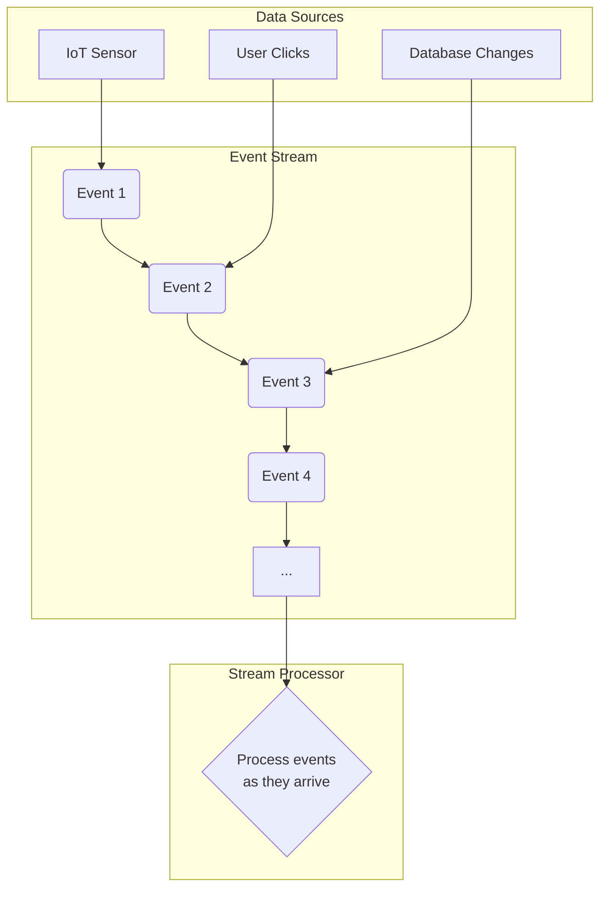
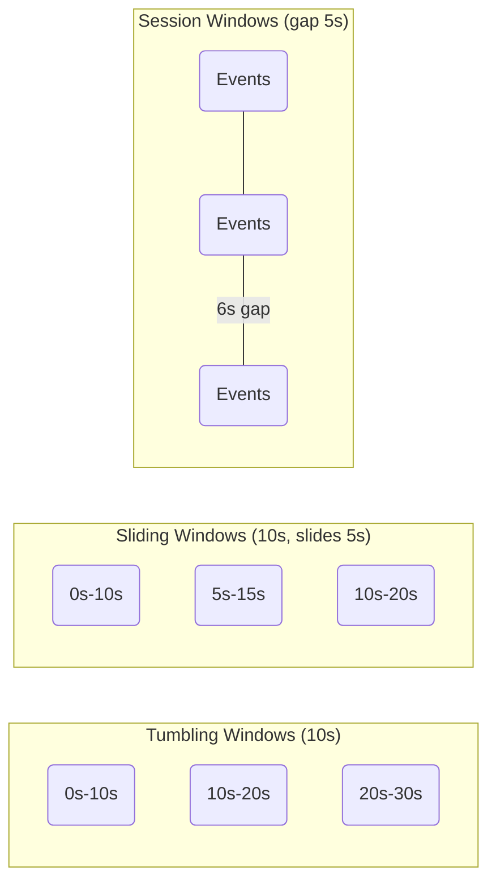

## Introduction: From Batch to Real-Time

For decades, data processing was synonymous with **batch processing**. You would collect large volumes of data over a period (e.g., a day's worth of sales transactions), store it in a database or file system, and then run a job to process it all at once. This model is simple and efficient for many use cases, like generating daily reports or archiving data.

However, the modern world generates data continuously. Social media feeds, IoT sensor readings, financial market data, and application logs are not finite datasets; they are **unbounded, infinite streams** of events. Waiting for a daily batch job to run is often too slow. Businesses need to react to this data in real-time.

This is where **stream processing** comes in. It's a paradigm designed for processing data *as it arrives*, enabling immediate analysis and reaction.

## What is a Stream?

In this context, a stream is a continuous, unbounded sequence of data records (events). Each event is typically a small, immutable piece of data with a timestamp.

Think of it like a conveyor belt in a factory that never stops. Items (events) are constantly being placed on the belt, and workers (processors) must inspect and handle them as they go by.



## Batch vs. Stream Processing

| Feature | Batch Processing | Stream Processing |
| :--- | :--- | :--- |
| **Data Scope** | Bounded Datasets (e.g., files, tables) | Unbounded, Infinite Streams |
| **Latency** | High (minutes to hours) | Low (milliseconds to seconds) |
| **Processing Model** | Process all data at once | Process event-by-event or in micro-batches |
| **State** | State is often transient (job finishes) | State is a long-lived, critical component |
| **Use Cases** | Payroll, daily reports, ETL jobs | Fraud detection, real-time analytics, alerting |

A key insight is that **batch processing is just a special case of stream processing**. A bounded dataset can be thought of as a stream that happens to have an end. Modern stream processing frameworks like Apache Flink and Apache Beam embrace this idea, providing unified APIs that can handle both batch and streaming workloads.

## Key Concepts in Stream Processing

### 1. Time: Event Time vs. Processing Time

Time is the most critical and complex aspect of stream processing.

*   **Event Time:** The time the event actually occurred at the source (e.g., when the user clicked a button). This is the most accurate time for analysis, but events can arrive out of order due to network latency.
*   **Processing Time:** The time the event is observed by the stream processing application. This is simple and always moves forward, but it can be inaccurate. If the system lags, an event that happened at 10:00 AM might not be processed until 10:05 AM.

Choosing which time to use depends on the application. For financial transactions, event time is crucial. For simple real-time monitoring, processing time might be sufficient.

### 2. Windowing

Since a stream is infinite, you can't just "group all data." Instead, you must define **windows**—bounded slices of the stream—to perform aggregations like counts, sums, and averages.

*   **Tumbling Window:** A fixed-size, non-overlapping window. For example, "count the number of clicks every 1 minute."
*   **Sliding Window:** A fixed-size, overlapping window. For example, "calculate the average CPU usage over the last 10 minutes, updated every 1 minute."
*   **Session Window:** A dynamic window that groups events by activity. A session starts with an event and closes after a period of inactivity (a "gap"). This is perfect for analyzing user sessions on a website.



### 3. State Management

Many stream processing tasks are stateful. To detect credit card fraud, you need to remember a user's recent transaction history (the state). To count website clicks, you need to store the current count (the state).

Since the application is always running, this state can grow infinitely. A robust stream processor must:
*   Provide a fast key-value store for state access.
*   **Persist state** by periodically checkpointing it to durable storage (like HDFS or S3). This ensures that if the application crashes, it can restart and recover its state without losing data.

## Use Cases for Stream Processing

*   **Real-Time Analytics:** Powering live dashboards that track business KPIs, user activity, or application performance.
*   **Fraud and Anomaly Detection:** Analyzing patterns in real-time to identify fraudulent transactions or security threats as they happen.
*   **Alerting and Monitoring:** Triggering alerts when system metrics (CPU, memory) cross a threshold or when application error rates spike.
*   **IoT (Internet of Things):** Processing data from thousands of sensors to monitor industrial equipment, manage smart homes, or track vehicle fleets.
*   **Event-Driven Microservices:** Enabling services to react to events from other services asynchronously.

## Go Example: A Simple Windowed Counter

This conceptual example in Go demonstrates the idea of a tumbling window. We'll process a stream of events and count them in 5-second windows.

```go
package main

import (
	"fmt"
	"sync"
	"time"
)

// Event represents a single data record in our stream.
type Event struct {
	Data      string
	Timestamp time.Time
}

// WindowedCounter processes events and counts them in windows.
type WindowedCounter struct {
	windowSize time.Duration
	counts     map[time.Time]int
	mu         sync.Mutex
}

func NewWindowedCounter(windowSize time.Duration) *WindowedCounter {
	return &WindowedCounter{
		windowSize: windowSize,
		counts:     make(map[time.Time]int),
	}
}

// Process adds an event to the correct window.
func (wc *WindowedCounter) Process(event Event) {
	wc.mu.Lock()
	defer wc.mu.Unlock()

	// Truncate the event's timestamp to find the start of its window.
	windowStart := event.Timestamp.Truncate(wc.windowSize)
	wc.counts[windowStart]++

	fmt.Printf("Processed event. Window %s count is now %d\n", windowStart.Format("15:04:05"), wc.counts[windowStart])
}

func main() {
	eventStream := make(chan Event)
	counter := NewWindowedCounter(5 * time.Second)

	// Start a goroutine to process events from the stream
	go func() {
		for event := range eventStream {
			counter.Process(event)
		}
	}()

	// Simulate a stream of incoming events
	fmt.Println("Starting event stream...")
	for i := 0; i < 20; i++ {
		eventStream <- Event{Data: "click", Timestamp: time.Now()}
		time.Sleep(700 * time.Millisecond)
	}

	close(eventStream)
	fmt.Println("\n--- Final Counts ---")
	for window, count := range counter.counts {
		fmt.Printf("Window starting at %s: %d events\n", window.Format("15:04:05"), count)
	}
}
```

This code simulates a stream of "click" events. The `WindowedCounter` uses `time.Truncate` to determine which 5-second window each event belongs to and increments the appropriate counter. This is the fundamental logic behind a tumbling window.

## Conclusion

Stream processing is a powerful paradigm for building systems that can derive insights and value from data in real-time. By understanding the core concepts of streams, windows, time, and state, you can design and build applications that are more responsive, intelligent, and resilient. It represents a shift from "what happened yesterday?" to "what is happening right now?"
