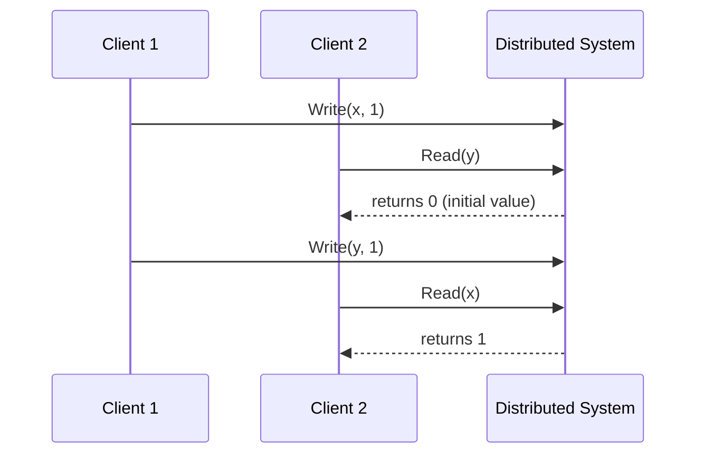

In the world of distributed systems, **strong consistency** is the gold standard. It is the most intuitive and strictest consistency model, providing the guarantee that every operation appears to have taken effect instantaneously. Once a write operation completes, all subsequent read operations will return that new value. There is no "in-between" state and no stale data.

This model makes a distributed system behave like a single, non-distributed one, which is much easier for developers to reason about. However, these powerful guarantees come with significant trade-offs in terms of performance and availability, as dictated by the CAP theorem.

### The Price of Strong Consistency

According to the CAP theorem, in the presence of a network partition (P), a system must choose between consistency (C) and availability (A). A strongly consistent system will always choose **consistency**.

This means that if a node cannot communicate with other nodes to confirm that it has the most recent data, it must return an error rather than risk returning stale data. This choice prioritizes data correctness above all else, even if it means the service becomes temporarily unavailable to some users.

**Diagram: Strong Consistency During a Partition**

Imagine a distributed key-value store where the value of `key-A` is `1`.

```mermaid
graph TD
    subgraph Cluster
        Node1[Node 1 (key-A=1)]
        Node2[Node 2 (key-A=1)]
    end

    Client1[Client 1] -- "1. WRITE key-A = 2" --> Node1
    
    subgraph "Network Partition Occurs"
        Node1 -.-> Node2
    end

    Node1 -- "2. Update successful locally" --> Client1
    Client2[Client 2] -- "3. READ key-A" --> Node2
    Node2 -- "4. Can't contact Node 1 to verify latest value" --> ErrorResponse[5. Return Error or Timeout]
```

In this scenario, `Node 2` refuses to serve the read request because it cannot guarantee it has the latest value. This ensures correctness but sacrifices availability for `Client 2`.

### Models of Strong Consistency

"Strong consistency" is an umbrella term. The two most important and widely discussed models are **Linearizability** and **Sequential Consistency**.

#### 1. Linearizability (Atomic Consistency)

Linearizability is the strongest form of consistency. It provides the illusion that every operation on a shared object occurs **instantaneously** at some single point in time between its invocation and its completion. It's about making operations appear atomic.

**The Core Guarantees:**
*   **Recency**: Any read will return the value of the most recently completed write.
*   **Real-time Ordering**: If operation A completes *before* operation B begins, then operation A must appear to have executed before operation B in the system's history. This must respect the real-world wall-clock time.

**Example:**
Consider a timeline of operations on a key `x`.

```mermaid
gantt
    title Linearizability Example
    dateFormat  X
    axisFormat  %Ss
    
    section Client 1
    Write(x, 10) : 0, 2
    
    section Client 2
    Read(x) -> 10 : 3, 5
    
    section Client 3
    Read(x) -> 0 (Stale) : 1, 3
```



*   **This IS Linearizable**: `Client 1` writes `10`. `Client 2` starts its read *after* the write completes and correctly sees `10`.
*   **This is NOT Linearizable**: If `Client 3` started its read at time `1s` and the write from `Client 1` completed at `2s`, it would be valid for `Client 3` to read the old value (`0`). However, if `Client 3` started its read at `3s` (after the write completed) and still read `0`, the system would *not* be linearizable.

Linearizability is crucial for systems that manage unique resources, like distributed locks or leader election, where you need an absolute consensus on the state of a variable at a specific moment in time. Consensus algorithms like Raft and Paxos are used to implement linearizable storage.

#### 2. Sequential Consistency

Sequential consistency is a slightly weaker, but still strong, model. It does not require operations to respect real-time wall-clock order. Instead, it requires that the result of any execution is the same as if all operations were executed in *some* sequential order, and the operations of each individual client appear in the order specified by its program.

**The Core Guarantees:**
*   **Program Order**: All clients agree on the order of operations for each individual client.
*   **Interleaving**: The global order of operations is an arbitrary interleaving of the individual client histories.

**Example:**
Imagine two clients writing to two different keys.

*   **Client 1**: `Write(x, 1)`, then `Write(y, 1)`
*   **Client 2**: `Read(y)`, then `Read(x)`

A sequentially consistent system could produce the result `Read(y) -> 1` and `Read(x) -> 0`. This might seem strange, but it's valid.

**Diagram: A Valid Sequential Interleaving**


In this interleaving, `Client 2`'s operations are reordered with `Client 1`'s. The system processes `Write(x, 1)`, then `Read(y)`, then `Write(y, 1)`, then `Read(x)`. This is a valid sequential order, and each client's own operations (`C1` writes `x` then `y`; `C2` reads `y` then `x`) are in the correct program order.

A linearizable system could *not* allow this if the `Write(y, 1)` operation completed before the `Read(y)` operation began. Sequential consistency is easier for system designers to implement because it doesn't have to worry about global clocks.

### When to Use Strong Consistency

Strong consistency is essential for systems where data correctness is paramount and stale data can lead to serious errors.

*   **Financial Systems**: Bank account balances, stock trades, and payment processing require every transaction to be atomic and immediately visible.
*   **Inventory Management**: An e-commerce site needs a strongly consistent view of its inventory to avoid selling the same item twice.
*   **Reservations Systems**: Airline or hotel booking systems need to ensure a seat or room is not double-booked.
*   **Distributed Locks and Leader Election**: These coordination primitives require all participants to have a single, unambiguous view of who holds the lock or who is the leader.

### Conclusion

Strong consistency provides the simplest and most predictable programming model by making a distributed system behave like a single machine. Models like linearizability offer powerful guarantees that are critical for correctness in many applications. However, this correctness comes at a cost. By choosing strong consistency, system designers are explicitly trading away some degree of availability and performance, especially during network partitions. The decision to use strong vs. eventual consistency depends entirely on the specific requirements of the application and understanding which trade-offs are acceptable for the business logic at hand.