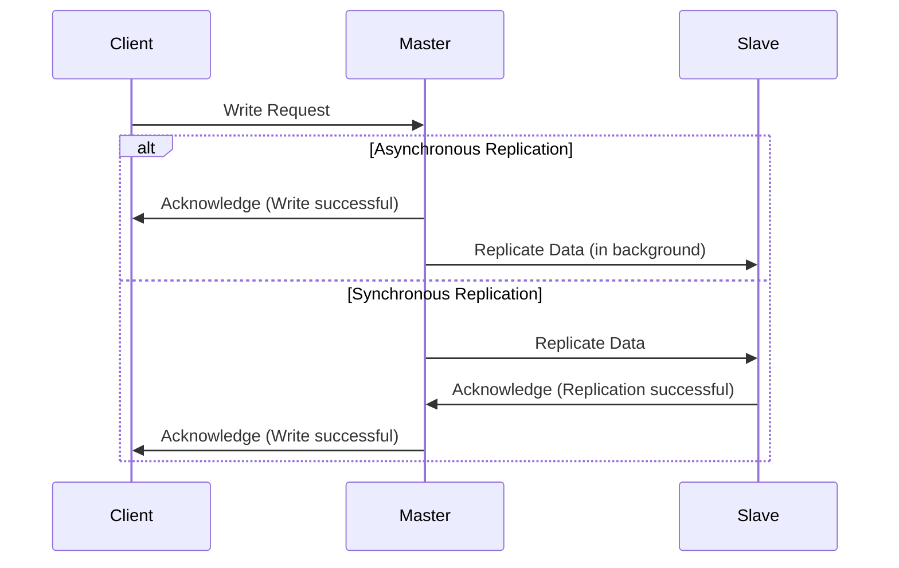

## The Replication Dilemma

When you decide to replicate your data, one of the first and most important decisions you'll need to make is *how* you're going to do it. The choice between synchronous and asynchronous replication is a fundamental one, and it has significant implications for your system's performance, consistency, and availability.

### What's the Difference?

The core difference between synchronous and asynchronous replication lies in when the master considers a write operation to be complete.

*   **Synchronous Replication:** The master waits for one or more slaves to confirm that they have received and applied the write before it acknowledges the write to the client.
*   **Asynchronous Replication:** The master sends the write to the slaves and immediately acknowledges the write to the client, without waiting for the slaves to respond.



## Synchronous Replication: The Consistency Champion

Synchronous replication prioritizes data consistency above all else. When a client receives a "success" message, it has a strong guarantee that the data has been safely stored on at least two servers.

### Benefits

*   **Strong Consistency:** No data loss in the event of a master failure (as long as at least one slave is up-to-date).
*   **Simpler Failover:** Since slaves are guaranteed to be in sync, promoting a new master is a more straightforward process.

### Drawbacks

*   **Higher Latency:** Write operations are slower because they have to wait for a round trip to a slave.
*   **Reduced Availability:** If all slaves are down or unreachable, the master cannot accept writes.

## Asynchronous Replication: The Performance King

Asynchronous replication is all about performance. By not waiting for slaves, the master can handle write operations much more quickly.

### Benefits

*   **Low Latency:** Writes are fast, as the master doesn't have to wait for slaves.
*   **High Availability:** The master can continue to accept writes even if all slaves are down.

### Drawbacks

*   **Potential for Data Loss:** If the master fails before a write has been replicated to any slaves, that write is lost forever. This is often referred to as "replication lag."
*   **Complex Failover:** Because of replication lag, a slave may not have all the data from the master. This can complicate the process of promoting a new master.

## Semi-Synchronous Replication: The Best of Both Worlds?

Semi-synchronous replication is a compromise between the two extremes. In this model, the master waits for at least one slave to acknowledge that it has *received* the write, but it doesn't wait for the slave to *apply* it.

*   **Benefits:** Better durability than asynchronous replication, with less of a performance impact than fully synchronous replication.
*   **Drawbacks:** Still has some performance overhead, and there's still a small window for data loss if the slave fails after acknowledging receipt but before applying the write.

## Simulating Replication Modes in Go

Let's create a simulation in Go to demonstrate the performance differences between these replication modes.

```go
package main

import (
    "fmt"
    "time"
)

func main() {
    networkLatency := 50 * time.Millisecond

    // Asynchronous
    startAsync := time.Now()
    // Master writes to its own disk
    time.Sleep(10 * time.Millisecond)
    // Master acknowledges to client
    fmt.Printf("Asynchronous write took: %v\n", time.Since(startAsync))

    // Synchronous
    startSync := time.Now()
    // Master writes to its own disk
    time.Sleep(10 * time.Millisecond)
    // Master sends to slave
    time.Sleep(networkLatency)
    // Slave writes to its disk
    time.Sleep(10 * time.Millisecond)
    // Slave acknowledges to master
    time.Sleep(networkLatency)
    // Master acknowledges to client
    fmt.Printf("Synchronous write took: %v\n", time.Since(startSync))

    // Semi-Synchronous
    startSemiSync := time.Now()
    // Master writes to its own disk
    time.Sleep(10 * time.Millisecond)
    // Master sends to slave
    time.Sleep(networkLatency)
    // Slave acknowledges to master
    time.Sleep(networkLatency)
    // Master acknowledges to client
    fmt.Printf("Semi-Synchronous write took: %v\n", time.Since(startSemiSync))
}
```

This simple simulation shows that synchronous replication has roughly double the network latency overhead of semi-synchronous replication, and asynchronous replication has no network latency overhead at all for the client.

## Which One Should You Choose?

The right choice depends entirely on your application's needs.

*   **Use Synchronous Replication if:**
    *   You absolutely cannot afford to lose any data.
    *   Your application is for something like financial transactions or critical inventory management.

*   **Use Asynchronous Replication if:**
    *   Performance and availability are more important than strong consistency.
    *   Your application is for something like social media feeds, where losing a single "like" is not a disaster.

*   **Use Semi-Synchronous Replication if:**
    *   You want a balance between performance and durability.
    *   You can tolerate a very small window of data loss in exchange for better performance than fully synchronous replication.

## Conclusion

The choice between synchronous and asynchronous replication is a classic trade-off in distributed systems. There is no "best" answer, only the answer that is best for *your* system. By carefully considering your requirements for consistency, performance, and availability, you can make an informed decision that will set your application up for success.
