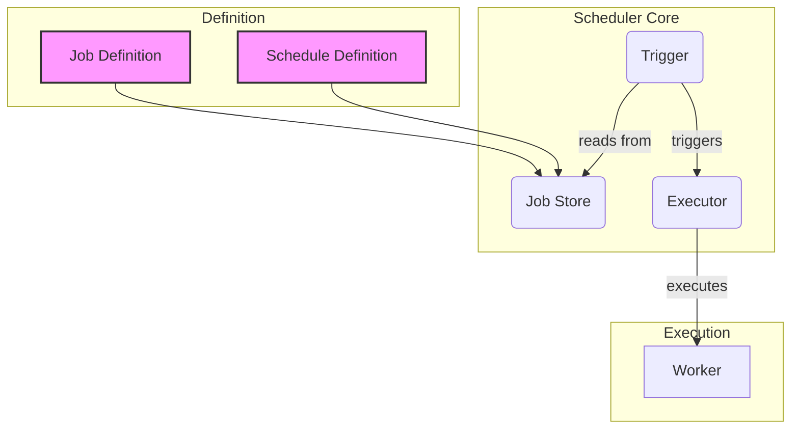

From sending daily email reports to running nightly data processing jobs, task scheduling is a fundamental requirement of nearly every software system. A **Task Scheduling System** is responsible for executing tasks automatically at predefined times or intervals. While the concept sounds simple, building a scheduler that is reliable, scalable, and fault-tolerant involves significant design considerations.

This post explores the architecture of task scheduling systems, from the simple elegance of `cron` to the complexities of distributed schedulers, complete with a conceptual Go example.

### What is a Task Scheduler?

A task scheduler is a system that automates the execution of jobs, scripts, or commands based on a schedule. Its primary responsibilities are:

-   **Defining Jobs**: Providing a way to define what work needs to be done.
-   **Defining Schedules**: Specifying *when* the work should be done (e.g., every hour, every Monday at 3 AM).
-   **Execution**: Triggering the jobs at the correct time.
-   **Monitoring & Logging**: Tracking the status of jobs (success, failure) and recording their output.

### Core Components of a Task Scheduler

A task scheduling system can be broken down into a few essential components.

**Architecture Diagram**



1.  **Job Definition**: The "what." This is the actual task to be executed. It could be a shell command, a function call, or an API request.
2.  **Schedule Definition**: The "when." This defines the trigger for the job. The most common format is the `cron` expression, which specifies schedules down to the minute (e.g., `0 5 * * *` for "every day at 5:00 AM").
3.  **Job Store**: A persistent database that stores the job definitions and their schedules. This ensures that jobs are not lost if the scheduler restarts.
4.  **Trigger (or Scheduler Daemon)**: This is the heart of the system. It's a long-running process that constantly checks the Job Store. Its main loop does the following:
    *   Calculate the next run time for all scheduled jobs.
    *   Identify which jobs are due to run *now*.
    *   Send the due jobs to the Executor.
5.  **Executor**: The "doer." When the Trigger identifies a job to run, the Executor is responsible for actually running it. It invokes the appropriate **Worker** to perform the task.
6.  **Worker**: The component that contains the business logic for the job. In a distributed system, workers might be separate services that the Executor communicates with via a message queue or RPC.

### Scheduling Strategies

-   **Time-Based (Cron-like)**: This is the most common strategy. Jobs are scheduled based on a fixed time, date, or interval. The scheduler's main loop is driven by the system clock.
-   **Event-Based**: Jobs are triggered by the occurrence of a specific event, rather than the time. For example, a "process new video" job could be triggered whenever a new video file is uploaded to a storage bucket. This is often handled by a message queue or an event bus rather than a traditional scheduler.

### Challenges in Distributed Scheduling

While a single-node scheduler is relatively simple, building a scheduler for a large-scale, distributed environment introduces several challenges:

1.  **High Availability**: If the scheduler node goes down, no jobs will be executed. To solve this, you need a multi-node setup where another node can take over if the primary one fails. This requires a leader election mechanism (e.g., using ZooKeeper or etcd).
2.  **Fault Tolerance**: What happens if a worker fails while executing a job? The scheduler needs to detect this failure and implement a retry policy.
3.  **Scalability**: A single scheduler can become a bottleneck if there are thousands of jobs to manage. A distributed scheduler can partition the jobs across multiple scheduler nodes to share the load.
4.  **Preventing Duplicate Executions**: In a multi-node setup, you must ensure that only one scheduler instance triggers a given job at its scheduled time. This is often solved by using distributed locks. The scheduler instance that acquires the lock for a job is the one that gets to execute it.

### Conceptual Go Example: A Simple Scheduler

Let's build a very basic, in-memory scheduler in Go to illustrate the core concepts. We'll use the popular `cron` library for parsing schedules.

First, install the library:
`go get github.com/robfig/cron/v3`

Now, let's write the code.

```go
package main

import (
	"fmt"
	"time"

	"github.com/robfig/cron/v3"
)

// Job represents a task to be executed.
type Job struct {
	ID       int
	Name     string
	Schedule string
	Action   func()
}

// Scheduler manages and runs jobs.
type Scheduler struct {
	cron     *cron.Cron
	jobs     map[int]Job
	nextID   int
}

func NewScheduler() *Scheduler {
	return &Scheduler{
		cron: cron.New(),
		jobs: make(map[int]Job),
		nextID: 1,
	}
}

// AddJob adds a new job to the scheduler.
func (s *Scheduler) AddJob(name, schedule string, action func()) (int, error) {
	job := Job{
		ID:       s.nextID,
		Name:     name,
		Schedule: schedule,
		Action:   action,
	}

	entryID, err := s.cron.AddFunc(schedule, func() {
		fmt.Printf("Executing job '%s' (ID: %d)\n", name, job.ID)
		action()
	})
	if err != nil {
		return 0, fmt.Errorf("failed to add job: %w", err)
	}

	s.jobs[job.ID] = job
	s.nextID++
	
	fmt.Printf("Added job '%s' with schedule '%s'. Cron Entry ID: %d\n", name, schedule, entryID)
	return job.ID, nil
}

// Start begins the scheduler's ticking.
func (s *Scheduler) Start() {
	fmt.Println("Starting scheduler...")
	s.cron.Start()
}

// Stop halts the scheduler.
func (s *Scheduler) Stop() {
	fmt.Println("Stopping scheduler...")
	s.cron.Stop()
}

func main() {
	scheduler := NewScheduler()

	// Job 1: Runs every 5 seconds
	scheduler.AddJob("Heartbeat", "*/5 * * * *", func() {
		fmt.Println("  -> Heartbeat job is alive!")
	})

	// Job 2: Runs every 10 seconds
	scheduler.AddJob("Data Sync", "*/10 * * * *", func() {
		fmt.Println("  -> Syncing data...")
		time.Sleep(2 * time.Second) // Simulate work
		fmt.Println("  -> Data sync complete.")
	})

	scheduler.Start()

	// Run the scheduler for 30 seconds for this demo
	time.Sleep(30 * time.Second)

	scheduler.Stop()
}
```

This example demonstrates the core loop:
- We define jobs with a name, a `cron` schedule, and an action (a Go function).
- The `cron` library handles the parsing of the schedule and the triggering.
- Our `Scheduler` struct acts as the Job Store and manages the `cron` instance.

### Conclusion

Task scheduling is a critical component of modern software architecture, enabling automation and background processing. While a simple `cron` job on a single server can suffice for small applications, building a robust, large-scale scheduling system requires careful consideration of high availability, fault tolerance, and scalability. By understanding the core components—the job store, trigger, and executor—and the challenges of a distributed environment, you can design a scheduler that is both powerful and resilient, ensuring your automated tasks run reliably, on time, every time.
