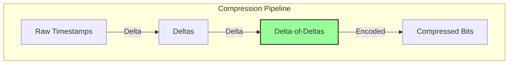

## Introduction: The High Cost of Precision

Time-series data, generated by monitoring systems and IoT devices, is relentless. A single server can produce dozens of metrics every second. Storing this high-volume, high-precision data is a major challenge. A single data point, consisting of a 64-bit timestamp and a 64-bit float value, consumes 16 bytes. For a system generating one million data points per second, this translates to over **1.3 terabytes of data per day**.

General-purpose compression algorithms like Gzip or Snappy can help, but they don't understand the unique structure of time-series data. To achieve truly massive storage savings, time-series databases (TSDBs) use specialized compression techniques designed to exploit the patterns inherent in time-series data.

This article explores some of the clever algorithms that make efficient time-series storage possible.

## The Predictable Nature of Time-Series Data

Time-series data, while vast, is often highly predictable.
1.  **Timestamps are regular:** Data points often arrive at a fixed interval (e.g., every 10 seconds). The difference between consecutive timestamps is nearly constant.
2.  **Values are correlated:** A CPU usage value is usually very similar to the value that came just before it.

These patterns are the key. Instead of storing the absolute value of each timestamp and data point, we can store only the **difference** from the previous one. This is the core idea behind **delta encoding**.

### Delta Encoding

Let's look at a series of timestamps arriving every 10 seconds.
*   **Raw Timestamps:** `1670000000`, `1670000010`, `1670000020`, `1670000030`
*   **Deltas:** `10`, `10`, `10`

And a series of temperature readings:
*   **Raw Values:** `25.1`, `25.2`, `25.1`, `25.3`
*   **Deltas:** `+0.1`, `-0.1`, `+0.2`

These delta values are much smaller than the original values and can be stored using fewer bits.

## Delta-of-Delta Encoding

We can take this one step further. What if the deltas themselves are very stable?
Let's look at our timestamp deltas: `10, 10, 10`. The difference between these deltas is always `0`. This is the "delta-of-delta".

*   **Timestamps:** `1670000000`, `1670000010`, `1670000021`, `1670000031` (with a little jitter)
*   **First Delta:** `10`, `11`, `10`
*   **Delta-of-Delta:** `+1`, `-1`

The delta-of-delta values are even smaller and more compressible. This is extremely effective for timestamps, which tend to have a very stable interval.



## XOR Encoding for Values: The Gorilla Algorithm

Facebook's (now Meta's) Gorilla paper introduced a highly effective compression scheme for time-series values, which is now used in many TSDBs. For floating-point values, it uses a combination of delta encoding and XOR encoding.

Here's a simplified view of how it works:
1.  Calculate the delta between the current value and the previous value.
2.  Calculate the XOR of the current value's bits and the previous value's bits.
3.  If the XOR result is `0` (meaning the value hasn't changed), store a single `0` bit.
4.  If the XOR result is not `0`, check if the number of leading and trailing zeros in the XOR result is the same as the previous non-zero XOR result.
    *   If they match, store a `10` bit followed by only the meaningful bits of the XOR result. This is a huge saving, as you don't need to store the leading/trailing zeros.
    *   If they don't match, store a `11` bit followed by the number of leading zeros, the length of the meaningful bits, and then the meaningful bits themselves.

This sounds complex, but the result is that for slowly changing floating-point values, you often only need to store a handful of bits per data point instead of the full 64 bits. The average compression ratio can be dramatic, often reducing 16 bytes per point to less than 2 bytes.

## Go Example: Simple Delta-of-Delta Encoding

Let's write a simple Go program to demonstrate the concept of delta-of-delta encoding for a series of timestamps.

```go
package main

import "fmt"

// DeltaOfDeltaEncoder compresses a series of integers.
type DeltaOfDeltaEncoder struct {
	lastTimestamp int64
	lastDelta     int64
}

// Encode takes a timestamp and returns the delta-of-delta.
func (e *DeltaOfDeltaEncoder) Encode(timestamp int64) int64 {
	if e.lastTimestamp == 0 {
		// First value, no delta to calculate.
		e.lastTimestamp = timestamp
		return timestamp // Store the first value raw
	}

	currentDelta := timestamp - e.lastTimestamp
	deltaOfDelta := currentDelta - e.lastDelta

	// Update state for the next call
	e.lastTimestamp = timestamp
	e.lastDelta = currentDelta

	return deltaOfDelta
}

func main() {
	encoder := &DeltaOfDeltaEncoder{}

	// A series of timestamps, mostly 10s apart with some jitter.
	timestamps := []int64{
		1670000000,
		1670000010,
		1670000020,
		1670000031, // Jitter
		1670000041,
		1670000052, // Jitter
		1670000062,
	}

	fmt.Println("Original Timestamps vs. Compressed Delta-of-Deltas")
	fmt.Println("----------------------------------------------------")
	
	var compressed []int64
	for _, ts := range timestamps {
		dod := encoder.Encode(ts)
		compressed = append(compressed, dod)
		fmt.Printf("Original: %d  ->  Compressed: %d\n", ts, dod)
	}

	fmt.Println("\nOriginal Data (bytes):", len(timestamps)*8)
	
	// A real variable-length integer encoding would be used here.
	// For demonstration, we'll just show the smaller values.
	fmt.Println("Compressed Values:", compressed)
	fmt.Println("These small integers can be stored with far fewer bytes than the originals.")
}
```
The output shows that after the first value, the compressed delta-of-delta values (`0`, `0`, `1`, `0`, `1`, `0`) are tiny and can be stored very efficiently using variable-length integer encoding schemes.

## Putting It All Together

A modern TSDB uses a combination of these techniques:
1.  Data is grouped into blocks (e.g., 2 hours of data).
2.  Within a block, timestamps are compressed using **delta-of-delta encoding**.
3.  Values are compressed using an algorithm like **Gorilla's XOR encoding**.
4.  The entire block is then often passed through a general-purpose compression algorithm like **Snappy** for further savings.

This multi-stage process is what allows TSDBs to achieve compression ratios of 10x, 20x, or even higher, transforming a seemingly unmanageable data firehose into a cost-effective and queryable historical record.

## Conclusion

Time-series compression is a fascinating field of computer science where clever observations about the nature of data lead to massive real-world efficiencies. By moving beyond generic compression and designing algorithms that understand the predictable patterns of time-stamped events, TSDBs can store years of high-resolution data in a fraction of the space that would otherwise be required. These techniques are the unsung heroes that make large-scale monitoring, IoT, and real-time analytics economically and technically feasible.
