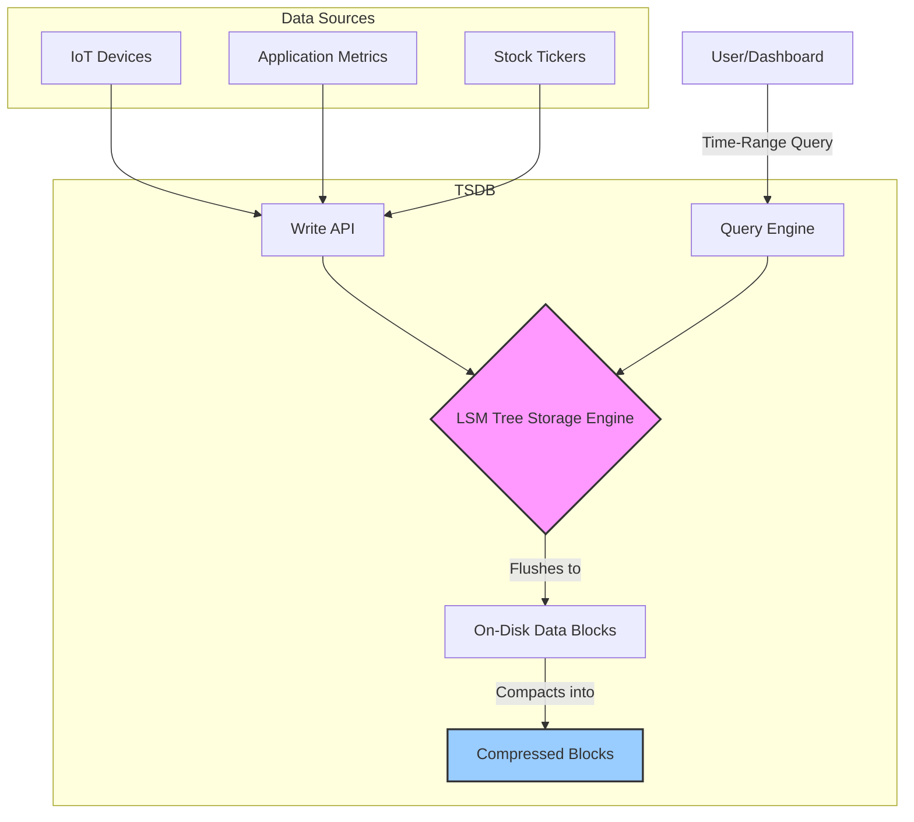

## Introduction: Data in Chronological Order

What do stock prices, server CPU usage, weather measurements, and IoT sensor readings have in common? They are all **time-series data**: a sequence of data points indexed in time order.

This type of data has several unique characteristics:
*   **Timestamp is King:** Every data point is inextricably linked to a specific point in time.
*   **Append-Only:** New data is almost always an insert. Historical data is rarely, if ever, updated.
*   **High Volume & Velocity:** Systems often generate millions of data points per second.
*   **Query Patterns:** Queries typically operate over time ranges and involve aggregations (e.g., "What was the average CPU usage over the last hour?").

Trying to manage this data deluge with a traditional relational or document database can be incredibly inefficient. They simply aren't built for this kind of workload. This is why a specialized category of database exists: the **Time-Series Database (TSDB)**.

## The Architecture of a TSDB

TSDBs like InfluxDB, Prometheus, and TimescaleDB are purpose-built to handle the unique demands of time-series data. Their architecture is optimized for two things above all else: ingesting a massive volume of writes and performing fast analytical queries over time ranges.



## The Data Model: Measurement, Tags, and Fields

To organize data efficiently, TSDBs use a specific data model:

*   **Measurement:** A string that describes the data being recorded, like `cpu_usage` or `temperature`. It's analogous to a SQL table name.
*   **Tag Set:** A collection of key-value pairs (both strings) that provide metadata for the data point. Tags are always indexed and are used for filtering and grouping. Examples: `host=server-1`, `region=us-west`.
*   **Field Set:** A collection of key-value pairs that represent the actual measured values. At least one field is required. Field values can be floats, integers, strings, or booleans. Fields are typically not indexed. Example: `value=98.5`, `usage_percent=15.2`.
*   **Timestamp:** The timestamp associated with the data point, typically with nanosecond precision.

A single data point might look like this:
`cpu_usage,host=server-1,region=us-west usage_system=10.5,usage_user=5.2 1669633200000000000`

Here:
- Measurement: `cpu_usage`
- Tags: `host=server-1`, `region=us-west`
- Fields: `usage_system=10.5`, `usage_user=5.2`
- Timestamp: `1669633200000000000`

This structure is powerful because it separates metadata (tags) from values (fields). You can efficiently query for all data from `host=server-1` without the database needing to look at the actual field values.

## The Storage Engine: The LSM Tree Advantage

The secret to a TSDB's incredible write performance is its storage engine, which is almost always based on a **Log-Structured Merge-Tree (LSM-Tree)**.

Instead of updating a complex B-Tree on disk for every write (which involves slow, random I/O), an LSM-Tree does the following:
1.  **Ingest:** Writes are appended to an in-memory table called a `memtable`. This is extremely fast.
2.  **Flush:** Once the `memtable` reaches a certain size, it is sorted and flushed to disk as a new, immutable file called an `SSTable` (Sorted String Table).
3.  **Compact:** In the background, a process continuously merges smaller `SSTable` files into larger ones, removing duplicate or deleted data as it goes.

This design converts many small, random writes into large, sequential writes, which is what modern storage hardware is best at.

## Query Patterns

Queries in a TSDB are optimized for time-based analysis. Common patterns include:

*   **Time-Range Scans:** `SELECT value FROM temperature WHERE time > now() - 1h AND location='roof'`
*   **Aggregations & Grouping:** `SELECT MEAN(value) FROM cpu_usage WHERE time > now() - 6h GROUP BY host`
*   **Windowing:** `SELECT MAX(value) FROM cpu_usage GROUP BY time(5m), host` (This calculates the max usage for every 5-minute window for each host).

## Go Example: Writing and Querying Sensor Data

Let's write a conceptual Go program that models interacting with a TSDB. We'll focus on the data structures and the logic for writing points and querying a time range.

```go
package main

import (
	"fmt"
	"log"
	"time"
)

// Point represents a single time-series data point.
type Point struct {
	Measurement string
	Tags        map[string]string
	Fields      map[string]interface{}
	Timestamp   time.Time
}

// TSDBClient simulates a client for a time-series database.
type TSDBClient struct {
	// In a real client, this would hold a connection pool.
	data []Point
}

// WritePoint simulates writing a data point to the database.
func (c *TSDBClient) WritePoint(p Point) {
	log.Printf("Writing point: %s, Tags: %v, Fields: %v", p.Measurement, p.Tags, p.Fields)
	// In a real TSDB, this would be a fast, append-only operation.
	c.data = append(c.data, p)
}

// QueryAvg simulates a query for the average of a field over a time range.
func (c *TSDBClient) QueryAvg(measurement, field, host string, start, end time.Time) (float64, int) {
	log.Printf("Querying for AVG(%s) on host %s between %s and %s", field, host, start.Format(time.RFC3339), end.Format(time.RFC3339))
	
	var sum float64
	var count int

	for _, p := range c.data {
		// Filter by measurement, tags, and time range
		if p.Measurement == measurement &&
			p.Tags["host"] == host &&
			!p.Timestamp.Before(start) &&
			!p.Timestamp.After(end) {
			
			if val, ok := p.Fields[field].(float64); ok {
				sum += val
				count++
			}
		}
	}

	if count == 0 {
		return 0, 0
	}
	return sum / float64(count), count
}

func main() {
	client := &TSDBClient{}
	now := time.Now()

	// --- Simulate writing some CPU data ---
	p1 := Point{
		Measurement: "cpu_usage",
		Tags:        map[string]string{"host": "server-1", "region": "us-east"},
		Fields:      map[string]interface{}{"usage_percent": 15.5},
		Timestamp:   now.Add(-30 * time.Minute),
	}
	p2 := Point{
		Measurement: "cpu_usage",
		Tags:        map[string]string{"host": "server-1", "region": "us-east"},
		Fields:      map[string]interface{}{"usage_percent": 18.2},
		Timestamp:   now.Add(-20 * time.Minute),
	}
	p3 := Point{
		Measurement: "cpu_usage",
		Tags:        map[string]string{"host": "server-2", "region": "us-west"}, // Different host
		Fields:      map[string]interface{}{"usage_percent": 30.0},
		Timestamp:   now.Add(-15 * time.Minute),
	}
	p4 := Point{
		Measurement: "cpu_usage",
		Tags:        map[string]string{"host": "server-1", "region": "us-east"},
		Fields:      map[string]interface{}{"usage_percent": 17.3},
		Timestamp:   now.Add(-10 * time.Minute),
	}

	client.WritePoint(p1)
	client.WritePoint(p2)
	client.WritePoint(p3)
	client.WritePoint(p4)

	// --- Now, query the data ---
	fmt.Println("\n--- Querying for server-1's average CPU in the last hour ---")
	avg, count := client.QueryAvg("cpu_usage", "usage_percent", "server-1", now.Add(-1*time.Hour), now)
	
	if count > 0 {
		fmt.Printf("Found %d data points. Average CPU for server-1: %.2f%%\n", count, avg)
	} else {
		fmt.Println("No data found for the specified range.")
	}
}
```

## Conclusion

Time-series databases are a masterful example of specialized engineering. By deeply understanding the nature of time-series data, they employ a data model and storage architecture (the LSM-Tree) that is perfectly tailored to the workload. They trade the general-purpose flexibility of relational databases for extreme performance in high-volume ingestion and time-based analytical queries. For any application involving monitoring, IoT, or financial data, a TSDB is not just a good choice—it's the essential one.
