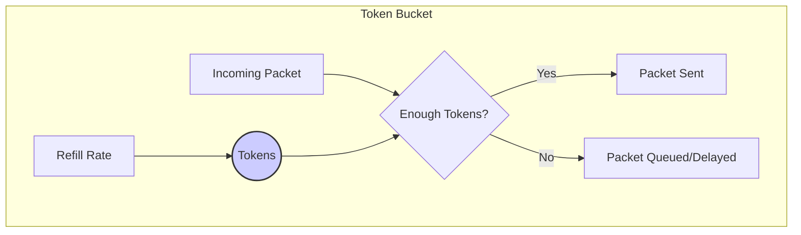
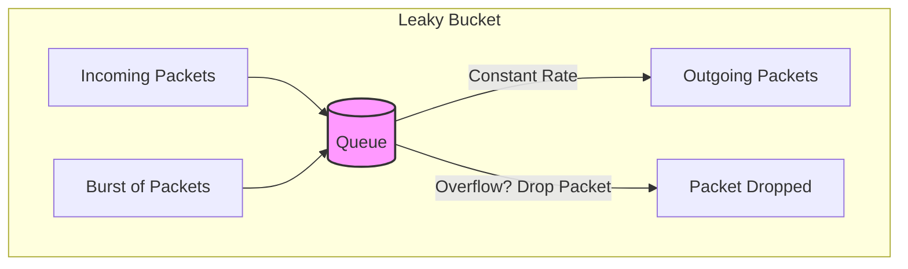

## System Design: An Overview of Traffic Shaping Patterns

In a distributed system, not all traffic is created equal. Some requests are more critical than others, and sudden bursts of traffic can overwhelm services, leading to degraded performance or even outages. **Traffic Shaping** (also known as packet shaping) is the practice of controlling the volume and rate of network traffic being sent into or out of a network to ensure a certain level of performance, quality of service (QoS), or to prevent congestion.

While [Rate Limiting](/blog/system-design/system-design-rate-limiting-strategies) is about rejecting excess requests, Traffic Shaping is about **delaying** them. Instead of dropping traffic, it holds it in a buffer and sends it out at a controlled, pre-defined rate.

This post will explore two of the most fundamental traffic shaping algorithms: the **Token Bucket** and the **Leaky Bucket**.

### Why Do We Need Traffic Shaping?

1.  **Ensure Quality of Service (QoS):** Prioritize critical traffic (like video conferencing packets) over less important traffic (like a background file download).
2.  **Prevent Congestion:** Smooth out bursts of traffic to prevent overwhelming downstream services. A sudden spike of 10,000 requests is much harder to handle than a steady stream of 100 requests per second.
3.  **Bandwidth Management:** Adhere to Service Level Agreements (SLAs) that might limit the bandwidth a service is allowed to consume.
4.  **Improve Fairness:** Ensure that no single user or process can monopolize all the available bandwidth.

### Pattern 1: The Token Bucket Algorithm

The Token Bucket is the most popular and flexible algorithm for traffic shaping and rate limiting. It works like this:

-   A bucket has a fixed capacity and is constantly refilled with "tokens" at a steady rate.
-   Each token represents permission to send a certain amount of data (e.g., one packet or one byte).
-   When a packet arrives, the system checks if there are enough tokens in the bucket.
    -   If **yes**, the required number of tokens are removed, and the packet is sent immediately.
    -   If **no**, the packet is either **dropped** (if used for rate limiting) or **queued** to wait for new tokens to be added (if used for traffic shaping).

The key feature of the Token Bucket is that it allows for **bursts**. If no traffic has been sent for a while, the bucket can accumulate tokens up to its capacity. This "saved" capacity can then be used to send a burst of traffic that is faster than the steady refill rate, as long as there are tokens to pay for it.



**Parameters:**
-   **Bucket Size:** The maximum number of tokens the bucket can hold. This determines the maximum possible burst size.
-   **Refill Rate:** The rate at which tokens are added to the bucket. This determines the average, sustainable traffic rate.

### Pattern 2: The Leaky Bucket Algorithm

The Leaky Bucket algorithm is simpler and provides a more rigid output rate. Imagine a bucket with a hole in the bottom.

-   Incoming packets are added to the bucket (a queue).
-   The bucket "leaks" packets out at a constant, fixed rate, regardless of how quickly the bucket is filled.
-   If the bucket is full when a new packet arrives, the packet is dropped.

The main characteristic of the Leaky Bucket is that it enforces a **constant output rate**. It smooths out bursty input traffic into a steady, predictable output stream. Unlike the Token Bucket, it does not allow for bursts, as it has no memory of past inactivity.



**Parameters:**
-   **Bucket Size (Queue Size):** The amount of data that can be buffered.
-   **Leak Rate (Output Rate):** The constant rate at which packets are sent.

### Token Bucket vs. Leaky Bucket

| Feature         | Token Bucket                                       | Leaky Bucket                                     |
|-----------------|----------------------------------------------------|--------------------------------------------------|
| **Output Rate** | Variable; allows for bursts.                       | **Constant** and predictable.                    |
| **Flexibility** | More flexible; can send bursts up to bucket size.  | Rigid; output is always at the same rate.        |
| **Idle Periods**| "Saves" capacity by accumulating tokens.           | Idle periods are wasted; the bucket just stays empty. |
| **Use Case**    | Ideal for services that need to handle bursts but maintain an average rate (e.g., API rate limiting). | Ideal for enforcing a strict bandwidth limit or ensuring a constant data flow for a downstream service. |

### Go Example: Implementing a Token Bucket

Go's standard library doesn't have a built-in traffic shaper, but the `golang.org/x/time/rate` package provides an excellent implementation of the Token Bucket algorithm.

This example shows how to create a rate limiter that allows an average of 2 requests per second, with a maximum burst of 5 requests.

```go
package main

import (
	"context"
	"fmt"
	"log"
	"net/http"
	"time"

	"golang.org/x/time/rate"
)

// Create a new limiter that allows 2 events per second with a burst of 5.
var limiter = rate.NewLimiter(rate.Limit(2), 5)

// limitedHandler is a middleware that uses the token bucket to shape traffic.
func limitedHandler(next http.Handler) http.Handler {
	return http.HandlerFunc(func(w http.ResponseWriter, r *http.Request) {
		// Wait blocks until a token is available or the context is canceled.
		// This is the "shaping" part - delaying the request.
		if err := limiter.Wait(context.Background()); err != nil {
			http.Error(w, "Too many requests", http.StatusTooManyRequests)
			return
		}
		
		// If you wanted to rate limit (reject) instead of shape (delay), you would use:
		// if !limiter.Allow() {
		// 	http.Error(w, "Too many requests", http.StatusTooManyRequests)
		// 	return
		// }

		next.ServeHTTP(w, r)
	})
}

func myAPIHandler(w http.ResponseWriter, r *http.Request) {
	fmt.Fprintf(w, "Request processed at %v", time.Now())
}

func main() {
	http.Handle("/api", limitedHandler(http.HandlerFunc(myAPIHandler)))

	log.Println("Server starting on :8080")
	log.Println("Try sending rapid requests to http://localhost:8080/api")
	log.Println("Example: for i in {1..10}; do curl http://localhost:8080/api &; done")
	
	log.Fatal(http.ListenAndServe(":8080", nil))
}
```

**To run this:**
1.  Install the package: `go get golang.org/x/time/rate`
2.  Run the server: `go run .`
3.  Open a terminal and send a burst of requests. The first 5 will be processed almost instantly (the burst size). Subsequent requests will be delayed and processed at a rate of 2 per second.

### Conclusion

Traffic shaping is a vital mechanism for building robust, reliable, and fair distributed systems. By understanding and implementing patterns like the Token Bucket and Leaky Bucket, you can protect your services from being overwhelmed by traffic bursts, manage bandwidth effectively, and ensure a high quality of service for your users. While the Token Bucket offers more flexibility and is generally more common, the Leaky Bucket provides a simple and effective way to enforce a strict, constant output rate. Choosing the right pattern depends on whether you need to accommodate bursts or enforce a smooth, predictable flow of traffic.
---
