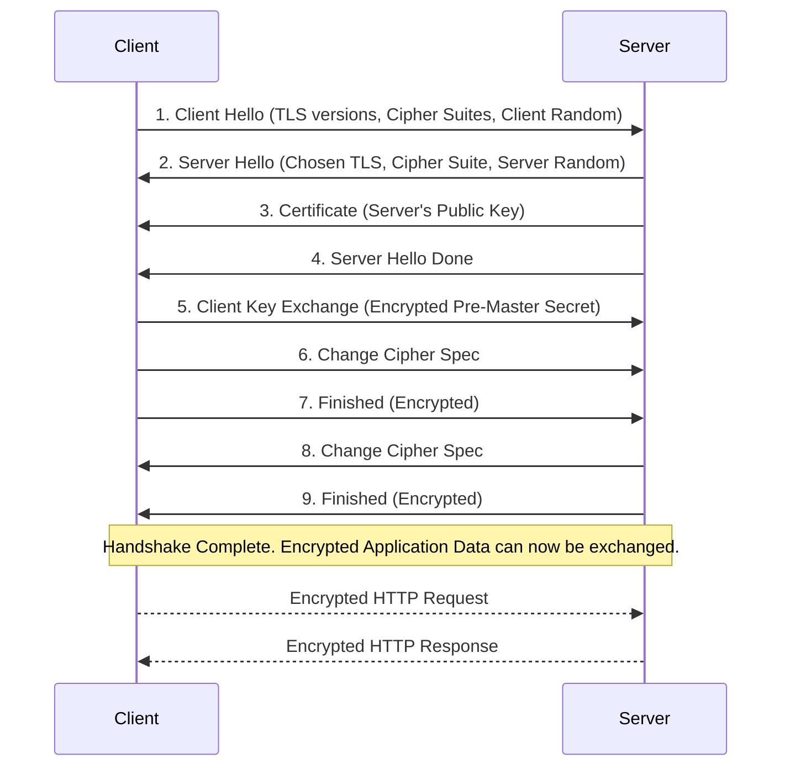

Every time you see a padlock icon in your browser's address bar, you're witnessing Transport Layer Security (TLS) in action. TLS is the cryptographic protocol that provides secure communication over a computer network. It's the "S" in HTTPS (Hypertext Transfer Protocol Secure) and is fundamental to protecting data privacy and integrity on the internet.

Understanding how TLS works is essential for any system designer or developer. It ensures that the data exchanged between a client (like a user's browser) and a server remains confidential, can't be tampered with, and that the server you're talking to is who it claims to be. This article breaks down the TLS handshake, the core components like certificates and cipher suites, and how it all comes together to create a secure channel.

### The Three Pillars of TLS

TLS provides three main security guarantees:

1.  **Confidentiality**: Prevents eavesdropping. The data exchanged between the client and server is encrypted. Even if an attacker intercepts the communication, they can't read the data.
2.  **Integrity**: Prevents data tampering. TLS uses a message authentication code (MAC) to ensure that the data has not been altered in transit. If an attacker modifies the data, the MAC check will fail.
3.  **Authentication**: Verifies identity. The client can be sure it's communicating with the legitimate server, not an imposter. This is achieved through digital certificates issued by trusted Certificate Authorities (CAs).

### The TLS Handshake: Establishing a Secure Channel

Before any application data (like an HTTP request) can be sent, the client and server must perform a "handshake." The goal of the handshake is to agree on the rules for the conversation and establish a shared secret key for encryption. This process uses **asymmetric (public-key) cryptography**, which is slow but good for securely exchanging a key. The actual application data is then encrypted using **symmetric cryptography**, which is much faster.

Here's a step-by-step breakdown of a simplified TLS 1.2 handshake:

1.  **Client Hello**: The client initiates the handshake by sending a `ClientHello` message to the server. This message includes:
    *   The TLS versions the client supports.
    *   A list of **cipher suites** it can use (see below).
    *   A random string of bytes, known as the `Client Random`.

2.  **Server Hello**: The server responds with a `ServerHello` message. It contains:
    *   The TLS version it has chosen from the client's list.
    *   The cipher suite it has selected.
    *   Its own random string of bytes, the `Server Random`.

3.  **Server Certificate**: The server sends its SSL certificate to the client. This certificate contains the server's public key and is signed by a trusted Certificate Authority (CA). The client can use the CA's public key (which is pre-installed in the browser/OS) to verify the signature on the server's certificate, thus authenticating the server.

4.  **Server Key Exchange (Optional)**: Depending on the cipher suite, the server may send additional information needed to generate the shared key.

5.  **Server Hello Done**: The server signals that it's done with its part of the initial negotiation.

6.  **Client Key Exchange**: Now it's the client's turn to help create the shared secret. The client generates another random string of bytes, called the `Pre-Master Secret`. It encrypts this `Pre-Master Secret` using the server's public key (from the certificate). This ensures that only the server (with its private key) can decrypt it.

7.  **Change Cipher Spec**: The client sends a message indicating that all future messages from it will be encrypted with the newly agreed-upon session key.

8.  **Client Finished**: The client sends its first encrypted message, which is a summary of the handshake messages so far.

9.  **Server Change Cipher Spec & Finished**: The server decrypts the `Pre-Master Secret` and independently calculates the same session key. It sends its own `Change Cipher Spec` and `Finished` messages, which are also encrypted.

At this point, the handshake is complete. Both the client and server have the same **session key**, and they can now communicate using fast symmetric encryption.



### Key Concepts Explained

#### Cipher Suites

A cipher suite is a named combination of cryptographic algorithms used during the TLS handshake. It defines:
*   **Key Exchange Algorithm**: How the shared secret key will be established (e.g., RSA, ECDHE).
*   **Bulk Encryption Algorithm**: The symmetric algorithm used to encrypt the application data (e.g., AES-256-GCM).
*   **Message Authentication Code (MAC) Algorithm**: How data integrity is verified (e.g., SHA256).

Example Cipher Suite: `TLS_ECDHE_RSA_WITH_AES_256_GCM_SHA384`
*   `ECDHE`: Elliptic Curve Diffie-Hellman Ephemeral (Key Exchange)
*   `RSA`: Used for signing the key exchange to authenticate the server.
*   `AES_256_GCM`: 256-bit Advanced Encryption Standard in Galois/Counter Mode (Bulk Encryption).
*   `SHA384`: 384-bit Secure Hash Algorithm (MAC).

Modern best practice favors cipher suites that provide **Perfect Forward Secrecy (PFS)**. This means that even if an attacker records all the encrypted traffic and later steals the server's private key, they still can't decrypt the past traffic. This is achieved by using an **ephemeral** (temporary) key exchange method like `ECDHE`, where a new temporary key is generated for every session and then discarded.

#### Digital Certificates

A digital certificate is like a digital passport. It's a data file that proves the identity of a server. It contains:
*   The server's domain name.
*   The server's public key.
*   The name of the Certificate Authority (CA) that issued it.
*   The CA's digital signature.

Your browser trusts a list of well-known CAs (like Let's Encrypt, DigiCert, GoDaddy). When it receives a certificate from a server, it checks if the signature was made by a trusted CA. If it was, the browser knows it's talking to the real server.

### Go Example: A Simple HTTPS Server

Go's standard library makes it incredibly easy to set up an HTTPS server. It handles the complexities of the TLS handshake for you.

To run this, you first need to generate a self-signed certificate and a private key. You can do this with OpenSSL:

```bash
# Generate a private key and a self-signed certificate valid for 365 days
openssl req -x509 -newkey rsa:2048 -nodes -keyout key.pem -out cert.pem -days 365
```
This will ask you for some information (Country Name, etc.). You can fill it out or leave it blank.

Now, here is the Go code for the server:

```go
package main

import (
	"fmt"
	"log"
	"net/http"
)

// helloHandler handles requests to the root path.
func helloHandler(w http.ResponseWriter, r *http.Request) {
	// The connection is already secure at this point.
	fmt.Fprintf(w, "Hello, you've connected securely over HTTPS!")
}

func main() {
	http.HandleFunc("/", helloHandler)

	// The paths to the certificate and key files we just generated.
	certFile := "cert.pem"
	keyFile := "key.pem"

	fmt.Println("Starting HTTPS server on https://localhost:8443")

	// ListenAndServeTLS handles the TLS handshake automatically.
	// It takes the server address, certificate file, and key file as arguments.
	err := http.ListenAndServeTLS(":8443", certFile, keyFile, nil)
	if err != nil {
		log.Fatalf("Failed to start server: %v", err)
	}
}
```

When you run this code and navigate to `https://localhost:8443`, your browser will show a warning because the certificate is "self-signed" and not issued by a trusted CA. This is expected. If you proceed past the warning, you will see the message, and the connection will be encrypted.

### Conclusion

TLS is a complex but vital protocol that forms the bedrock of web security. By orchestrating a handshake to authenticate the server and establish a shared secret, it provides a secure channel for confidential data exchange. As a developer, while modern libraries handle most of the implementation details, understanding the concepts of the handshake, cipher suites, and certificates is crucial for making informed decisions about system security, troubleshooting connection issues, and ensuring that your application's data remains safe from prying eyes.