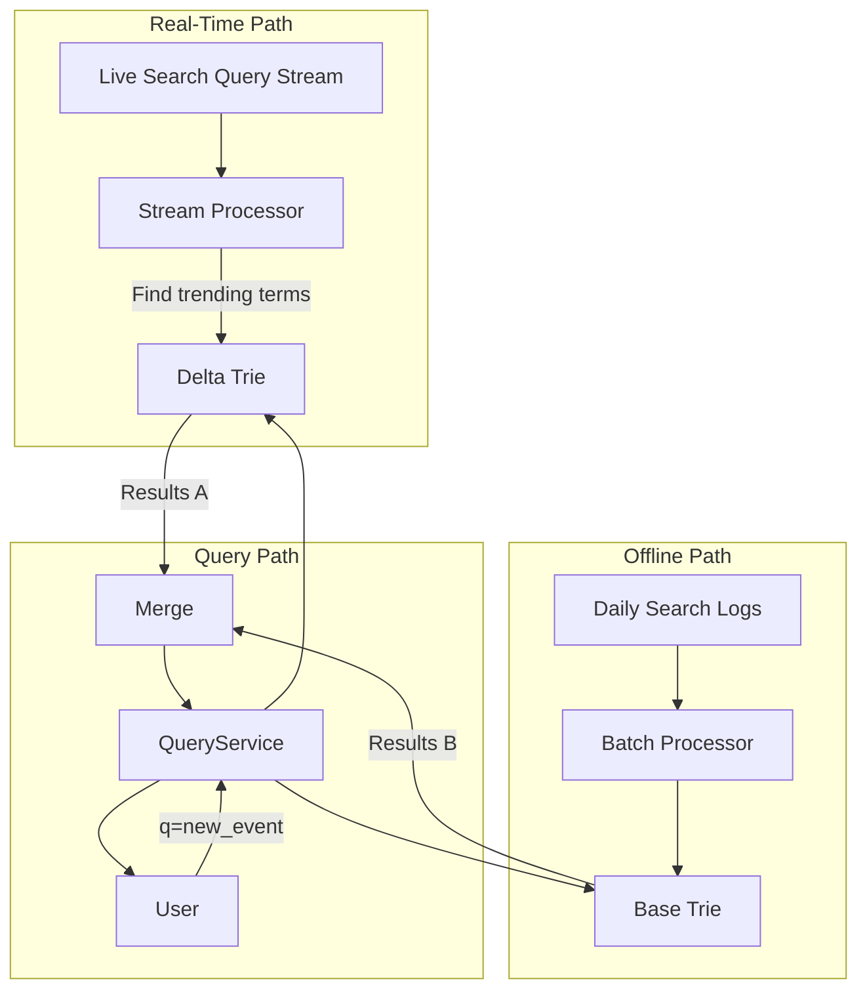

Type-ahead search, often used interchangeably with autocomplete, is the feature that provides real-time suggestions as a user types into a search box. While the previous article covered the foundational data structure (the Trie), building a production-grade type-ahead system involves much more. It requires relentless optimization for performance, sophisticated caching strategies, and a robust architecture to handle massive query volumes.

This article moves beyond the basic Trie and explores the advanced techniques required to build a fast, scalable, and resilient type-ahead search system, focusing on performance tuning, caching, and managing data updates.

### The Performance Challenge: Beyond the Big O

The Trie gives us an excellent theoretical time complexity of O(k) for a prefix of length k. However, in the real world, constant factors matter immensely. A 50ms response time is good; a 20ms response time is better. Shaving off every possible millisecond is the name of the game.

**Key Performance Bottlenecks:**
1.  **Data Size**: A Trie containing millions of terms can become very large, potentially exceeding the RAM of a single server.
2.  **Garbage Collection (GC)**: In managed languages like Go or Java, a large in-memory Trie can lead to significant GC pauses, causing latency spikes.
3.  **Query Volume**: A popular service might handle tens of thousands of queries per second (QPS), putting immense pressure on the serving infrastructure.
4.  **Ranking Complexity**: Complex ranking algorithms that consider personalization or real-time trends can add significant computational overhead to each query.

### Architectural Scaling and Optimization

A single server with a single Trie in memory won't scale forever. We need to distribute the load and the data.

#### 1. Sharding the Trie

If the dictionary of terms is too large for one machine, we need to partition (or shard) it across multiple servers.

**Sharding Strategy:**
A common approach is to shard by the **prefix itself**. For example:
*   **Server 1**: Handles all prefixes starting with `a-d`.
*   **Server 2**: Handles all prefixes starting with `e-h`.
*   ...and so on.

A load balancer or an API gateway sits in front of the sharded servers and routes requests based on the first few characters of the query.

```mermaid
graph TD
    User -- "q=apple" --> LB(Load Balancer)
    LB -- "prefix 'a' -> Server 1" --> S1[Server 1 (a-d)]
    User -- "q=google" --> LB
    LB -- "prefix 'g' -> Server 2" --> S2[Server 2 (e-h)]
    User -- "q=tesla" --> LB
    LB -- "prefix 't' -> Server N" --> SN[Server N (s-z)]

    S1 -- "Trie for a-d" --> D1[(Data)]
    S2 -- "Trie for e-h" --> D2[(Data)]
    SN -- "Trie for s-z" --> DN[(Data)]
```

*   **Pros**: Distributes the memory footprint and query load effectively.
*   **Cons**: Can lead to hot spots if certain prefixes are much more popular than others (e.g., more words start with 'c' than 'x'). This can be mitigated with more dynamic sharding logic.

#### 2. Caching Layers

Even with an in-memory Trie, computation still happens. Caching the *results* of frequent queries can eliminate this work entirely.

*   **Level 1: Local Cache (In-Memory on API Server)**
    *   Each API server can maintain a small, in-memory LRU (Least Recently Used) cache of popular prefixes and their top-k results.
    *   Example: The results for `q=a`, `q=ap`, `q=app` are likely to be requested very frequently and are great candidates for a local cache.

*   **Level 2: Distributed Cache (e.g., Redis)**
    *   A shared Redis cluster can store cached results for a much larger set of queries.
    *   When a request for `q=appl` comes to an API server, it first checks its local cache. If it's a miss, it checks the distributed Redis cache. If that's also a miss, it finally queries its in-memory Trie, computes the result, and then populates both the distributed and local caches on its way back to the user.

**Cache Invalidation:**
When the underlying Trie data is updated (e.g., a new term is added or frequencies change), the caches must be invalidated. This can be done with a Time-To-Live (TTL) on cache entries or through an explicit invalidation mechanism triggered by the indexing pipeline.

### Optimizing the Trie Data Structure

The standard Trie implementation can be further optimized for memory and speed.

*   **Compressed Tries (Radix Tree)**: A standard Trie can be deep, with many nodes that have only one child. A Radix Tree compresses these chains of single-child nodes into a single edge labeled with a substring, significantly reducing the number of nodes and the memory footprint.

*   **Memory Layout**: How you lay out the Trie in memory matters. Using contiguous memory blocks (e.g., a large array) instead of many small, scattered pointer-based node objects can improve cache locality and reduce GC pressure. This is an advanced technique but can yield significant performance gains.

### Handling Real-Time Updates

The offline indexing pipeline works well for daily updates, but what about new, trending search terms? If a major news event happens, you want terms related to it to appear in suggestions within minutes, not hours.

This requires a **hybrid approach**:
1.  **Base Trie**: The massive, comprehensive Trie built by the offline pipeline. This is immutable and updated daily.
2.  **Delta Trie**: A smaller, separate in-memory Trie that contains only new and trending terms.
    *   A real-time stream processing system (e.g., using Kafka and Flink/Spark Streaming) analyzes the search query stream to identify new, rapidly rising terms.
    *   These terms are inserted into the `Delta Trie` on the fly.
3.  **Query-Time Merging**: When a user queries, the system queries *both* the Base Trie and the Delta Trie and merges the results. Suggestions from the Delta Trie are often given a temporary ranking boost to ensure they appear at the top.



### Go Example: Caching Layer for a Trie

This example builds on the previous Trie implementation by adding a simple in-memory caching layer to demonstrate how to reduce redundant computations.

```go
package main

import (
	"fmt"
	"sync"
	"time"
)

// Using the Trie from the previous example (simplified for brevity)
type Trie struct {
	// ... (Trie implementation from Autocomplete article)
	root *TrieNode
}
type TrieNode struct {
	children   map[rune]*TrieNode
	isEndOfWord bool
	frequency   int
}
// ... (Assume NewTrie, Insert, Suggest, etc. are defined)

// TypeAheadService wraps our Trie with a caching layer.
type TypeAheadService struct {
	trie      *Trie
	cache     map[string][]string
	cacheLock sync.RWMutex
}

func NewTypeAheadService(trie *Trie) *TypeAheadService {
	return &TypeAheadService{
		trie:  trie,
		cache: make(map[string][]string),
	}
}

// GetSuggestions is the cached entry point for getting suggestions.
func (s *TypeAheadService) GetSuggestions(prefix string) []string {
	// 1. Check the cache first
	s.cacheLock.RLock()
	cachedResult, found := s.cache[prefix]
	s.cacheLock.RUnlock()

	if found {
		fmt.Printf("CACHE HIT for prefix: '%s'\n", prefix)
		return cachedResult
	}

	fmt.Printf("CACHE MISS for prefix: '%s'. Computing from Trie...\n", prefix)
	
	// 2. If not in cache, compute from the Trie
	result := s.trie.Suggest(prefix)

	// 3. Store the result in the cache
	s.cacheLock.Lock()
	s.cache[prefix] = result
	s.cacheLock.Unlock()

	return result
}

// --- Mock Trie implementation for this example ---
func NewTrie() *Trie { return &Trie{root: NewTrieNode()} }
func NewTrieNode() *TrieNode { return &TrieNode{children: make(map[rune]*TrieNode)} }
func (t *Trie) Insert(word string, freq int) { /* ... */ }
func (t *Trie) Suggest(prefix string) []string {
	// Simulate work
	time.Sleep(10 * time.Millisecond)
	if prefix == "a" { return []string{"apple", "ant"} }
	if prefix == "ap" { return []string{"apple"} }
	return []string{}
}


func main() {
	// Setup
	trie := NewTrie()
	// In a real app, you'd populate the trie here.
	
	service := NewTypeAheadService(trie)

	// --- Simulate user typing "apple" ---

	// First request for "a"
	fmt.Println("--- Typing 'a' ---")
	service.GetSuggestions("a")
	
	// Second request for "a" (should be cached)
	fmt.Println("\n--- Typing 'a' again ---")
	service.GetSuggestions("a")

	// First request for "ap"
	fmt.Println("\n--- Typing 'p' (prefix 'ap') ---")
	service.GetSuggestions("ap")
	
	// Second request for "ap" (should be cached)
	fmt.Println("\n--- Typing 'p' again (prefix 'ap') ---")
	service.GetSuggestions("ap")
}
```

### Conclusion

A production-grade type-ahead search system is a high-performance machine. While the Trie data structure is the heart of the system, achieving scalability and low latency requires a holistic approach. **Sharding** the Trie distributes the data and load, multiple **layers of caching** reduce redundant computation to near zero for common queries, and a **hybrid data model** combining batch-processed and real-time Tries ensures that the suggestions are always fresh and relevant. By carefully tuning each of these components, it's possible to build a type-ahead system that feels instantaneous to the user, even at massive scale.