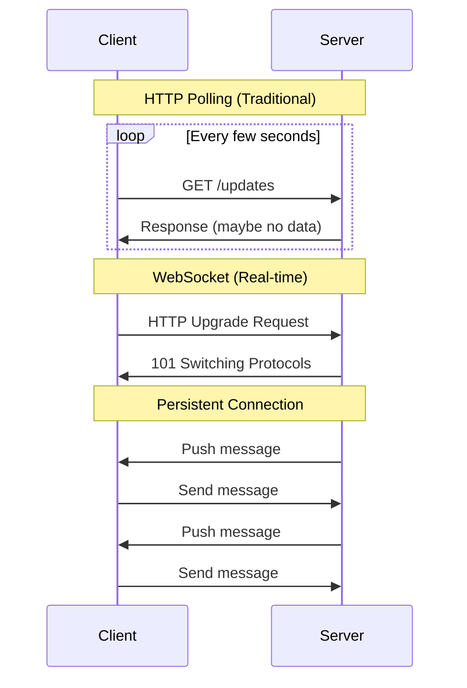

# System Design Fundamentals: WebSockets & Real-time Communication

WebSockets enable full-duplex, bidirectional communication between clients and servers, perfect for real-time applications like chat, notifications, collaborative editing, and live updates.

## WebSocket vs HTTP



## Connection Manager

```go
package main

import (
    "fmt"
    "sync"
    "time"
)

// Connection represents a WebSocket connection
type Connection struct {
    ID            string
    UserID        string
    ConnectedAt   time.Time
    LastActivity  time.Time
    MessageCount  int64
    SendChannel   chan []byte
    CloseChannel  chan struct{}
    Metadata      map[string]interface{}
}

// ConnectionManager manages all WebSocket connections
type ConnectionManager struct {
    connections    map[string]*Connection
    userConnections map[string][]*Connection // userID -> connections
    mutex          sync.RWMutex
    heartbeatInterval time.Duration
}

func NewConnectionManager(heartbeatInterval time.Duration) *ConnectionManager {
    return &ConnectionManager{
        connections:     make(map[string]*Connection),
        userConnections: make(map[string][]*Connection),
        heartbeatInterval: heartbeatInterval,
    }
}

// AddConnection registers a new connection
func (cm *ConnectionManager) AddConnection(conn *Connection) {
    cm.mutex.Lock()
    defer cm.mutex.Unlock()
    
    conn.ConnectedAt = time.Now()
    conn.LastActivity = time.Now()
    conn.SendChannel = make(chan []byte, 256)
    conn.CloseChannel = make(chan struct{})
    
    cm.connections[conn.ID] = conn
    
    // Index by user
    if cm.userConnections[conn.UserID] == nil {
        cm.userConnections[conn.UserID] = make([]*Connection, 0)
    }
    cm.userConnections[conn.UserID] = append(cm.userConnections[conn.UserID], conn)
    
    fmt.Printf("✅ Connection added: %s (user: %s)\n", conn.ID, conn.UserID)
    
    // Start heartbeat for this connection
    go cm.startHeartbeat(conn)
}

// RemoveConnection removes a connection
func (cm *ConnectionManager) RemoveConnection(connID string) {
    cm.mutex.Lock()
    defer cm.mutex.Unlock()
    
    conn, exists := cm.connections[connID]
    if !exists {
        return
    }
    
    // Remove from main map
    delete(cm.connections, connID)
    
    // Remove from user connections
    userConns := cm.userConnections[conn.UserID]
    for i, c := range userConns {
        if c.ID == connID {
            cm.userConnections[conn.UserID] = append(userConns[:i], userConns[i+1:]...)
            break
        }
    }
    
    // Clean up user connections if empty
    if len(cm.userConnections[conn.UserID]) == 0 {
        delete(cm.userConnections, conn.UserID)
    }
    
    // Close channels
    close(conn.CloseChannel)
    close(conn.SendChannel)
    
    fmt.Printf("🗑️  Connection removed: %s (user: %s)\n", connID, conn.UserID)
}

// GetConnection retrieves a connection by ID
func (cm *ConnectionManager) GetConnection(connID string) (*Connection, bool) {
    cm.mutex.RLock()
    defer cm.mutex.RUnlock()
    
    conn, exists := cm.connections[connID]
    return conn, exists
}

// GetUserConnections returns all connections for a user
func (cm *ConnectionManager) GetUserConnections(userID string) []*Connection {
    cm.mutex.RLock()
    defer cm.mutex.RUnlock()
    
    conns := cm.userConnections[userID]
    if conns == nil {
        return []*Connection{}
    }
    
    // Return copy
    result := make([]*Connection, len(conns))
    copy(result, conns)
    
    return result
}

// GetAllConnections returns all active connections
func (cm *ConnectionManager) GetAllConnections() []*Connection {
    cm.mutex.RLock()
    defer cm.mutex.RUnlock()
    
    result := make([]*Connection, 0, len(cm.connections))
    for _, conn := range cm.connections {
        result = append(result, conn)
    }
    
    return result
}

// GetConnectionCount returns total connection count
func (cm *ConnectionManager) GetConnectionCount() int {
    cm.mutex.RLock()
    defer cm.mutex.RUnlock()
    
    return len(cm.connections)
}

// UpdateActivity updates last activity time
func (cm *ConnectionManager) UpdateActivity(connID string) {
    cm.mutex.Lock()
    defer cm.mutex.Unlock()
    
    if conn, exists := cm.connections[connID]; exists {
        conn.LastActivity = time.Now()
    }
}

// startHeartbeat sends periodic heartbeat messages
func (cm *ConnectionManager) startHeartbeat(conn *Connection) {
    ticker := time.NewTicker(cm.heartbeatInterval)
    defer ticker.Stop()
    
    for {
        select {
        case <-ticker.C:
            // Check if connection is stale
            if time.Since(conn.LastActivity) > cm.heartbeatInterval*3 {
                fmt.Printf("💔 Connection %s timed out\n", conn.ID)
                cm.RemoveConnection(conn.ID)
                return
            }
            
            // Send heartbeat
            select {
            case conn.SendChannel <- []byte("ping"):
                // Heartbeat sent
            case <-conn.CloseChannel:
                return
            }
            
        case <-conn.CloseChannel:
            return
        }
    }
}
```

## Message Broadcaster

```go
// Message represents a WebSocket message
type Message struct {
    Type      string                 `json:"type"`
    From      string                 `json:"from"`
    To        string                 `json:"to,omitempty"`
    RoomID    string                 `json:"room_id,omitempty"`
    Payload   map[string]interface{} `json:"payload"`
    Timestamp time.Time              `json:"timestamp"`
}

// Broadcaster handles message broadcasting
type Broadcaster struct {
    connectionManager *ConnectionManager
    messageQueue      chan Message
    workers           int
}

func NewBroadcaster(connectionManager *ConnectionManager, workers int) *Broadcaster {
    return &Broadcaster{
        connectionManager: connectionManager,
        messageQueue:      make(chan Message, 1000),
        workers:           workers,
    }
}

// Start begins processing messages
func (b *Broadcaster) Start() {
    fmt.Printf("📢 Broadcaster started with %d workers\n", b.workers)
    
    for i := 0; i < b.workers; i++ {
        go b.worker(i)
    }
}

// worker processes messages from queue
func (b *Broadcaster) worker(id int) {
    for msg := range b.messageQueue {
        switch msg.Type {
        case "unicast":
            b.sendToUser(msg)
        case "broadcast":
            b.sendToAll(msg)
        case "room":
            b.sendToRoom(msg)
        case "multicast":
            b.sendToMultiple(msg)
        }
    }
}

// SendMessage queues a message for sending
func (b *Broadcaster) SendMessage(msg Message) {
    msg.Timestamp = time.Now()
    b.messageQueue <- msg
}

// sendToUser sends message to a specific user (all their connections)
func (b *Broadcaster) sendToUser(msg Message) {
    connections := b.connectionManager.GetUserConnections(msg.To)
    
    if len(connections) == 0 {
        fmt.Printf("⚠️  No connections for user: %s\n", msg.To)
        return
    }
    
    data := b.serializeMessage(msg)
    
    for _, conn := range connections {
        select {
        case conn.SendChannel <- data:
            conn.MessageCount++
            fmt.Printf("📤 Message sent to %s (conn: %s)\n", msg.To, conn.ID)
        case <-time.After(1 * time.Second):
            fmt.Printf("⚠️  Send timeout for connection: %s\n", conn.ID)
        }
    }
}

// sendToAll broadcasts message to all connected users
func (b *Broadcaster) sendToAll(msg Message) {
    connections := b.connectionManager.GetAllConnections()
    
    fmt.Printf("📢 Broadcasting to %d connections\n", len(connections))
    
    data := b.serializeMessage(msg)
    
    var wg sync.WaitGroup
    for _, conn := range connections {
        wg.Add(1)
        go func(c *Connection) {
            defer wg.Done()
            
            select {
            case c.SendChannel <- data:
                c.MessageCount++
            case <-time.After(1 * time.Second):
                fmt.Printf("⚠️  Broadcast timeout for connection: %s\n", c.ID)
            }
        }(conn)
    }
    
    wg.Wait()
    fmt.Printf("✅ Broadcast completed\n")
}

// sendToRoom sends message to all users in a room
func (b *Broadcaster) sendToRoom(msg Message) {
    // Room membership would be tracked separately
    // For demo, we'll simulate with metadata
    
    connections := b.connectionManager.GetAllConnections()
    roomMembers := make([]*Connection, 0)
    
    for _, conn := range connections {
        if room, ok := conn.Metadata["room"].(string); ok && room == msg.RoomID {
            roomMembers = append(roomMembers, conn)
        }
    }
    
    fmt.Printf("📢 Sending to room %s (%d members)\n", msg.RoomID, len(roomMembers))
    
    data := b.serializeMessage(msg)
    
    for _, conn := range roomMembers {
        select {
        case conn.SendChannel <- data:
            conn.MessageCount++
        case <-time.After(1 * time.Second):
            fmt.Printf("⚠️  Room send timeout for connection: %s\n", conn.ID)
        }
    }
}

// sendToMultiple sends to multiple specific users
func (b *Broadcaster) sendToMultiple(msg Message) {
    // Expects msg.Payload["users"] to be []string
    users, ok := msg.Payload["users"].([]string)
    if !ok {
        return
    }
    
    data := b.serializeMessage(msg)
    
    for _, userID := range users {
        connections := b.connectionManager.GetUserConnections(userID)
        
        for _, conn := range connections {
            select {
            case conn.SendChannel <- data:
                conn.MessageCount++
            case <-time.After(1 * time.Second):
                // Timeout
            }
        }
    }
    
    fmt.Printf("📤 Multicast sent to %d users\n", len(users))
}

// serializeMessage converts message to bytes
func (b *Broadcaster) serializeMessage(msg Message) []byte {
    // In production: use json.Marshal
    return []byte(fmt.Sprintf("[%s] %s: %v", msg.Type, msg.From, msg.Payload))
}
```

## Room Manager

```go
// Room represents a chat room or channel
type Room struct {
    ID          string
    Name        string
    Members     map[string]bool // userID -> bool
    CreatedAt   time.Time
    MessageCount int64
    mutex       sync.RWMutex
}

// RoomManager manages rooms and memberships
type RoomManager struct {
    rooms              map[string]*Room
    userRooms          map[string][]string // userID -> roomIDs
    connectionManager  *ConnectionManager
    mutex              sync.RWMutex
}

func NewRoomManager(connectionManager *ConnectionManager) *RoomManager {
    return &RoomManager{
        rooms:             make(map[string]*Room),
        userRooms:         make(map[string][]string),
        connectionManager: connectionManager,
    }
}

// CreateRoom creates a new room
func (rm *RoomManager) CreateRoom(roomID, name string) *Room {
    rm.mutex.Lock()
    defer rm.mutex.Unlock()
    
    room := &Room{
        ID:        roomID,
        Name:      name,
        Members:   make(map[string]bool),
        CreatedAt: time.Now(),
    }
    
    rm.rooms[roomID] = room
    
    fmt.Printf("🏠 Room created: %s (%s)\n", name, roomID)
    
    return room
}

// JoinRoom adds a user to a room
func (rm *RoomManager) JoinRoom(userID, roomID string) error {
    rm.mutex.Lock()
    defer rm.mutex.Unlock()
    
    room, exists := rm.rooms[roomID]
    if !exists {
        return fmt.Errorf("room not found: %s", roomID)
    }
    
    room.mutex.Lock()
    room.Members[userID] = true
    room.mutex.Unlock()
    
    // Track user's rooms
    if rm.userRooms[userID] == nil {
        rm.userRooms[userID] = make([]string, 0)
    }
    rm.userRooms[userID] = append(rm.userRooms[userID], roomID)
    
    // Update connection metadata
    connections := rm.connectionManager.GetUserConnections(userID)
    for _, conn := range connections {
        conn.Metadata["room"] = roomID
    }
    
    fmt.Printf("👤 User %s joined room %s\n", userID, room.Name)
    
    return nil
}

// LeaveRoom removes a user from a room
func (rm *RoomManager) LeaveRoom(userID, roomID string) error {
    rm.mutex.Lock()
    defer rm.mutex.Unlock()
    
    room, exists := rm.rooms[roomID]
    if !exists {
        return fmt.Errorf("room not found: %s", roomID)
    }
    
    room.mutex.Lock()
    delete(room.Members, userID)
    room.mutex.Unlock()
    
    // Remove from user's rooms
    userRoomsList := rm.userRooms[userID]
    for i, rid := range userRoomsList {
        if rid == roomID {
            rm.userRooms[userID] = append(userRoomsList[:i], userRoomsList[i+1:]...)
            break
        }
    }
    
    fmt.Printf("👋 User %s left room %s\n", userID, room.Name)
    
    return nil
}

// GetRoomMembers returns all members in a room
func (rm *RoomManager) GetRoomMembers(roomID string) []string {
    rm.mutex.RLock()
    defer rm.mutex.RUnlock()
    
    room, exists := rm.rooms[roomID]
    if !exists {
        return []string{}
    }
    
    room.mutex.RLock()
    defer room.mutex.RUnlock()
    
    members := make([]string, 0, len(room.Members))
    for userID := range room.Members {
        members = append(members, userID)
    }
    
    return members
}

// GetUserRooms returns all rooms a user is in
func (rm *RoomManager) GetUserRooms(userID string) []string {
    rm.mutex.RLock()
    defer rm.mutex.RUnlock()
    
    rooms := rm.userRooms[userID]
    if rooms == nil {
        return []string{}
    }
    
    result := make([]string, len(rooms))
    copy(result, rooms)
    
    return result
}

// GetRoomInfo returns room information
func (rm *RoomManager) GetRoomInfo(roomID string) (*Room, error) {
    rm.mutex.RLock()
    defer rm.mutex.RUnlock()
    
    room, exists := rm.rooms[roomID]
    if !exists {
        return nil, fmt.Errorf("room not found: %s", roomID)
    }
    
    return room, nil
}
```

## Presence Tracker

```go
// PresenceTracker tracks user online/offline status
type PresenceTracker struct {
    connectionManager *ConnectionManager
    userStatus        map[string]string // userID -> status
    statusListeners   map[string][]StatusListener
    mutex             sync.RWMutex
}

type StatusListener func(userID, status string)

func NewPresenceTracker(connectionManager *ConnectionManager) *PresenceTracker {
    return &PresenceTracker{
        connectionManager: connectionManager,
        userStatus:        make(map[string]string),
        statusListeners:   make(map[string][]StatusListener),
    }
}

// SetUserStatus sets a user's presence status
func (pt *PresenceTracker) SetUserStatus(userID, status string) {
    pt.mutex.Lock()
    defer pt.mutex.Unlock()
    
    oldStatus := pt.userStatus[userID]
    pt.userStatus[userID] = status
    
    fmt.Printf("👁️  User %s status: %s -> %s\n", userID, oldStatus, status)
    
    // Notify listeners
    listeners := pt.statusListeners[userID]
    for _, listener := range listeners {
        go listener(userID, status)
    }
}

// GetUserStatus returns a user's current status
func (pt *PresenceTracker) GetUserStatus(userID string) string {
    pt.mutex.RLock()
    defer pt.mutex.RUnlock()
    
    status, exists := pt.userStatus[userID]
    if !exists {
        // Check if user has any active connections
        connections := pt.connectionManager.GetUserConnections(userID)
        if len(connections) > 0 {
            return "online"
        }
        return "offline"
    }
    
    return status
}

// SubscribeToStatus subscribes to status changes for a user
func (pt *PresenceTracker) SubscribeToStatus(userID string, listener StatusListener) {
    pt.mutex.Lock()
    defer pt.mutex.Unlock()
    
    if pt.statusListeners[userID] == nil {
        pt.statusListeners[userID] = make([]StatusListener, 0)
    }
    
    pt.statusListeners[userID] = append(pt.statusListeners[userID], listener)
}

// GetOnlineUsers returns all online users
func (pt *PresenceTracker) GetOnlineUsers() []string {
    pt.mutex.RLock()
    defer pt.mutex.RUnlock()
    
    online := make([]string, 0)
    
    // Get users from active connections
    connections := pt.connectionManager.GetAllConnections()
    userSet := make(map[string]bool)
    
    for _, conn := range connections {
        if !userSet[conn.UserID] {
            online = append(online, conn.UserID)
            userSet[conn.UserID] = true
        }
    }
    
    return online
}

// UpdatePresenceFromConnections updates presence based on connections
func (pt *PresenceTracker) UpdatePresenceFromConnections() {
    connections := pt.connectionManager.GetAllConnections()
    activeUsers := make(map[string]bool)
    
    for _, conn := range connections {
        activeUsers[conn.UserID] = true
    }
    
    pt.mutex.Lock()
    defer pt.mutex.Unlock()
    
    // Mark users with connections as online
    for userID := range activeUsers {
        if pt.userStatus[userID] != "online" {
            pt.userStatus[userID] = "online"
            
            // Notify listeners
            listeners := pt.statusListeners[userID]
            for _, listener := range listeners {
                go listener(userID, "online")
            }
        }
    }
    
    // Mark users without connections as offline
    for userID, status := range pt.userStatus {
        if !activeUsers[userID] && status != "offline" {
            pt.userStatus[userID] = "offline"
            
            // Notify listeners
            listeners := pt.statusListeners[userID]
            for _, listener := range listeners {
                go listener(userID, "offline")
            }
        }
    }
}
```

## Message Handler

```go
// MessageHandler processes incoming messages
type MessageHandler struct {
    broadcaster     *Broadcaster
    roomManager     *RoomManager
    presenceTracker *PresenceTracker
}

func NewMessageHandler(broadcaster *Broadcaster, roomManager *RoomManager, presenceTracker *PresenceTracker) *MessageHandler {
    return &MessageHandler{
        broadcaster:     broadcaster,
        roomManager:     roomManager,
        presenceTracker: presenceTracker,
    }
}

// HandleMessage processes a message from a connection
func (mh *MessageHandler) HandleMessage(conn *Connection, msgType string, data []byte) error {
    fmt.Printf("📨 Handling message from %s: type=%s\n", conn.UserID, msgType)
    
    switch msgType {
    case "chat":
        return mh.handleChatMessage(conn, data)
    case "join_room":
        return mh.handleJoinRoom(conn, data)
    case "leave_room":
        return mh.handleLeaveRoom(conn, data)
    case "status_update":
        return mh.handleStatusUpdate(conn, data)
    case "typing":
        return mh.handleTypingIndicator(conn, data)
    default:
        return fmt.Errorf("unknown message type: %s", msgType)
    }
}

func (mh *MessageHandler) handleChatMessage(conn *Connection, data []byte) error {
    // Parse message (simplified)
    msg := Message{
        Type: "chat",
        From: conn.UserID,
        Payload: map[string]interface{}{
            "text": string(data),
        },
    }
    
    // Check if user is in a room
    if roomID, ok := conn.Metadata["room"].(string); ok {
        msg.Type = "room"
        msg.RoomID = roomID
        mh.broadcaster.SendMessage(msg)
    } else {
        // Direct message (would need "to" field)
        msg.Type = "unicast"
        mh.broadcaster.SendMessage(msg)
    }
    
    return nil
}

func (mh *MessageHandler) handleJoinRoom(conn *Connection, data []byte) error {
    roomID := string(data)
    
    if err := mh.roomManager.JoinRoom(conn.UserID, roomID); err != nil {
        return err
    }
    
    // Notify room members
    msg := Message{
        Type:   "room",
        RoomID: roomID,
        From:   "system",
        Payload: map[string]interface{}{
            "event":  "user_joined",
            "userID": conn.UserID,
        },
    }
    
    mh.broadcaster.SendMessage(msg)
    
    return nil
}

func (mh *MessageHandler) handleLeaveRoom(conn *Connection, data []byte) error {
    roomID := string(data)
    
    if err := mh.roomManager.LeaveRoom(conn.UserID, roomID); err != nil {
        return err
    }
    
    // Notify room members
    msg := Message{
        Type:   "room",
        RoomID: roomID,
        From:   "system",
        Payload: map[string]interface{}{
            "event":  "user_left",
            "userID": conn.UserID,
        },
    }
    
    mh.broadcaster.SendMessage(msg)
    
    return nil
}

func (mh *MessageHandler) handleStatusUpdate(conn *Connection, data []byte) error {
    status := string(data) // "online", "away", "busy", "offline"
    
    mh.presenceTracker.SetUserStatus(conn.UserID, status)
    
    return nil
}

func (mh *MessageHandler) handleTypingIndicator(conn *Connection, data []byte) error {
    // Broadcast typing indicator to room
    if roomID, ok := conn.Metadata["room"].(string); ok {
        msg := Message{
            Type:   "room",
            RoomID: roomID,
            From:   conn.UserID,
            Payload: map[string]interface{}{
                "event": "typing",
            },
        }
        
        mh.broadcaster.SendMessage(msg)
    }
    
    return nil
}
```

## Complete Demo

```go
func main() {
    fmt.Println("🚀 Starting WebSocket & Real-time Communication Demo\n")
    
    // Initialize components
    connectionManager := NewConnectionManager(10 * time.Second)
    broadcaster := NewBroadcaster(connectionManager, 4)
    roomManager := NewRoomManager(connectionManager)
    presenceTracker := NewPresenceTracker(connectionManager)
    messageHandler := NewMessageHandler(broadcaster, roomManager, presenceTracker)
    
    broadcaster.Start()
    
    fmt.Println("=== Setting Up Chat Rooms ===\n")
    
    // Create rooms
    roomManager.CreateRoom("room-general", "General Chat")
    roomManager.CreateRoom("room-tech", "Tech Discussion")
    
    fmt.Println("\n=== Connecting Users ===\n")
    
    // Simulate user connections
    user1Conn1 := &Connection{
        ID:       "conn-1",
        UserID:   "alice",
        Metadata: make(map[string]interface{}),
    }
    connectionManager.AddConnection(user1Conn1)
    
    user2Conn1 := &Connection{
        ID:       "conn-2",
        UserID:   "bob",
        Metadata: make(map[string]interface{}),
    }
    connectionManager.AddConnection(user2Conn1)
    
    user3Conn1 := &Connection{
        ID:       "conn-3",
        UserID:   "charlie",
        Metadata: make(map[string]interface{}),
    }
    connectionManager.AddConnection(user3Conn1)
    
    // Alice connects from mobile too
    user1Conn2 := &Connection{
        ID:       "conn-4",
        UserID:   "alice",
        Metadata: make(map[string]interface{}),
    }
    connectionManager.AddConnection(user1Conn2)
    
    fmt.Printf("\nTotal connections: %d\n", connectionManager.GetConnectionCount())
    
    fmt.Println("\n=== Users Joining Rooms ===\n")
    
    // Users join rooms
    roomManager.JoinRoom("alice", "room-general")
    roomManager.JoinRoom("bob", "room-general")
    roomManager.JoinRoom("charlie", "room-tech")
    roomManager.JoinRoom("alice", "room-tech")
    
    time.Sleep(500 * time.Millisecond)
    
    fmt.Println("\n=== Room Information ===\n")
    
    // Show room info
    generalMembers := roomManager.GetRoomMembers("room-general")
    fmt.Printf("General Chat members: %v\n", generalMembers)
    
    techMembers := roomManager.GetRoomMembers("room-tech")
    fmt.Printf("Tech Discussion members: %v\n", techMembers)
    
    aliceRooms := roomManager.GetUserRooms("alice")
    fmt.Printf("Alice's rooms: %v\n", aliceRooms)
    
    fmt.Println("\n=== Broadcasting Messages ===\n")
    
    // Broadcast to all
    broadcaster.SendMessage(Message{
        Type: "broadcast",
        From: "system",
        Payload: map[string]interface{}{
            "text": "Welcome to the chat system!",
        },
    })
    
    time.Sleep(500 * time.Millisecond)
    
    // Send to specific room
    broadcaster.SendMessage(Message{
        Type:   "room",
        RoomID: "room-general",
        From:   "alice",
        Payload: map[string]interface{}{
            "text": "Hello everyone in General!",
        },
    })
    
    time.Sleep(500 * time.Millisecond)
    
    // Direct message
    broadcaster.SendMessage(Message{
        Type: "unicast",
        From: "alice",
        To:   "bob",
        Payload: map[string]interface{}{
            "text": "Hey Bob, check your DMs!",
        },
    })
    
    time.Sleep(500 * time.Millisecond)
    
    fmt.Println("\n=== Presence Tracking ===\n")
    
    // Set user statuses
    presenceTracker.SetUserStatus("alice", "online")
    presenceTracker.SetUserStatus("bob", "away")
    presenceTracker.SetUserStatus("charlie", "busy")
    
    // Subscribe to status changes
    presenceTracker.SubscribeToStatus("alice", func(userID, status string) {
        fmt.Printf("🔔 Status change notification: %s is now %s\n", userID, status)
    })
    
    // Get online users
    onlineUsers := presenceTracker.GetOnlineUsers()
    fmt.Printf("\nCurrently online users: %v\n", onlineUsers)
    
    // Check specific user status
    aliceStatus := presenceTracker.GetUserStatus("alice")
    fmt.Printf("Alice's status: %s\n", aliceStatus)
    
    fmt.Println("\n=== Simulating Message Handling ===\n")
    
    // Simulate typing indicator
    messageHandler.HandleMessage(user1Conn1, "typing", []byte(""))
    
    time.Sleep(500 * time.Millisecond)
    
    // Simulate chat message
    messageHandler.HandleMessage(user1Conn1, "chat", []byte("This is a test message"))
    
    time.Sleep(500 * time.Millisecond)
    
    fmt.Println("\n=== User Disconnection ===\n")
    
    // Alice disconnects from one device
    connectionManager.RemoveConnection("conn-4")
    
    fmt.Printf("Alice's remaining connections: %d\n",
        len(connectionManager.GetUserConnections("alice")))
    
    // Update presence based on connections
    presenceTracker.UpdatePresenceFromConnections()
    
    fmt.Println("\n=== Connection Statistics ===\n")
    
    connections := connectionManager.GetAllConnections()
    for _, conn := range connections {
        fmt.Printf("Connection %s:\n", conn.ID)
        fmt.Printf("  User: %s\n", conn.UserID)
        fmt.Printf("  Connected: %v ago\n", time.Since(conn.ConnectedAt).Round(time.Second))
        fmt.Printf("  Messages sent: %d\n", conn.MessageCount)
        fmt.Printf("  Last activity: %v ago\n", time.Since(conn.LastActivity).Round(time.Second))
        fmt.Println()
    }
    
    fmt.Println("✅ WebSocket Demo completed!")
}
```

## WebSocket Patterns Comparison

| Pattern | Use Case | Pros | Cons |
|---------|----------|------|------|
| **Single Connection** | Simple apps | Easy to implement | No multi-device support |
| **Multiple Connections** | Multi-device users | Better UX | More overhead |
| **Room-based** | Group communication | Organized, scalable | Complexity |
| **Pub/Sub** | Event broadcasting | Decoupled, flexible | Infrastructure needed |

## Best Practices

### 1. Connection Management
```go
// Good: Track all connections per user
type ConnectionManager struct {
    userConnections map[string][]*Connection
    // ...
}

// Bad: Single connection per user
type BadConnectionManager struct {
    userConnection map[string]*Connection // Only one!
}
```

### 2. Heartbeat & Timeout
```go
// Implement heartbeat to detect dead connections
heartbeatInterval := 30 * time.Second
connectionTimeout := 90 * time.Second

if time.Since(conn.LastActivity) > connectionTimeout {
    closeConnection(conn)
}
```

### 3. Backpressure Handling
```go
// Use buffered channels with timeout
select {
case conn.SendChannel <- message:
    // Sent successfully
case <-time.After(1 * time.Second):
    // Slow consumer, drop message or close connection
    closeConnection(conn)
}
```

### 4. Message Ordering
```go
// Use sequence numbers for message ordering
type Message struct {
    SequenceNumber int64
    // ...
}

// Client can detect and handle out-of-order messages
```

## Scaling WebSockets

### Horizontal Scaling
```
┌─────────┐     ┌─────────────┐
│ Client 1│────▶│Load Balancer│
└─────────┘     └──────┬──────┘
                       │
         ┌─────────────┼─────────────┐
         ▼             ▼             ▼
    ┌────────┐    ┌────────┐    ┌────────┐
    │Server 1│    │Server 2│    │Server 3│
    └───┬────┘    └───┬────┘    └───┬────┘
        │             │             │
        └─────────────┼─────────────┘
                      ▼
              ┌───────────────┐
              │ Redis Pub/Sub │
              └───────────────┘
```

### Sticky Sessions
- Route user to same server
- Use consistent hashing
- Store session data centrally

## When to Use WebSockets

### Good Use Cases
- **Chat applications**: Real-time messaging
- **Live updates**: Stock prices, sports scores
- **Collaborative editing**: Google Docs-style
- **Gaming**: Real-time multiplayer
- **IoT**: Sensor data streaming
- **Notifications**: Push notifications

### Not Recommended For
- Simple request/response (use HTTP)
- Infrequent updates (use polling)
- Large file transfers (use HTTP with resumption)
- When firewall/proxy issues expected

## Conclusion

WebSockets enable true real-time bidirectional communication, essential for modern interactive applications. Key principles:

- **Connection Management**: Track all connections, handle multi-device users
- **Broadcasting**: Efficient message distribution (unicast, broadcast, room-based)
- **Presence**: Track online/offline status accurately
- **Graceful Degradation**: Handle disconnections and reconnections
- **Scalability**: Use pub/sub for horizontal scaling

Implement proper heartbeats, backpressure handling, and security (authentication, rate limiting) for production-ready WebSocket systems.
