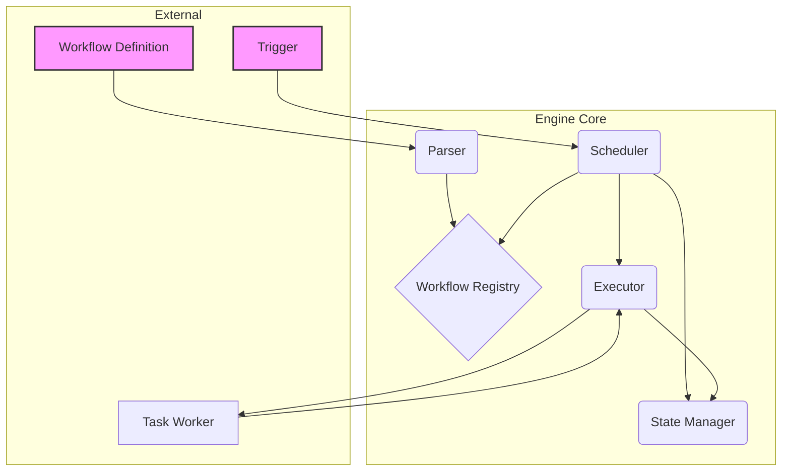

In modern applications, many business processes are not single, atomic operations but rather a series of interconnected steps that must be executed in a specific order. Consider an e-commerce order: the process involves validating payment, reserving inventory, notifying the warehouse, and sending a confirmation email. Managing this sequence, especially in a distributed microservices environment, is a classic orchestration challenge. This is where a **Workflow Engine** comes in.

A workflow engine is a system that manages and executes long-running, multi-step processes. It provides the backbone for orchestrating complex tasks, ensuring they are completed reliably, in the correct sequence, and with visibility into their status. This post explores the design of workflow engines, their core components, and their importance in building robust applications.

### What is a Workflow Engine?

At its core, a workflow engine is a state machine on steroids. It takes a workflow definition—a blueprint of the steps, their dependencies, and the logic connecting them—and executes it. It is responsible for:

-   **State Management**: Tracking the current state of every running workflow instance.
-   **Task Scheduling**: Determining which task to execute next based on the workflow definition.
-   **Task Execution**: Invoking the actual business logic (e.g., calling a microservice, running a script).
-   **Failure Handling**: Managing retries, timeouts, and compensating actions when a step fails.
-   **Visibility**: Providing insights into the status of workflows, both in-progress and completed.

Workflow engines are crucial for processes that are long-running, involve multiple services, and require high reliability.

### Core Components of a Workflow Engine

A typical workflow engine consists of several key components that work together to manage and execute workflows.

**Architecture Diagram**



1.  **Workflow Definition**: This is the blueprint of the process, often defined in a structured format like YAML, JSON, or a domain-specific language (DSL). It specifies the tasks, their inputs/outputs, and the control flow (e.g., sequential, parallel).

2.  **Parser**: The parser reads the workflow definition and validates it. It then converts the definition into an in-memory representation that the engine can execute and often stores it in a **Workflow Registry**.

3.  **Scheduler**: The scheduler is the brain of the engine. It decides what to do next. When a workflow is triggered or a task completes, the scheduler queries the **State Manager** to find the current state of the workflow instance and consults the workflow definition to determine the next task(s) to run.

4.  **State Manager**: This component is responsible for persisting the state of every workflow instance. It records which steps have been completed, the outputs of those steps, and the current position in the workflow. This is critical for ensuring that workflows can survive engine restarts and continue from where they left off. A database or a distributed key-value store is typically used for this.

5.  **Executor**: The executor’s job is to run a task. The scheduler hands a task to the executor, which then invokes the appropriate **Task Worker**. The executor might communicate with workers via a message queue, an HTTP call, or another mechanism.

6.  **Task Worker**: A worker is an external component that contains the actual business logic. For example, a `charge-credit-card` worker would contain the code to interact with a payment gateway. This separation of concerns keeps the engine generic and the business logic decoupled.

### Types of Workflows

Workflow engines can support various control flows:

-   **Sequential**: Tasks are executed one after another. This is the simplest workflow type.
-   **Parallel**: Multiple tasks are executed concurrently. The workflow waits for all parallel tasks to complete before moving to the next step (a "fan-out/fan-in" pattern).
-   **State-Driven (Event-Based)**: The workflow transitions from one state to another based on external events. This is common in systems modeled explicitly as state machines.
-   **Conditional**: The path of the workflow depends on the outcome of a previous task (e.g., an `if/else` branch).

### Conceptual Go Example

Let's sketch out a highly simplified, conceptual workflow engine in Go to see how these components might interact. We'll focus on the core structures and not a full implementation.

```go
package main

import (
	"fmt"
	"sync"
	"time"
)

// Task represents a single step in a workflow.
type Task struct {
	ID          string
	Name        string
	Action      func(inputs map[string]interface{}) (map[string]interface{}, error)
	NextTaskID  string
	IsEnd       bool
}

// WorkflowDefinition defines the structure of a workflow.
type WorkflowDefinition struct {
	StartTaskID string
	Tasks       map[string]*Task
}

// WorkflowInstance represents a running instance of a workflow.
type WorkflowInstance struct {
	ID              string
	Definition      *WorkflowDefinition
	CurrentTaskID   string
	State           map[string]interface{} // Stores outputs of completed tasks
	Status          string // e.g., RUNNING, COMPLETED, FAILED
}

// Engine is our simple workflow engine.
type Engine struct {
	workflows map[string]*WorkflowInstance
	mu        sync.Mutex
}

func NewEngine() *Engine {
	return &Engine{
		workflows: make(map[string]*WorkflowInstance),
	}
}

// StartWorkflow creates and starts a new workflow instance.
func (e *Engine) StartWorkflow(def *WorkflowDefinition) *WorkflowInstance {
	e.mu.Lock()
	defer e.mu.Unlock()

	instance := &WorkflowInstance{
		ID:              fmt.Sprintf("wf-instance-%d", time.Now().UnixNano()),
		Definition:      def,
		CurrentTaskID:   def.StartTaskID,
		State:           make(map[string]interface{}),
		Status:          "RUNNING",
	}
	e.workflows[instance.ID] = instance
	
	fmt.Printf("Starting workflow %s at task %s\n", instance.ID, instance.CurrentTaskID)
	go e.run(instance) // Run the workflow in a new goroutine
	return instance
}

// run is the core execution loop for a workflow instance.
func (e *Engine) run(instance *WorkflowInstance) {
	for instance.Status == "RUNNING" {
		task := instance.Definition.Tasks[instance.CurrentTaskID]
		
		fmt.Printf("[%s] Executing task: %s\n", instance.ID, task.Name)
		
		// Execute the task's action
		output, err := task.Action(instance.State)
		if err != nil {
			instance.Status = "FAILED"
			fmt.Printf("[%s] Task %s failed: %v\n", instance.ID, task.Name, err)
			return
		}

		// Merge output into the instance state
		for k, v := range output {
			instance.State[k] = v
		}

		if task.IsEnd {
			instance.Status = "COMPLETED"
			fmt.Printf("[%s] Workflow completed successfully.\n", instance.ID)
		} else {
			instance.CurrentTaskID = task.NextTaskID
		}
	}
}

func main() {
	// Define a simple workflow: TaskA -> TaskB
	taskA := &Task{
		ID:   "task-a",
		Name: "Validate Payment",
		Action: func(inputs map[string]interface{}) (map[string]interface{}, error) {
			fmt.Println("Validating payment...")
			time.Sleep(500 * time.Millisecond)
			return map[string]interface{}{"paymentValidated": true}, nil
		},
		NextTaskID: "task-b",
	}

	taskB := &Task{
		ID:   "task-b",
		Name: "Notify Warehouse",
		Action: func(inputs map[string]interface{}) (map[string]interface{}, error) {
			if validated, ok := inputs["paymentValidated"].(bool); ok && validated {
				fmt.Println("Notifying warehouse...")
				time.Sleep(500 * time.Millisecond)
				return map[string]interface{}{"warehouseNotified": true}, nil
			}
			return nil, fmt.Errorf("payment was not validated")
		},
		IsEnd: true,
	}

	workflowDef := &WorkflowDefinition{
		StartTaskID: "task-a",
		Tasks: map[string]*Task{
			"task-a": taskA,
			"task-b": taskB,
		},
	}

	engine := NewEngine()
	engine.StartWorkflow(workflowDef)

	// Wait for the workflow to finish (in a real app, this would be handled differently)
	time.Sleep(2 * time.Second)
}
```

### Conclusion

Workflow engines are a powerful abstraction for managing complex, multi-step processes in a reliable and observable way. By decoupling the orchestration logic from the business logic, they allow developers to define, execute, and monitor complex workflows with greater clarity and control. Whether you use an open-source engine like Cadence or Temporal, a cloud service like AWS Step Functions, or build a simple one for a specific domain, understanding the core principles of workflow engine design is essential for building robust, scalable, and maintainable distributed systems.
