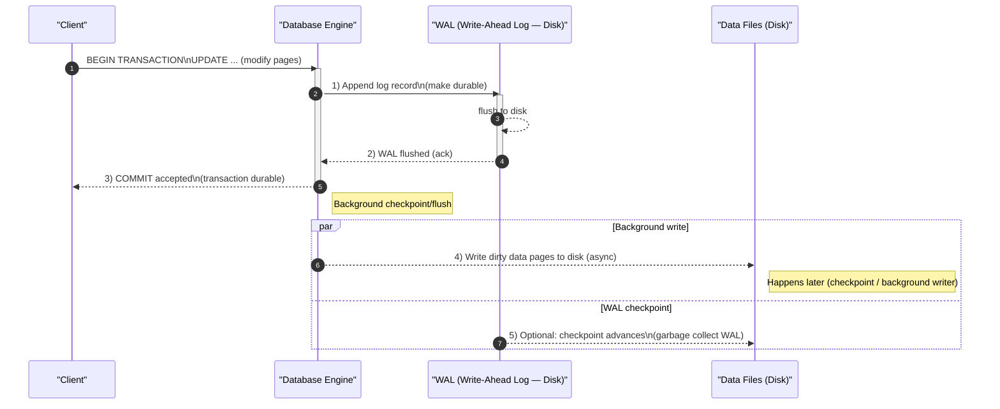

## Introduction: The Fear of a Crash

Imagine you're running a critical database transaction, like transferring money from one bank account to another. This involves two steps: debiting account A and crediting account B. What happens if the database server crashes right after it has debited account A, but *before* it has credited account B?

Without a proper safety mechanism, the money would vanish into thin air. The database would be left in an inconsistent state, violating the core principles of **Atomicity** (transactions should either complete fully or not at all) and **Durability** (once a transaction is committed, it must survive any subsequent crash).

The **Write-Ahead Logging (WAL)** protocol is the near-universal solution to this problem. It's a simple, elegant, and powerful technique that forms the foundation of reliability in almost every modern relational and NoSQL database.

## What is Write-Ahead Logging?

The rule of WAL is simple: **before making any change to the actual data files on disk, the database must first write a description of that change to a separate, append-only log file.**

This log file is called the Write-Ahead Log or the transaction log.

Here's the process for a database modification:
1.  **Start Transaction:** A transaction begins.
2.  **Log the Change:** Before modifying the data pages on disk (e.g., the B-Tree), the database writes a log record describing the intended change (e.g., "Update record X in page Y with value Z"). This log record is appended to the WAL file on disk.
3.  **Flush the Log:** The database ensures this log record is physically written and flushed to durable storage. This is a critical step.
4.  **Modify Data in Memory:** The database can now apply the change to the version of the data it holds in memory (the buffer pool).
5.  **Commit Transaction:** Once all changes in the transaction have been logged to the WAL and flushed, the transaction can be considered "committed." The client can be notified of success.
6.  **Write Data to Disk (Later):** The actual data file modifications (the "dirty" pages in memory) can be written to disk at a later, more convenient time. This is often done in the background to optimize disk I/O.



## How WAL Ensures Atomicity and Durability

The WAL acts as a safety net in case of a crash. When the database restarts, it performs a recovery procedure:

1.  **Read the WAL:** The database reads the log records from the last known checkpoint.
2.  **Redo Committed Transactions:** It examines the log for transactions that have a "commit" record. For each of these, it checks if the corresponding changes were already written to the data files. If not, it **re-applies** the changes described in the log. This ensures that all committed transactions are durable. This is the "Redo" phase.
3.  **Undo Uncommitted Transactions:** It also looks for transactions that started but do not have a "commit" record. These were in-flight when the crash happened. The database **rolls back** any partial changes made by these transactions, using the "before" image from the log. This ensures atomicity. This is the "Undo" phase.

Because the log write is a simple, sequential append, it's much faster and more reliable than performing random writes to multiple data files. By ensuring the log is written *first*, the database guarantees it has a complete record of what it needs to do to restore a consistent state after a crash.

## WAL in B-Trees vs. LSM-Trees

The WAL protocol is used in both B-Tree and LSM-Tree-based storage engines, but its role is slightly different.

*   **In B-Tree Databases (e.g., PostgreSQL, MySQL):** The WAL is the primary mechanism for durability. Changes are applied to the B-Tree pages in memory, and the WAL ensures those changes can be recovered if the server crashes before the pages are flushed to disk.
*   **In LSM-Tree Databases (e.g., RocksDB, Cassandra):** The WAL serves the same durability purpose, but only for data in the in-memory **Memtable**. When a write comes in, it's written to both the WAL and the Memtable. If the server crashes, the Memtable is lost, but it can be perfectly reconstructed by replaying the WAL. Once the Memtable is flushed to an SSTable on disk, the corresponding WAL segment can be discarded.

## Go Example: Conceptual WAL Implementation

This example demonstrates the core principle of writing to a log before applying a change. It's a highly simplified model to illustrate the flow.

```go
package main

import (
	"fmt"
	"os"
	"sync"
)

// Represents the main data store (e.g., B-Tree pages in memory)
type DataStore struct {
	data map[string]string
}

// Represents the Write-Ahead Log on disk
type WAL struct {
	file *os.File
	mu   sync.Mutex
}

func (w *WAL) Append(logEntry string) error {
	w.mu.Lock()
	defer w.mu.Unlock()

	_, err := w.file.WriteString(logEntry + "\n")
	if err != nil {
		return err
	}
	// In a real DB, this sync is critical.
	return w.file.Sync()
}

// Database combines the data store and the WAL.
type Database struct {
	wal       *WAL
	dataStore *DataStore
}

func (db *Database) Set(key, value string) error {
	// 1. Create the log entry.
	logEntry := fmt.Sprintf("SET %s = %s", key, value)

	// 2. Write to the log FIRST.
	fmt.Println("Step 1: Writing to WAL...")
	if err := db.wal.Append(logEntry); err != nil {
		fmt.Println("Failed to write to WAL. Aborting operation.")
		return err
	}
	fmt.Println("Step 2: WAL write successful.")

	// --- CRASH COULD HAPPEN HERE ---
	// If a crash occurs now, the log entry is safe on disk.
	// On restart, the recovery process would read the log and apply the change.

	// 3. Now, modify the data in memory.
	fmt.Println("Step 3: Updating in-memory data store.")
	db.dataStore.data[key] = value

	return nil
}

func main() {
	walFile, _ := os.Create("transaction.log")
	defer os.Remove("transaction.log")

	db := &Database{
		wal: &WAL{file: walFile},
		dataStore: &DataStore{
			data: make(map[string]string),
		},
	}

	fmt.Println("Initial data:", db.dataStore.data)
	fmt.Println("\nExecuting Set('name', 'Alice')...")
	db.Set("name", "Alice")

	fmt.Println("\nFinal data:", db.dataStore.data)
	
	// Check the log file
	content, _ := os.ReadFile("transaction.log")
	fmt.Println("\nContent of transaction.log:")
	fmt.Print(string(content))
}
```

This code clearly shows the sequence: the intent to change the data is written to the `transaction.log` file *before* the in-memory map is modified. This guarantees that even if the program crashed between steps 2 and 3, the `transaction.log` would contain the record of the intended operation, allowing a recovery process to complete it.

## Conclusion

The Write-Ahead Logging protocol is a simple yet profound concept that underpins the reliability of modern databases. By enforcing the rule that all changes must be recorded in a durable log before being applied to the main data files, WAL provides the atomicity and durability guarantees that users expect from a transactional system. It is a perfect example of how a simple, sequential, append-only structure can be used to build complex, robust, and high-performance data systems.
