# System Design Fundamentals: Write-Back Cache Pattern Explained

Write-back (write-behind) caching writes data to cache immediately and asynchronously flushes to database later, optimizing for write performance at the cost of durability. Let's explore how to implement write-back caching for high-throughput systems.

## Why Write-Back Cache?

**Write-Through (Synchronous):**


**Write-Back (Asynchronous):**

```mermaid
sequenceDiagram
    participant C as Client
    participant Cache as Cache<br/>+ Buffer
    participant Flusher as Background<br/>Flusher
    participant DB as Database
    
    Note over C,DB: Writes return immediately
    
    C->>Cache: Write 1
    Cache->>Cache: Update cache
    Cache-->>C: ✅ Done (<1ms)
    
    C->>Cache: Write 2
    Cache->>Cache: Update cache
    Cache-->>C: ✅ Done (<1ms)
    
    Note over C: Total: 2ms<br/>✅ Low latency
    
    Note over Flusher: Async flush
    Flusher->>DB: Batch write 1 & 2
    Note over DB: 20ms (background)
    DB-->>Flusher: Success
```



## Write-Back vs Write-Through

```mermaid
graph TB
    subgraph "Write-Back (Fast Writes)"
        WB_Client[Client] -->|< 1ms| WB_Cache[Cache]
        WB_Cache -->|Update Cache| WB_Data[Cached Data]
        WB_Cache -.->|Async Flush| WB_Flusher[Background<br/>Flusher]
        WB_Flusher -.->|Batched| WB_DB[(Database)]
        
        WB_Note[✅ Low Write Latency<br/>✅ High Throughput<br/>❌ Data Loss Risk]
    end
    
    subgraph "Write-Through (Consistent)"
        WT_Client[Client] -->|10-50ms| WT_Cache[Cache]
        WT_Cache -->|Sync Write| WT_DB[(Database)]
        WT_DB -->|Then Update| WT_Data[Cached Data]
        
        WT_Note[✅ Strong Consistency<br/>✅ No Data Loss<br/>❌ High Write Latency]
    end
    
    style WB_Cache fill:#e8f5e8
    style WT_Cache fill:#fff3e0
```



## Write-Back Architecture


## Basic Types

```go
package main

import (
    "context"
    "errors"
    "fmt"
    "sync"
    "sync/atomic"
    "time"
)

// DirtyEntry represents a modified cache entry pending flush
type DirtyEntry struct {
    Key        string
    Value      interface{}
    ModifiedAt time.Time
    Version    int64
    Retries    int
}

// WriteBackStats tracks cache and flush performance
type WriteBackStats struct {
    Writes          int64
    Reads           int64
    Hits            int64
    Misses          int64
    Flushes         int64
    FlushErrors     int64
    DirtyEntries    int64
    WriteLatencyMs  int64
    FlushLatencyMs  int64
}

// Database interface
type Database interface {
    Get(ctx context.Context, key string) (interface{}, error)
    Set(ctx context.Context, key string, value interface{}) error
    BatchSet(ctx context.Context, entries map[string]interface{}) error
    Delete(ctx context.Context, key string) error
}
```

## Pattern 1: Basic Write-Back Cache

**How it works:** Write to cache immediately, flush to database asynchronously.

```mermaid
sequenceDiagram
    participant C as Client
    participant WB as Write-Back<br/>Cache
    participant Buf as Dirty<br/>Buffer
    participant BG as Background<br/>Flusher
    participant DB as Database
    
    Note over C,DB: Write Operation
    
    C->>WB: Set("key1", value)
    WB->>WB: Update cache
    WB->>Buf: Mark as dirty
    WB-->>C: ✅ Success (<1ms)
    
    Note over BG: Periodic flush trigger
    
    BG->>Buf: Get dirty entries
    Buf-->>BG: [key1, key2, key3]
    
    BG->>DB: Batch write
    Note over DB: Async flush
    
    alt Database Success
        DB-->>BG: ✅ Success
        BG->>Buf: Mark entries clean
    else Database Failure
        DB-->>BG: ❌ Error
        BG->>BG: Retry with backoff
    end
```



```go
// WriteBackCache implements asynchronous write-behind caching
type WriteBackCache struct {
    cache           map[string]interface{}
    dirtyEntries    map[string]*DirtyEntry
    db              Database
    flushInterval   time.Duration
    flushBatchSize  int
    maxRetries      int
    stopChan        chan struct{}
    wg              sync.WaitGroup
    mutex           sync.RWMutex
    dirtyMutex      sync.RWMutex
    stats           WriteBackStats
}

func NewWriteBackCache(db Database, flushInterval time.Duration, batchSize int) *WriteBackCache {
    wbc := &WriteBackCache{
        cache:          make(map[string]interface{}),
        dirtyEntries:   make(map[string]*DirtyEntry),
        db:             db,
        flushInterval:  flushInterval,
        flushBatchSize: batchSize,
        maxRetries:     3,
        stopChan:       make(chan struct{}),
    }
    
    // Start background flusher
    wbc.wg.Add(1)
    go wbc.backgroundFlusher()
    
    return wbc
}

// Set writes to cache immediately and marks as dirty
func (wbc *WriteBackCache) Set(ctx context.Context, key string, value interface{}) error {
    startTime := time.Now()
    defer func() {
        latency := time.Since(startTime).Milliseconds()
        atomic.AddInt64(&wbc.stats.WriteLatencyMs, latency)
        atomic.AddInt64(&wbc.stats.Writes, 1)
    }()
    
    fmt.Printf("Write-Back: Writing key '%s' (async)\n", key)
    
    // Update cache immediately
    wbc.mutex.Lock()
    wbc.cache[key] = value
    wbc.mutex.Unlock()
    
    // Mark as dirty for later flush
    wbc.dirtyMutex.Lock()
    wbc.dirtyEntries[key] = &DirtyEntry{
        Key:        key,
        Value:      value,
        ModifiedAt: time.Now(),
        Version:    1,
        Retries:    0,
    }
    atomic.AddInt64(&wbc.stats.DirtyEntries, 1)
    wbc.dirtyMutex.Unlock()
    
    fmt.Printf("  ✅ Cached immediately (< 1ms)\n")
    fmt.Printf("  📝 Marked dirty (pending flush)\n")
    
    return nil
}

// Get reads from cache
func (wbc *WriteBackCache) Get(ctx context.Context, key string) (interface{}, error) {
    atomic.AddInt64(&wbc.stats.Reads, 1)
    
    // Check cache first
    wbc.mutex.RLock()
    value, exists := wbc.cache[key]
    wbc.mutex.RUnlock()
    
    if exists {
        atomic.AddInt64(&wbc.stats.Hits, 1)
        fmt.Printf("Read: Cache HIT for key '%s'\n", key)
        return value, nil
    }
    
    // Cache miss - load from database
    atomic.AddInt64(&wbc.stats.Misses, 1)
    fmt.Printf("Read: Cache MISS for key '%s' - loading from DB\n", key)
    
    value, err := wbc.db.Get(ctx, key)
    if err != nil {
        return nil, err
    }
    
    // Store in cache
    wbc.mutex.Lock()
    wbc.cache[key] = value
    wbc.mutex.Unlock()
    
    return value, nil
}

// backgroundFlusher periodically flushes dirty entries to database
func (wbc *WriteBackCache) backgroundFlusher() {
    defer wbc.wg.Done()
    
    ticker := time.NewTicker(wbc.flushInterval)
    defer ticker.Stop()
    
    fmt.Printf("Background Flusher: Started (interval: %v)\n", wbc.flushInterval)
    
    for {
        select {
        case <-ticker.C:
            wbc.flushDirtyEntries()
            
        case <-wbc.stopChan:
            fmt.Println("Background Flusher: Stopping")
            // Final flush before shutdown
            wbc.flushDirtyEntries()
            return
        }
    }
}

// flushDirtyEntries writes dirty entries to database in batches
func (wbc *WriteBackCache) flushDirtyEntries() {
    wbc.dirtyMutex.RLock()
    dirtyCount := len(wbc.dirtyEntries)
    wbc.dirtyMutex.RUnlock()
    
    if dirtyCount == 0 {
        return
    }
    
    fmt.Printf("\n🔄 Flusher: Starting flush (%d dirty entries)\n", dirtyCount)
    startTime := time.Now()
    
    // Get batch of dirty entries
    wbc.dirtyMutex.Lock()
    
    batch := make(map[string]interface{})
    entriesToClean := make([]string, 0)
    
    count := 0
    for key, entry := range wbc.dirtyEntries {
        batch[key] = entry.Value
        entriesToClean = append(entriesToClean, key)
        count++
        
        if count >= wbc.flushBatchSize {
            break
        }
    }
    
    wbc.dirtyMutex.Unlock()
    
    // Flush batch to database
    fmt.Printf("  → Flushing batch of %d entries to database...\n", len(batch))
    
    ctx, cancel := context.WithTimeout(context.Background(), 10*time.Second)
    defer cancel()
    
    err := wbc.db.BatchSet(ctx, batch)
    
    if err != nil {
        atomic.AddInt64(&wbc.stats.FlushErrors, 1)
        fmt.Printf("  ❌ Flush failed: %v\n", err)
        
        // Handle retry logic
        wbc.handleFlushFailure(entriesToClean)
        return
    }
    
    // Success - mark entries as clean
    wbc.dirtyMutex.Lock()
    for _, key := range entriesToClean {
        delete(wbc.dirtyEntries, key)
        atomic.AddInt64(&wbc.stats.DirtyEntries, -1)
    }
    wbc.dirtyMutex.Unlock()
    
    atomic.AddInt64(&wbc.stats.Flushes, 1)
    flushLatency := time.Since(startTime).Milliseconds()
    atomic.AddInt64(&wbc.stats.FlushLatencyMs, flushLatency)
    
    fmt.Printf("  ✅ Flush completed (%d entries, %dms)\n", len(batch), flushLatency)
}

// handleFlushFailure implements retry logic for failed flushes
func (wbc *WriteBackCache) handleFlushFailure(keys []string) {
    wbc.dirtyMutex.Lock()
    defer wbc.dirtyMutex.Unlock()
    
    for _, key := range keys {
        if entry, exists := wbc.dirtyEntries[key]; exists {
            entry.Retries++
            
            if entry.Retries >= wbc.maxRetries {
                fmt.Printf("  ⚠️  Entry '%s' exceeded max retries (%d) - moving to DLQ\n",
                    key, wbc.maxRetries)
                // In production, would send to dead letter queue
                delete(wbc.dirtyEntries, key)
                atomic.AddInt64(&wbc.stats.DirtyEntries, -1)
            } else {
                fmt.Printf("  🔄 Entry '%s' will retry (attempt %d/%d)\n",
                    key, entry.Retries, wbc.maxRetries)
            }
        }
    }
}

// ForceFlush immediately flushes all dirty entries
func (wbc *WriteBackCache) ForceFlush() error {
    fmt.Println("\n⚡ Force Flush: Flushing all dirty entries immediately")
    
    wbc.dirtyMutex.RLock()
    allDirty := make(map[string]interface{})
    for key, entry := range wbc.dirtyEntries {
        allDirty[key] = entry.Value
    }
    wbc.dirtyMutex.RUnlock()
    
    if len(allDirty) == 0 {
        fmt.Println("  No dirty entries to flush")
        return nil
    }
    
    ctx := context.Background()
    err := wbc.db.BatchSet(ctx, allDirty)
    
    if err != nil {
        return fmt.Errorf("force flush failed: %w", err)
    }
    
    // Clear dirty entries
    wbc.dirtyMutex.Lock()
    wbc.dirtyEntries = make(map[string]*DirtyEntry)
    atomic.StoreInt64(&wbc.stats.DirtyEntries, 0)
    wbc.dirtyMutex.Unlock()
    
    fmt.Printf("  ✅ Flushed %d entries\n", len(allDirty))
    return nil
}

// Shutdown gracefully stops cache and flushes pending writes
func (wbc *WriteBackCache) Shutdown() error {
    fmt.Println("\n🛑 Shutdown: Stopping write-back cache")
    
    // Stop background flusher
    close(wbc.stopChan)
    wbc.wg.Wait()
    
    // Check for remaining dirty entries
    wbc.dirtyMutex.RLock()
    remaining := len(wbc.dirtyEntries)
    wbc.dirtyMutex.RUnlock()
    
    if remaining > 0 {
        fmt.Printf("  ⚠️  Warning: %d dirty entries not flushed\n", remaining)
    }
    
    fmt.Println("  ✅ Shutdown complete")
    return nil
}

// GetStats returns current statistics
func (wbc *WriteBackCache) GetStats() WriteBackStats {
    wbc.dirtyMutex.RLock()
    defer wbc.dirtyMutex.RUnlock()
    
    stats := wbc.stats
    stats.DirtyEntries = int64(len(wbc.dirtyEntries))
    
    return stats
}
```

**Flush Behavior Visualization:**

```
Time →

T0:   Client Write → Cache Updated → Dirty: [A]
T1:   Client Write → Cache Updated → Dirty: [A, B]
T2:   Client Write → Cache Updated → Dirty: [A, B, C]
T3:   Client Write → Cache Updated → Dirty: [A, B, C, D]
      
T5:   [FLUSH TRIGGER]
      → Batch Flush [A, B, C, D] to Database (20ms)
      → Mark as Clean → Dirty: []

T6:   Client Write → Cache Updated → Dirty: [E]
T7:   Client Write → Cache Updated → Dirty: [E, F]

T10:  [FLUSH TRIGGER]
      → Batch Flush [E, F] to Database (20ms)
      → Mark as Clean → Dirty: []
```

## Pattern 2: Write-Back with Write Coalescing

**How it works:** Merge multiple writes to same key before flushing.

```mermaid
sequenceDiagram
    participant C as Client
    participant WB as Write-Back<br/>Cache
    participant Coal as Write<br/>Coalescer
    participant DB as Database
    
    C->>WB: Set("counter", 1)
    WB->>Coal: Dirty: counter=1
    
    C->>WB: Set("counter", 2)
    WB->>Coal: Dirty: counter=2<br/>(overwrites v1)
    
    C->>WB: Set("counter", 3)
    WB->>Coal: Dirty: counter=3<br/>(overwrites v2)
    
    Note over Coal: Only final value<br/>is flushed
    
    Coal->>DB: Write counter=3
    DB-->>Coal: Success
    
    Note over Coal: ✅ Saved 2 DB writes<br/>by coalescing
```



```go
// CoalescingWriteBackCache coalesces multiple writes to same key
type CoalescingWriteBackCache struct {
    *WriteBackCache
    writeCount    map[string]int64
    coalescedOps  int64
}

func NewCoalescingWriteBackCache(db Database, flushInterval time.Duration, batchSize int) *CoalescingWriteBackCache {
    cwbc := &CoalescingWriteBackCache{
        WriteBackCache: NewWriteBackCache(db, flushInterval, batchSize),
        writeCount:     make(map[string]int64),
    }
    
    return cwbc
}

// Set coalesces multiple writes to same key
func (cwbc *CoalescingWriteBackCache) Set(ctx context.Context, key string, value interface{}) error {
    cwbc.mutex.Lock()
    
    // Track write count for this key
    if _, exists := cwbc.cache[key]; exists {
        cwbc.writeCount[key]++
        atomic.AddInt64(&cwbc.coalescedOps, 1)
        fmt.Printf("Write-Back: Coalescing write to '%s' (write #%d)\n", 
            key, cwbc.writeCount[key]+1)
    } else {
        cwbc.writeCount[key] = 1
    }
    
    cwbc.cache[key] = value
    cwbc.mutex.Unlock()
    
    // Mark as dirty (will overwrite previous dirty entry)
    cwbc.dirtyMutex.Lock()
    cwbc.dirtyEntries[key] = &DirtyEntry{
        Key:        key,
        Value:      value,
        ModifiedAt: time.Now(),
    }
    cwbc.dirtyMutex.Unlock()
    
    return nil
}

// GetCoalescedCount returns number of coalesced writes
func (cwbc *CoalescingWriteBackCache) GetCoalescedCount() int64 {
    return atomic.LoadInt64(&cwbc.coalescedOps)
}
```

**Coalescing Example:**

```
Without Coalescing:
  Write counter=1 → Flush to DB
  Write counter=2 → Flush to DB
  Write counter=3 → Flush to DB
  Total DB Writes: 3

With Coalescing:
  Write counter=1 → Cache only
  Write counter=2 → Cache only (coalesced)
  Write counter=3 → Cache only (coalesced)
  [Flush] counter=3 → Single DB write
  Total DB Writes: 1 (67% reduction!)
```

## Pattern 3: Write-Back with Prioritized Flush

**How it works:** Flush high-priority entries first.

```go
// PriorityWriteBackCache flushes high-priority entries first
type PriorityWriteBackCache struct {
    *WriteBackCache
    priorities map[string]int // 1=high, 2=medium, 3=low
}

func NewPriorityWriteBackCache(db Database, flushInterval time.Duration, batchSize int) *PriorityWriteBackCache {
    pwbc := &PriorityWriteBackCache{
        WriteBackCache: NewWriteBackCache(db, flushInterval, batchSize),
        priorities:     make(map[string]int),
    }
    
    return pwbc
}

// SetWithPriority sets value with priority level
func (pwbc *PriorityWriteBackCache) SetWithPriority(ctx context.Context, key string, value interface{}, priority int) error {
    pwbc.mutex.Lock()
    pwbc.cache[key] = value
    pwbc.priorities[key] = priority
    pwbc.mutex.Unlock()
    
    pwbc.dirtyMutex.Lock()
    pwbc.dirtyEntries[key] = &DirtyEntry{
        Key:        key,
        Value:      value,
        ModifiedAt: time.Now(),
        Version:    int64(priority),
    }
    pwbc.dirtyMutex.Unlock()
    
    fmt.Printf("Write-Back: Set '%s' with priority %d\n", key, priority)
    return nil
}

// flushByPriority flushes entries in priority order
func (pwbc *PriorityWriteBackCache) flushByPriority() {
    pwbc.dirtyMutex.Lock()
    defer pwbc.dirtyMutex.Unlock()
    
    // Group by priority
    priorityGroups := make(map[int][]*DirtyEntry)
    for _, entry := range pwbc.dirtyEntries {
        priority := int(entry.Version)
        priorityGroups[priority] = append(priorityGroups[priority], entry)
    }
    
    // Flush in priority order: 1 (high), 2 (medium), 3 (low)
    for priority := 1; priority <= 3; priority++ {
        if entries, exists := priorityGroups[priority]; exists {
            fmt.Printf("Flushing priority %d entries (%d items)\n", priority, len(entries))
            
            batch := make(map[string]interface{})
            for _, entry := range entries {
                batch[entry.Key] = entry.Value
            }
            
            ctx := context.Background()
            if err := pwbc.db.BatchSet(ctx, batch); err == nil {
                // Remove flushed entries
                for _, entry := range entries {
                    delete(pwbc.dirtyEntries, entry.Key)
                }
            }
        }
    }
}
```

**Priority Flush Visualization:**

```
Dirty Entries:
  user:1 (Priority 1 - High)     ← Flushed first
  user:2 (Priority 1 - High)     ← Flushed first
  log:1  (Priority 3 - Low)      ← Flushed last
  log:2  (Priority 3 - Low)      ← Flushed last
  order:1 (Priority 2 - Medium)  ← Flushed second

Flush Order:
  Batch 1 (High):   user:1, user:2
  Batch 2 (Medium): order:1
  Batch 3 (Low):    log:1, log:2
```

## Pattern 4: Write-Back with Durability Options

**How it works:** Provide durability guarantees via WAL (Write-Ahead Log).

```go
// DurableWriteBackCache adds write-ahead log for durability
type DurableWriteBackCache struct {
    *WriteBackCache
    wal       *WriteAheadLog
    walMutex  sync.Mutex
}

type WriteAheadLog struct {
    entries []WALEntry
    mutex   sync.Mutex
}

type WALEntry struct {
    Timestamp time.Time
    Key       string
    Value     interface{}
    Flushed   bool
}

func NewDurableWriteBackCache(db Database, flushInterval time.Duration, batchSize int) *DurableWriteBackCache {
    return &DurableWriteBackCache{
        WriteBackCache: NewWriteBackCache(db, flushInterval, batchSize),
        wal:            &WriteAheadLog{entries: make([]WALEntry, 0)},
    }
}

// Set writes to WAL first for durability
func (dwbc *DurableWriteBackCache) Set(ctx context.Context, key string, value interface{}) error {
    // Step 1: Write to WAL (durable)
    dwbc.walMutex.Lock()
    dwbc.wal.entries = append(dwbc.wal.entries, WALEntry{
        Timestamp: time.Now(),
        Key:       key,
        Value:     value,
        Flushed:   false,
    })
    dwbc.walMutex.Unlock()
    
    fmt.Printf("Write-Back: Wrote '%s' to WAL (durable)\n", key)
    
    // Step 2: Write to cache (fast)
    return dwbc.WriteBackCache.Set(ctx, key, value)
}

// RecoverFromWAL recovers unflushed entries from WAL
func (dwbc *DurableWriteBackCache) RecoverFromWAL() error {
    dwbc.walMutex.Lock()
    defer dwbc.walMutex.Unlock()
    
    unflushed := 0
    for _, entry := range dwbc.wal.entries {
        if !entry.Flushed {
            ctx := context.Background()
            dwbc.db.Set(ctx, entry.Key, entry.Value)
            unflushed++
        }
    }
    
    fmt.Printf("Recovery: Recovered %d unflushed entries from WAL\n", unflushed)
    return nil
}
```

## Mock Database for Testing

```go
// MockDatabase simulates database with batch operations
type MockDatabase struct {
    data    map[string]interface{}
    mutex   sync.RWMutex
    latency time.Duration
}

func NewMockDatabase(latency time.Duration) *MockDatabase {
    return &MockDatabase{
        data:    make(map[string]interface{}),
        latency: latency,
    }
}

func (md *MockDatabase) Get(ctx context.Context, key string) (interface{}, error) {
    time.Sleep(md.latency)
    
    md.mutex.RLock()
    defer md.mutex.RUnlock()
    
    if value, exists := md.data[key]; exists {
        return value, nil
    }
    
    return nil, errors.New("key not found")
}

func (md *MockDatabase) Set(ctx context.Context, key string, value interface{}) error {
    time.Sleep(md.latency)
    
    md.mutex.Lock()
    defer md.mutex.Unlock()
    
    md.data[key] = value
    return nil
}

func (md *MockDatabase) BatchSet(ctx context.Context, entries map[string]interface{}) error {
    time.Sleep(md.latency)
    
    md.mutex.Lock()
    defer md.mutex.Unlock()
    
    for key, value := range entries {
        md.data[key] = value
    }
    
    return nil
}

func (md *MockDatabase) Delete(ctx context.Context, key string) error {
    time.Sleep(md.latency)
    
    md.mutex.Lock()
    defer md.mutex.Unlock()
    
    delete(md.data, key)
    return nil
}
```

## Complete Demo

```go
func main() {
    fmt.Println("🚀 Starting Write-Back Cache Demo\n")
    
    ctx := context.Background()
    
    fmt.Println("=== 1. Basic Write-Back Cache ===\n")
    
    // Create mock database with 20ms latency
    db := NewMockDatabase(20 * time.Millisecond)
    
    // Flush every 2 seconds, batch size 5
    cache := NewWriteBackCache(db, 2*time.Second, 5)
    
    fmt.Println("--- Fast writes (async) ---")
    startTime := time.Now()
    
    for i := 1; i <= 10; i++ {
        key := fmt.Sprintf("user:%d", i)
        value := map[string]interface{}{"id": i, "name": fmt.Sprintf("User%d", i)}
        cache.Set(ctx, key, value)
    }
    
    writeTime := time.Since(startTime)
    fmt.Printf("\n✅ Wrote 10 entries in %dms (avg: %.1fms per write)\n", 
        writeTime.Milliseconds(), float64(writeTime.Milliseconds())/10)
    
    // Wait for flush
    fmt.Println("\n--- Waiting for background flush ---")
    time.Sleep(3 * time.Second)
    
    stats := cache.GetStats()
    fmt.Printf("\nWrite-Back Stats:\n")
    fmt.Printf("  Writes: %d\n", stats.Writes)
    fmt.Printf("  Flushes: %d\n", stats.Flushes)
    fmt.Printf("  Dirty Entries: %d\n", stats.DirtyEntries)
    fmt.Printf("  Avg Write Latency: %.1fms\n", float64(stats.WriteLatencyMs)/float64(stats.Writes))
    
    cache.Shutdown()
    
    fmt.Println("\n\n=== 2. Write Coalescing ===\n")
    
    coalescingCache := NewCoalescingWriteBackCache(db, 2*time.Second, 10)
    
    fmt.Println("--- Multiple writes to same key ---")
    
    // Write same key multiple times
    for i := 1; i <= 5; i++ {
        coalescingCache.Set(ctx, "counter", map[string]interface{}{"value": i})
        time.Sleep(100 * time.Millisecond)
    }
    
    coalesced := coalescingCache.GetCoalescedCount()
    fmt.Printf("\n✅ Coalesced %d writes (saved %d DB writes)\n", coalesced, coalesced)
    
    coalescingCache.ForceFlush()
    coalescingCache.Shutdown()
    
    fmt.Println("\n\n=== 3. Priority-Based Flushing ===\n")
    
    priorityCache := NewPriorityWriteBackCache(db, 2*time.Second, 10)
    
    fmt.Println("--- Writing with priorities ---")
    
    priorityCache.SetWithPriority(ctx, "critical:1", "High priority data", 1)
    priorityCache.SetWithPriority(ctx, "normal:1", "Medium priority data", 2)
    priorityCache.SetWithPriority(ctx, "log:1", "Low priority data", 3)
    priorityCache.SetWithPriority(ctx, "critical:2", "High priority data 2", 1)
    
    fmt.Println("\n--- Flushing by priority ---")
    priorityCache.flushByPriority()
    
    priorityCache.Shutdown()
    
    fmt.Println("\n\n=== 4. Durability with WAL ===\n")
    
    durableCache := NewDurableWriteBackCache(db, 2*time.Second, 5)
    
    fmt.Println("--- Writing with WAL ---")
    
    durableCache.Set(ctx, "transaction:1", map[string]interface{}{"amount": 100.00})
    durableCache.Set(ctx, "transaction:2", map[string]interface{}{"amount": 250.00})
    
    fmt.Println("\n--- Simulating crash and recovery ---")
    durableCache.RecoverFromWAL()
    
    durableCache.Shutdown()
    
    fmt.Println("\n✅ Write-Back Cache Demo completed!")
}
```

## Performance Comparison

| Metric | Write-Through | Write-Back | Improvement |
|--------|--------------|------------|-------------|
| **Write Latency** | 10-50ms | <1ms | 10-50x faster |
| **Write Throughput** | 20-100 writes/sec | 1000+ writes/sec | 10-50x higher |
| **Read Latency** | <1ms (cached) | <1ms (cached) | Same |
| **Consistency** | Strong | Eventual | Trade-off |
| **Data Loss Risk** | None | Possible | Trade-off |

## Best Practices

### 1. Use for Write-Heavy Workloads
```go
// Good: High write volume (logs, metrics, analytics)
metricsCache := NewWriteBackCache(db, 5*time.Second, 100)

// Not ideal: Critical financial transactions
// Use write-through instead for strong consistency
```

### 2. Implement Proper Shutdown
```go
// Always flush before shutdown
defer func() {
    cache.ForceFlush()
    cache.Shutdown()
}()
```

### 3. Monitor Dirty Entry Count
```go
stats := cache.GetStats()
if stats.DirtyEntries > 1000 {
    log.Warn("High dirty entry count - consider more frequent flushes")
    cache.ForceFlush()
}
```

### 4. Add WAL for Critical Data
```go
// Use durable cache with WAL for important data
durableCache := NewDurableWriteBackCache(db, 1*time.Second, 50)

// Can recover unflushed writes after crash
durableCache.RecoverFromWAL()
```

## Conclusion

Write-back caching optimizes write performance through asynchronous flushing:

- **Basic Write-Back**: Immediate cache writes, periodic DB flushes
- **Coalescing**: Merge multiple writes to same key
- **Prioritized**: Flush high-priority entries first
- **Durable**: WAL for crash recovery

Use write-back for write-heavy workloads where eventual consistency is acceptable. Implement proper shutdown and monitoring. Add WAL for critical data requiring durability guarantees.
