# System Design Fundamentals: Write-Through Cache Pattern Explained

Write-through caching writes data to both cache and database synchronously, ensuring strong consistency between cache and persistent storage. Let's explore how to implement write-through caching for reliable data access.

## Why Write-Through Cache?

**Without Cache (Direct Database Access):**


**With Write-Through Cache:**

```mermaid
sequenceDiagram
    participant C as Client
    participant Cache as Cache<br/>(Fast: <1ms)
    participant DB as Database<br/>(Slow: 10-50ms)
    
    Note over C,DB: Write Operation
    C->>Cache: Write Data
    Cache->>DB: Write to Database
    Note over DB: Synchronous write
    DB-->>Cache: Success
    Cache->>Cache: Update Cache
    Cache-->>C: Success
    
    Note over C,DB: Read Operation (Cache Hit)
    C->>Cache: Read Data
    Cache-->>C: Data (< 1ms)
    
    Note over C,Cache: ✅ Fast reads<br/>Strong consistency
```



## Write-Through vs Other Cache Patterns

```mermaid
graph TB
    subgraph "Write-Through"
        WT_Client[Client] --> WT_Cache[Cache]
        WT_Cache -->|Sync Write| WT_DB[(Database)]
        WT_Cache -->|Then Update| WT_CacheData[Cache Data]
        
        WT_Note[✅ Strong Consistency<br/>❌ Write Latency]
    end
    
    subgraph "Write-Back"
        WB_Client[Client] --> WB_Cache[Cache]
        WB_Cache -->|Update Cache| WB_CacheData[Cache Data]
        WB_Cache -.->|Async Write| WB_DB[(Database)]
        
        WB_Note[✅ Fast Writes<br/>❌ Potential Data Loss]
    end
    
    subgraph "Cache-Aside"
        CA_Client[Client] --> CA_DB[(Database)]
        CA_Client --> CA_Cache[Cache]
        
        CA_Note[✅ Flexible<br/>❌ Cache Inconsistency]
    end
    
    style WT_Cache fill:#e8f5e8
    style WB_Cache fill:#fff3e0
    style CA_Cache fill:#e3f2fd
```



## Write-Through Architecture


## Basic Types

```go
package main

import (
    "context"
    "encoding/json"
    "errors"
    "fmt"
    "sync"
    "sync/atomic"
    "time"
)

// CacheEntry represents a cached item with metadata
type CacheEntry struct {
    Key        string
    Value      interface{}
    CreatedAt  time.Time
    AccessedAt time.Time
    TTL        time.Duration
    Version    int64
}

// CacheStats tracks cache performance
type CacheStats struct {
    Hits              int64
    Misses            int64
    Writes            int64
    Evictions         int64
    WriteLatencyMs    int64
    ReadLatencyMs     int64
    CacheSize         int64
    MaxSize           int
}

// Database interface for persistent storage
type Database interface {
    Get(ctx context.Context, key string) (interface{}, error)
    Set(ctx context.Context, key string, value interface{}) error
    Delete(ctx context.Context, key string) error
}
```

## Pattern 1: Basic Write-Through Cache

**How it works:** Write to database first, then update cache on success.

```mermaid
sequenceDiagram
    participant C as Client
    participant WT as Write-Through<br/>Cache
    participant DB as Database
    
    Note over C,DB: Write Operation
    
    C->>WT: Set("user:1", data)
    
    WT->>WT: Validate data
    
    WT->>DB: Write to Database
    Note over DB: Synchronous write<br/>Wait for confirmation
    
    alt Database Success
        DB-->>WT: Success
        WT->>WT: Update Cache Entry
        WT-->>C: ✅ Success (cache updated)
    else Database Failure
        DB-->>WT: ❌ Error
        WT-->>C: ❌ Error (cache NOT updated)
        Note over WT: Cache remains consistent<br/>with database
    end
```



```go
// WriteThroughCache implements synchronous cache-through writes
type WriteThroughCache struct {
    cache      map[string]*CacheEntry
    db         Database
    maxSize    int
    defaultTTL time.Duration
    mutex      sync.RWMutex
    stats      CacheStats
}

func NewWriteThroughCache(db Database, maxSize int, defaultTTL time.Duration) *WriteThroughCache {
    wtc := &WriteThroughCache{
        cache:      make(map[string]*CacheEntry),
        db:         db,
        maxSize:    maxSize,
        defaultTTL: defaultTTL,
    }
    
    // Start background cleanup
    go wtc.cleanupExpired()
    
    return wtc
}

// Set writes to database first, then updates cache
func (wtc *WriteThroughCache) Set(ctx context.Context, key string, value interface{}) error {
    startTime := time.Now()
    defer func() {
        latency := time.Since(startTime).Milliseconds()
        atomic.AddInt64(&wtc.stats.WriteLatencyMs, latency)
        atomic.AddInt64(&wtc.stats.Writes, 1)
    }()
    
    fmt.Printf("Write-Through: Writing key '%s'\n", key)
    
    // Step 1: Write to database (synchronous)
    fmt.Printf("  → Writing to database...\n")
    err := wtc.db.Set(ctx, key, value)
    if err != nil {
        fmt.Printf("  ❌ Database write failed: %v\n", err)
        return fmt.Errorf("database write failed: %w", err)
    }
    
    fmt.Printf("  ✅ Database write successful\n")
    
    // Step 2: Update cache (only after successful database write)
    wtc.mutex.Lock()
    defer wtc.mutex.Unlock()
    
    // Check if eviction needed
    if len(wtc.cache) >= wtc.maxSize {
        wtc.evictLRU()
    }
    
    // Create cache entry
    entry := &CacheEntry{
        Key:        key,
        Value:      value,
        CreatedAt:  time.Now(),
        AccessedAt: time.Now(),
        TTL:        wtc.defaultTTL,
        Version:    1,
    }
    
    // Update existing entry version if exists
    if existing, exists := wtc.cache[key]; exists {
        entry.Version = existing.Version + 1
    }
    
    wtc.cache[key] = entry
    
    fmt.Printf("  ✅ Cache updated (version: %d)\n", entry.Version)
    fmt.Printf("  ⏱️  Total write latency: %dms\n", time.Since(startTime).Milliseconds())
    
    return nil
}

// Get reads from cache, falls back to database on miss
func (wtc *WriteThroughCache) Get(ctx context.Context, key string) (interface{}, error) {
    startTime := time.Now()
    defer func() {
        latency := time.Since(startTime).Milliseconds()
        atomic.AddInt64(&wtc.stats.ReadLatencyMs, latency)
    }()
    
    // Try cache first
    wtc.mutex.RLock()
    entry, exists := wtc.cache[key]
    wtc.mutex.RUnlock()
    
    if exists && !wtc.isExpired(entry) {
        // Cache hit
        atomic.AddInt64(&wtc.stats.Hits, 1)
        
        // Update access time
        wtc.mutex.Lock()
        entry.AccessedAt = time.Now()
        wtc.mutex.Unlock()
        
        fmt.Printf("Read: Cache HIT for key '%s' (< 1ms)\n", key)
        return entry.Value, nil
    }
    
    // Cache miss - load from database
    atomic.AddInt64(&wtc.stats.Misses, 1)
    fmt.Printf("Read: Cache MISS for key '%s'\n", key)
    
    fmt.Printf("  → Loading from database...\n")
    value, err := wtc.db.Get(ctx, key)
    if err != nil {
        fmt.Printf("  ❌ Database read failed: %v\n", err)
        return nil, err
    }
    
    fmt.Printf("  ✅ Loaded from database\n")
    
    // Load into cache
    wtc.mutex.Lock()
    defer wtc.mutex.Unlock()
    
    if len(wtc.cache) >= wtc.maxSize {
        wtc.evictLRU()
    }
    
    wtc.cache[key] = &CacheEntry{
        Key:        key,
        Value:      value,
        CreatedAt:  time.Now(),
        AccessedAt: time.Now(),
        TTL:        wtc.defaultTTL,
        Version:    1,
    }
    
    fmt.Printf("  ✅ Cached for future reads\n")
    fmt.Printf("  ⏱️  Total read latency: %dms\n", time.Since(startTime).Milliseconds())
    
    return value, nil
}

// Delete removes from both cache and database
func (wtc *WriteThroughCache) Delete(ctx context.Context, key string) error {
    fmt.Printf("Delete: Removing key '%s'\n", key)
    
    // Delete from database first
    err := wtc.db.Delete(ctx, key)
    if err != nil {
        fmt.Printf("  ❌ Database delete failed: %v\n", err)
        return err
    }
    
    fmt.Printf("  ✅ Deleted from database\n")
    
    // Remove from cache
    wtc.mutex.Lock()
    delete(wtc.cache, key)
    wtc.mutex.Unlock()
    
    fmt.Printf("  ✅ Removed from cache\n")
    
    return nil
}

// evictLRU removes least recently used entry
func (wtc *WriteThroughCache) evictLRU() {
    var oldestKey string
    var oldestTime time.Time = time.Now()
    
    for key, entry := range wtc.cache {
        if entry.AccessedAt.Before(oldestTime) {
            oldestTime = entry.AccessedAt
            oldestKey = key
        }
    }
    
    if oldestKey != "" {
        delete(wtc.cache, oldestKey)
        atomic.AddInt64(&wtc.stats.Evictions, 1)
        fmt.Printf("  🗑️  Evicted LRU entry: %s\n", oldestKey)
    }
}

// isExpired checks if entry has expired
func (wtc *WriteThroughCache) isExpired(entry *CacheEntry) bool {
    if entry.TTL == 0 {
        return false
    }
    return time.Since(entry.CreatedAt) > entry.TTL
}

// cleanupExpired removes expired entries periodically
func (wtc *WriteThroughCache) cleanupExpired() {
    ticker := time.NewTicker(1 * time.Minute)
    defer ticker.Stop()
    
    for range ticker.C {
        wtc.mutex.Lock()
        
        expired := make([]string, 0)
        for key, entry := range wtc.cache {
            if wtc.isExpired(entry) {
                expired = append(expired, key)
            }
        }
        
        for _, key := range expired {
            delete(wtc.cache, key)
            atomic.AddInt64(&wtc.stats.Evictions, 1)
        }
        
        wtc.mutex.Unlock()
        
        if len(expired) > 0 {
            fmt.Printf("Cleanup: Removed %d expired entries\n", len(expired))
        }
    }
}

// GetStats returns current cache statistics
func (wtc *WriteThroughCache) GetStats() CacheStats {
    wtc.mutex.RLock()
    defer wtc.mutex.RUnlock()
    
    stats := wtc.stats
    stats.CacheSize = int64(len(wtc.cache))
    stats.MaxSize = wtc.maxSize
    
    return stats
}
```

## Pattern 2: Write-Through with Retry

**How it works:** Retry failed database writes with exponential backoff.

```mermaid
graph TD
    Start[Write Request] --> Attempt1[Attempt 1:<br/>Write to DB]
    
    Attempt1 -->|Success| UpdateCache[Update Cache]
    Attempt1 -->|Failure| Wait1[Wait 100ms]
    
    Wait1 --> Attempt2[Attempt 2:<br/>Write to DB]
    Attempt2 -->|Success| UpdateCache
    Attempt2 -->|Failure| Wait2[Wait 200ms]
    
    Wait2 --> Attempt3[Attempt 3:<br/>Write to DB]
    Attempt3 -->|Success| UpdateCache
    Attempt3 -->|Failure| FinalFail[❌ Return Error]
    
    UpdateCache --> Success[✅ Return Success]
    
    style UpdateCache fill:#e8f5e8
    style FinalFail fill:#ffcdd2
```



```go
// RetryableWriteThroughCache adds retry logic to write-through
type RetryableWriteThroughCache struct {
    *WriteThroughCache
    maxRetries    int
    retryDelay    time.Duration
    retryAttempts int64
    retryFailures int64
}

func NewRetryableWriteThroughCache(db Database, maxSize int, defaultTTL time.Duration, maxRetries int) *RetryableWriteThroughCache {
    return &RetryableWriteThroughCache{
        WriteThroughCache: NewWriteThroughCache(db, maxSize, defaultTTL),
        maxRetries:        maxRetries,
        retryDelay:        100 * time.Millisecond,
    }
}

// Set with exponential backoff retry
func (rtc *RetryableWriteThroughCache) Set(ctx context.Context, key string, value interface{}) error {
    var lastErr error
    delay := rtc.retryDelay
    
    for attempt := 0; attempt <= rtc.maxRetries; attempt++ {
        if attempt > 0 {
            atomic.AddInt64(&rtc.retryAttempts, 1)
            fmt.Printf("  🔄 Retry attempt %d/%d (waiting %dms)\n", 
                attempt, rtc.maxRetries, delay.Milliseconds())
            time.Sleep(delay)
            delay *= 2 // Exponential backoff
        }
        
        // Try write to database
        err := rtc.db.Set(ctx, key, value)
        if err == nil {
            // Success - update cache
            rtc.mutex.Lock()
            
            if len(rtc.cache) >= rtc.maxSize {
                rtc.evictLRU()
            }
            
            rtc.cache[key] = &CacheEntry{
                Key:        key,
                Value:      value,
                CreatedAt:  time.Now(),
                AccessedAt: time.Now(),
                TTL:        rtc.defaultTTL,
            }
            
            rtc.mutex.Unlock()
            
            if attempt > 0 {
                fmt.Printf("  ✅ Succeeded on retry attempt %d\n", attempt)
            }
            
            atomic.AddInt64(&rtc.stats.Writes, 1)
            return nil
        }
        
        lastErr = err
        fmt.Printf("  ❌ Attempt %d failed: %v\n", attempt+1, err)
    }
    
    atomic.AddInt64(&rtc.retryFailures, 1)
    return fmt.Errorf("write failed after %d attempts: %w", rtc.maxRetries+1, lastErr)
}

// GetRetryStats returns retry statistics
func (rtc *RetryableWriteThroughCache) GetRetryStats() (attempts, failures int64) {
    return atomic.LoadInt64(&rtc.retryAttempts), atomic.LoadInt64(&rtc.retryFailures)
}
```

## Pattern 3: Write-Through with Version Control

**How it works:** Track versions to detect concurrent modifications.

```mermaid
sequenceDiagram
    participant C1 as Client 1
    participant C2 as Client 2
    participant Cache as Cache<br/>(Version Control)
    participant DB as Database
    
    Note over Cache: user:1 = {data: "old", version: 1}
    
    C1->>Cache: Set("user:1", "new1")
    Cache->>DB: Write (version: 1)
    DB-->>Cache: Success
    Cache->>Cache: Update to version 2
    Cache-->>C1: ✅ Success (v2)
    
    C2->>Cache: Set("user:1", "new2")
    Cache->>DB: Write (version: 2)
    DB-->>Cache: Success
    Cache->>Cache: Update to version 3
    Cache-->>C2: ✅ Success (v3)
    
    Note over Cache: Version prevents<br/>overwriting newer data
```



```go
// VersionedWriteThroughCache adds optimistic locking
type VersionedWriteThroughCache struct {
    *WriteThroughCache
    versionConflicts int64
}

func NewVersionedWriteThroughCache(db Database, maxSize int, defaultTTL time.Duration) *VersionedWriteThroughCache {
    return &VersionedWriteThroughCache{
        WriteThroughCache: NewWriteThroughCache(db, maxSize, defaultTTL),
    }
}

// SetWithVersion writes only if version matches
func (vtc *VersionedWriteThroughCache) SetWithVersion(ctx context.Context, key string, value interface{}, expectedVersion int64) error {
    vtc.mutex.Lock()
    
    // Check current version
    if entry, exists := vtc.cache[key]; exists {
        if entry.Version != expectedVersion {
            vtc.mutex.Unlock()
            atomic.AddInt64(&vtc.versionConflicts, 1)
            
            fmt.Printf("Version Conflict: Expected v%d, found v%d for key '%s'\n",
                expectedVersion, entry.Version, key)
            return fmt.Errorf("version conflict: expected %d, found %d", 
                expectedVersion, entry.Version)
        }
    }
    
    vtc.mutex.Unlock()
    
    // Write to database
    err := vtc.db.Set(ctx, key, value)
    if err != nil {
        return err
    }
    
    // Update cache with new version
    vtc.mutex.Lock()
    defer vtc.mutex.Unlock()
    
    newVersion := expectedVersion + 1
    vtc.cache[key] = &CacheEntry{
        Key:        key,
        Value:      value,
        CreatedAt:  time.Now(),
        AccessedAt: time.Now(),
        TTL:        vtc.defaultTTL,
        Version:    newVersion,
    }
    
    fmt.Printf("Version Update: Updated '%s' to v%d\n", key, newVersion)
    atomic.AddInt64(&vtc.stats.Writes, 1)
    
    return nil
}

// GetVersion returns current version of cached entry
func (vtc *VersionedWriteThroughCache) GetVersion(key string) (int64, error) {
    vtc.mutex.RLock()
    defer vtc.mutex.RUnlock()
    
    if entry, exists := vtc.cache[key]; exists {
        return entry.Version, nil
    }
    
    return 0, errors.New("key not found in cache")
}

// GetVersionConflicts returns count of version conflicts
func (vtc *VersionedWriteThroughCache) GetVersionConflicts() int64 {
    return atomic.LoadInt64(&vtc.versionConflicts)
}
```

## Pattern 4: Write-Through with Batching

**How it works:** Batch multiple writes for better throughput.

```go
// BatchWriteThroughCache batches writes for efficiency
type BatchWriteThroughCache struct {
    *WriteThroughCache
    batchSize     int
    batchTimeout  time.Duration
    pendingWrites chan *WriteRequest
    batchCount    int64
}

type WriteRequest struct {
    ctx      context.Context
    key      string
    value    interface{}
    resultCh chan error
}

func NewBatchWriteThroughCache(db Database, maxSize int, defaultTTL time.Duration, batchSize int) *BatchWriteThroughCache {
    btc := &BatchWriteThroughCache{
        WriteThroughCache: NewWriteThroughCache(db, maxSize, defaultTTL),
        batchSize:         batchSize,
        batchTimeout:      100 * time.Millisecond,
        pendingWrites:     make(chan *WriteRequest, batchSize*2),
    }
    
    // Start batch processor
    go btc.processBatches()
    
    return btc
}

// Set queues write for batching
func (btc *BatchWriteThroughCache) Set(ctx context.Context, key string, value interface{}) error {
    resultCh := make(chan error, 1)
    
    req := &WriteRequest{
        ctx:      ctx,
        key:      key,
        value:    value,
        resultCh: resultCh,
    }
    
    // Queue write
    select {
    case btc.pendingWrites <- req:
        // Wait for result
        return <-resultCh
    case <-ctx.Done():
        return ctx.Err()
    }
}

// processBatches handles batched writes
func (btc *BatchWriteThroughCache) processBatches() {
    ticker := time.NewTicker(btc.batchTimeout)
    defer ticker.Stop()
    
    batch := make([]*WriteRequest, 0, btc.batchSize)
    
    for {
        select {
        case req := <-btc.pendingWrites:
            batch = append(batch, req)
            
            if len(batch) >= btc.batchSize {
                btc.executeBatch(batch)
                batch = make([]*WriteRequest, 0, btc.batchSize)
            }
            
        case <-ticker.C:
            if len(batch) > 0 {
                btc.executeBatch(batch)
                batch = make([]*WriteRequest, 0, btc.batchSize)
            }
        }
    }
}

// executeBatch writes batch to database
func (btc *BatchWriteThroughCache) executeBatch(batch []*WriteRequest) {
    atomic.AddInt64(&btc.batchCount, 1)
    
    fmt.Printf("Batch: Processing %d writes (batch #%d)\n", 
        len(batch), atomic.LoadInt64(&btc.batchCount))
    
    // Write all to database
    for _, req := range batch {
        err := btc.db.Set(req.ctx, req.key, req.value)
        
        if err == nil {
            // Update cache
            btc.mutex.Lock()
            btc.cache[req.key] = &CacheEntry{
                Key:        req.key,
                Value:      req.value,
                CreatedAt:  time.Now(),
                AccessedAt: time.Now(),
                TTL:        btc.defaultTTL,
            }
            btc.mutex.Unlock()
        }
        
        // Send result
        req.resultCh <- err
    }
    
    fmt.Printf("Batch: Completed %d writes\n", len(batch))
}
```

## Mock Database for Testing

```go
// MockDatabase simulates database operations
type MockDatabase struct {
    data       map[string]interface{}
    mutex      sync.RWMutex
    latency    time.Duration
    failureRate float64
}

func NewMockDatabase(latency time.Duration) *MockDatabase {
    return &MockDatabase{
        data:    make(map[string]interface{}),
        latency: latency,
    }
}

func (md *MockDatabase) Get(ctx context.Context, key string) (interface{}, error) {
    time.Sleep(md.latency)
    
    md.mutex.RLock()
    defer md.mutex.RUnlock()
    
    if value, exists := md.data[key]; exists {
        return value, nil
    }
    
    return nil, errors.New("key not found")
}

func (md *MockDatabase) Set(ctx context.Context, key string, value interface{}) error {
    time.Sleep(md.latency)
    
    md.mutex.Lock()
    defer md.mutex.Unlock()
    
    md.data[key] = value
    return nil
}

func (md *MockDatabase) Delete(ctx context.Context, key string) error {
    time.Sleep(md.latency)
    
    md.mutex.Lock()
    defer md.mutex.Unlock()
    
    delete(md.data, key)
    return nil
}
```

## Complete Demo

```go
func main() {
    fmt.Println("🚀 Starting Write-Through Cache Demo\n")
    
    ctx := context.Background()
    
    fmt.Println("=== 1. Basic Write-Through Cache ===\n")
    
    // Create mock database with 10ms latency
    db := NewMockDatabase(10 * time.Millisecond)
    cache := NewWriteThroughCache(db, 100, 5*time.Minute)
    
    // Write operations
    fmt.Println("--- Writing data ---")
    cache.Set(ctx, "user:1", map[string]string{"name": "Alice", "email": "alice@example.com"})
    cache.Set(ctx, "user:2", map[string]string{"name": "Bob", "email": "bob@example.com"})
    
    // Read operations
    fmt.Println("\n--- Reading data ---")
    user1, _ := cache.Get(ctx, "user:1")
    fmt.Printf("Cached user:1: %v\n", user1)
    
    user1Again, _ := cache.Get(ctx, "user:1")
    fmt.Printf("Cached user:1 (hit): %v\n", user1Again)
    
    // Stats
    stats := cache.GetStats()
    fmt.Printf("\nCache Stats:\n")
    fmt.Printf("  Hits: %d, Misses: %d\n", stats.Hits, stats.Misses)
    fmt.Printf("  Hit Rate: %.1f%%\n", float64(stats.Hits)/float64(stats.Hits+stats.Misses)*100)
    fmt.Printf("  Cache Size: %d/%d\n", stats.CacheSize, stats.MaxSize)
    fmt.Printf("  Avg Write Latency: %dms\n", stats.WriteLatencyMs/stats.Writes)
    
    fmt.Println("\n\n=== 2. Retryable Write-Through Cache ===\n")
    
    retryCache := NewRetryableWriteThroughCache(db, 100, 5*time.Minute, 3)
    
    fmt.Println("--- Testing retry logic ---")
    retryCache.Set(ctx, "order:1", map[string]interface{}{"total": 99.99, "items": 3})
    
    attempts, failures := retryCache.GetRetryStats()
    fmt.Printf("\nRetry Stats: Attempts=%d, Failures=%d\n", attempts, failures)
    
    fmt.Println("\n\n=== 3. Versioned Write-Through Cache ===\n")
    
    versionCache := NewVersionedWriteThroughCache(db, 100, 5*time.Minute)
    
    fmt.Println("--- Testing version control ---")
    versionCache.Set(ctx, "product:1", map[string]interface{}{"price": 29.99, "stock": 100})
    
    version, _ := versionCache.GetVersion("product:1")
    fmt.Printf("Current version: %d\n", version)
    
    // Update with correct version
    err := versionCache.SetWithVersion(ctx, "product:1", 
        map[string]interface{}{"price": 24.99, "stock": 95}, version)
    if err == nil {
        fmt.Println("✅ Update succeeded with correct version")
    }
    
    // Try update with old version
    err = versionCache.SetWithVersion(ctx, "product:1",
        map[string]interface{}{"price": 19.99, "stock": 90}, version)
    if err != nil {
        fmt.Printf("❌ Update failed: %v\n", err)
    }
    
    fmt.Printf("Version conflicts: %d\n", versionCache.GetVersionConflicts())
    
    fmt.Println("\n\n=== 4. Batch Write-Through Cache ===\n")
    
    batchCache := NewBatchWriteThroughCache(db, 100, 5*time.Minute, 5)
    
    fmt.Println("--- Batching writes ---")
    
    // Send multiple writes
    for i := 1; i <= 12; i++ {
        key := fmt.Sprintf("log:%d", i)
        value := map[string]interface{}{"timestamp": time.Now(), "level": "INFO"}
        
        go func(k string, v interface{}) {
            batchCache.Set(ctx, k, v)
        }(key, value)
    }
    
    time.Sleep(500 * time.Millisecond)
    
    fmt.Println("\n✅ Write-Through Cache Demo completed!")
}
```

## Performance Comparison

| Pattern | Write Latency | Read Latency | Consistency | Data Loss Risk |
|---------|--------------|--------------|-------------|----------------|
| **Write-Through** | High (DB + Cache) | Low (Cache hit) | Strong | None |
| **Write-Back** | Low (Cache only) | Low (Cache hit) | Eventual | Possible |
| **Cache-Aside** | Low (DB only) | Medium | Weak | None |
| **Read-Through** | Low (DB only) | Medium (First read) | Strong | None |

## Best Practices

### 1. Use for Read-Heavy Workloads
```go
// Good: High read-to-write ratio
type UserProfileCache struct {
    cache *WriteThroughCache
}

// Profiles read frequently, updated rarely
func (u *UserProfileCache) GetProfile(userID string) (Profile, error) {
    return u.cache.Get(context.Background(), userID)
}
```

### 2. Monitor Cache Performance
```go
// Alert on low hit rate
stats := cache.GetStats()
hitRate := float64(stats.Hits) / float64(stats.Hits + stats.Misses)

if hitRate < 0.8 {
    log.Warn("Cache hit rate below 80%: %.1f%%", hitRate*100)
}
```

### 3. Set Appropriate TTL
```go
// Short-lived data: lower TTL
sessionCache := NewWriteThroughCache(db, 1000, 15*time.Minute)

// Long-lived data: higher TTL
configCache := NewWriteThroughCache(db, 100, 24*time.Hour)
```

### 4. Handle Failures Gracefully
```go
// Fallback to database on cache errors
func (s *Service) GetUser(id string) (User, error) {
    // Try cache first
    user, err := s.cache.Get(context.Background(), id)
    if err == nil {
        return user.(User), nil
    }
    
    // Fallback to database
    return s.db.GetUser(id)
}
```

## Conclusion

Write-through caching provides strong consistency with cache-through writes:

- **Basic Write-Through**: Synchronous writes to database + cache
- **Retryable**: Exponential backoff for transient failures
- **Versioned**: Optimistic locking for concurrent updates
- **Batched**: Improved throughput with write batching

Use write-through for read-heavy workloads where consistency is critical. Accept higher write latency for guaranteed cache coherency. Monitor hit rates and adjust TTL based on access patterns.
