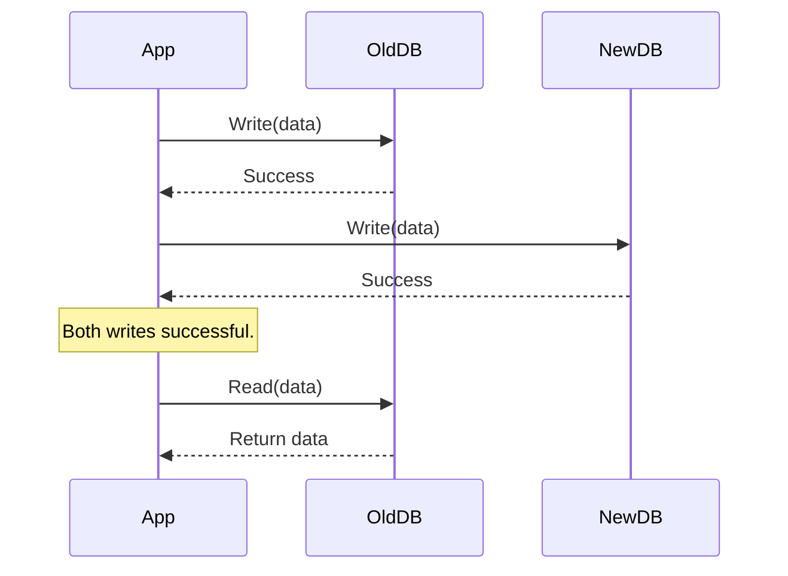
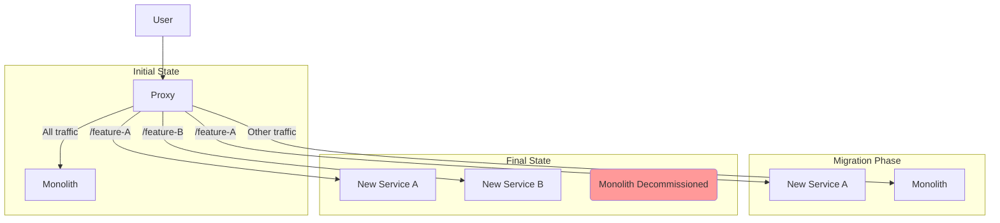

## System Design: The Challenge of Zero-Downtime Migrations

Migrating a critical system—whether it's a database, a monolithic application being broken into microservices, or a move to a new cloud provider—is one of the most high-stakes tasks in software engineering. The traditional approach often involves a "maintenance window," where the service is taken offline for several hours while the migration occurs. For modern, global applications, this kind of downtime is unacceptable.

**Zero-Downtime Migration** is the process of performing these complex migrations while the system remains fully available to users. It requires careful planning, sophisticated technical patterns, and a phased approach to minimize risk.

### Why Aim for Zero Downtime?

-   **Business Continuity:** For e-commerce, finance, or any 24/7 global service, downtime directly translates to lost revenue and customer trust.
-   **User Experience:** A seamless transition is a better user experience than a "we'll be back soon" page.
-   **Risk Reduction:** A big-bang migration is incredibly risky. If something goes wrong, rolling back can be just as complex as the migration itself. A phased, zero-downtime approach allows you to test and validate each step, making it easier to catch issues and roll back safely.

### Key Strategies for Zero-Downtime Migrations

Successfully migrating a system without downtime involves a combination of several patterns. The core idea is to run the old and new systems in parallel for a period, gradually shifting responsibility to the new system while ensuring data consistency.

#### 1. The Dual-Write (or Parallel Run) Pattern

This is a foundational pattern for data migrations. For a period, your application writes to **both** the old and the new database simultaneously.

-   **How it works:**
    1.  Modify your application logic to write to the old database.
    2.  If the first write is successful, write the same data to the new database.
    3.  Reads are still served from the old database.
    4.  This ensures that the new database is kept in sync with the old one for all new data coming into the system.

-   **Challenges:**
    -   **Increased Latency:** The application has to perform two writes.
    -   **Partial Failures:** What if the write to the old system succeeds but the write to the new one fails? This requires complex error handling and reconciliation logic.
    -   **Data Backfill:** This pattern only handles new data. You still need a separate process to migrate all the existing historical data from the old system to the new one.



#### 2. The Strangler Fig Pattern

This pattern is commonly used for migrating from a monolith to microservices. The name comes from a fig vine that "strangles" a host tree by slowly growing around it until the tree itself is gone.

-   **How it works:**
    1.  Identify a piece of functionality to be extracted from the monolith into a new microservice.
    2.  Create a proxy or routing layer (like an API Gateway) that sits in front of the monolith.
    3.  Initially, the proxy just passes all traffic to the monolith.
    4.  You then deploy the new microservice.
    5.  You configure the proxy to "strangle" the old functionality by routing all calls for that specific feature to the new microservice instead of the monolith.
    6.  You repeat this process, feature by feature, until the monolith has been completely replaced and can be decommissioned.



#### 3. Feature Flags

Feature flags (or feature toggles) are essential for controlling who sees what during a migration. They allow you to decouple deployment from release.

-   **How it works:** You wrap new functionality or calls to a new service in a conditional block that is controlled by a feature flag. This allows you to:
    -   **Canary Release:** Enable the new feature for a small subset of users (e.g., 1% of traffic, or only internal employees) to test it in production with minimal risk.
    -   **Dark Launch:** Deploy the new code to production but keep the feature flag turned off. This allows you to test the deployment itself without affecting users.
    -   **Instant Rollback:** If the new feature causes problems, you can instantly disable it by turning off the feature flag, which is much faster and safer than redeploying the old code.

#### 4. Database Migration: The Expand and Contract Pattern

This pattern is used for making schema changes (like renaming a column or changing its data type) without downtime.

-   **Expand Phase:**
    1.  **Add new schema:** Add the new column to the database but don't use it yet.
    2.  **Dual-write:** Modify the application to write to both the old and new columns.
    3.  **Backfill:** Run a script to copy data from the old column to the new column for all existing rows.
    4.  **Switch reads:** Modify the application to start reading from the new column.

-   **Contract Phase:**
    1.  **Stop writing to old:** Modify the application to stop writing to the old column.
    2.  **Remove old schema:** Once you are confident the new column is working correctly, you can drop the old column.

### Go Example: A Simple Dual-Write

This example demonstrates the logic of a dual-write during a migration. The application tries to write to a new service, but if it fails, it logs the error and continues, ensuring the old system remains the source of truth.

```go
package main

import (
	"fmt"
	"log"
	"time"
)

// OldDB represents the legacy database.
type OldDB struct{}

func (db *OldDB) Save(data string) error {
	log.Printf("Writing to OLD database: %s", data)
	// Simulate write delay
	time.Sleep(50 * time.Millisecond)
	return nil
}

// NewDB represents the new database we are migrating to.
type NewDB struct {
	IsAvailable bool
}

func (db *NewDB) Save(data string) error {
	if !db.IsAvailable {
		return fmt.Errorf("new database is not available")
	}
	log.Printf("Writing to NEW database: %s", data)
	// Simulate write delay
	time.Sleep(75 * time.Millisecond)
	return nil
}

// DataRepository handles the dual-write logic.
type DataRepository struct {
	oldDB *OldDB
	newDB *NewDB
}

func (r *DataRepository) SaveOrder(orderData string) error {
	// 1. Write to the old database first. This is our source of truth.
	if err := r.oldDB.Save(orderData); err != nil {
		// If this fails, we must return an error. The operation has failed.
		log.Printf("CRITICAL: Failed to write to old database: %v", err)
		return err
	}

	// 2. Try to write to the new database.
	// We run this in a goroutine so it doesn't block the main request path.
	go func() {
		if err := r.newDB.Save(orderData); err != nil {
			// If this fails, we log it for later reconciliation.
			// The main operation is still considered a success.
			log.Printf("WARNING: Failed to write to new database: %v. Reconciliation needed.", err)
		}
	}()

	return nil
}

func main() {
	repo := &DataRepository{
		oldDB: &OldDB{},
		newDB: &NewDB{IsAvailable: true}, // Initially, the new DB is available
	}

	fmt.Println("--- Both databases are available ---")
	if err := repo.SaveOrder("Order #123"); err != nil {
		log.Fatalf("Failed to save order: %v", err)
	}
	time.Sleep(100 * time.Millisecond) // Wait for goroutine

	// --- Simulate the new DB becoming unavailable ---
	fmt.Println("\n--- New database becomes unavailable ---")
	repo.newDB.IsAvailable = false
	if err := repo.SaveOrder("Order #456"); err != nil {
		log.Fatalf("Failed to save order: %v", err)
	}
	time.Sleep(100 * time.Millisecond) // Wait for goroutine
}
```

### Conclusion

Zero-downtime migrations are complex but achievable. They require a shift from a "big bang" mentality to a gradual, incremental approach. By combining patterns like **Dual-Write**, the **Strangler Fig**, **Feature Flags**, and **Expand-Contract**, you can de-risk the migration process and ensure your application remains available and responsive to your users. The key is to always have a clear rollback plan at every stage and to move in small, verifiable steps.
---
