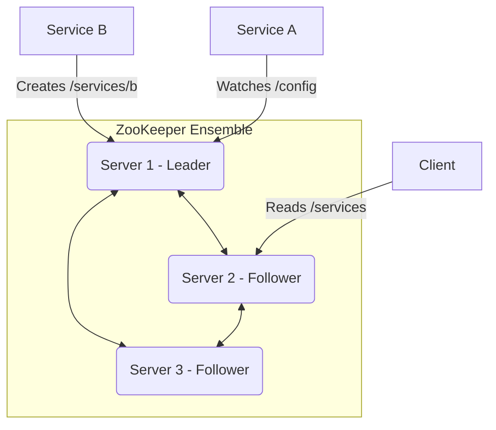
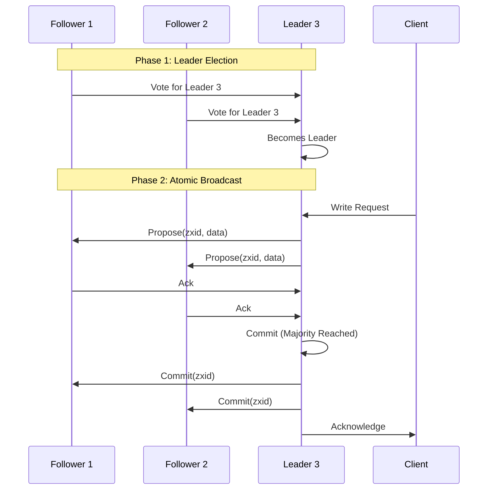

## Introduction: The Distributed Systems Coordinator

In the complex world of distributed systems, where multiple services need to work together, **coordination** is key. How does a new service discover others? How do you manage configuration across a cluster? How do you perform a leader election?

For many years, the answer to these questions has been **Apache ZooKeeper**. ZooKeeper is not a database or a messaging queue; it's a centralized service for maintaining configuration information, naming, providing distributed synchronization, and providing group services.

At the heart of ZooKeeper's reliability is the **ZooKeeper Atomic Broadcast (ZAB)** protocol. While Raft and Paxos are general-purpose consensus algorithms, ZAB is specifically designed for the primary-backup style of replication that ZooKeeper uses.

### Why ZooKeeper?

ZooKeeper provides a simple, file-system-like API with nodes called **znodes**. Clients can create, delete, and watch znodes. This simple abstraction can be used to build powerful distributed primitives:

*   **Configuration Management:** Store configuration in a znode. Services can watch the znode for changes and update their configuration automatically.
*   **Service Discovery:** Services can create ephemeral znodes under a specific path. Clients can list the children of that path to discover available services.
*   **Leader Election:** Multiple clients can try to create the same ephemeral znode. The one that succeeds becomes the leader.
*   **Distributed Locks:** Similar to leader election, clients can use znodes to acquire a lock.



## The ZAB Protocol

ZAB is the magic that keeps all the ZooKeeper servers (the "ensemble") in sync. It's designed to guarantee that all changes are delivered in the order they were sent by the leader.

ZAB operates in two main phases:

1.  **Phase 1: Leader Election:** When the ensemble starts or a leader fails, ZAB enters a leader election phase. The goal is to elect a new leader that has the most up-to-date log of transactions. This is crucial to avoid losing committed changes.
2.  **Phase 2: Atomic Broadcast:** Once a leader is elected, it starts broadcasting state changes to the followers. This is where ZAB ensures total order and durability.

### ZAB vs. Raft/Paxos

*   **Primary-Backup Focus:** ZAB is specifically a primary-backup protocol. It assumes a single, stable leader that broadcasts to backups (followers). Raft and Paxos are more general and handle competing proposers more directly.
*   **Ordering Guarantees:** ZAB provides total ordering of broadcasts. It uses a 64-bit transaction ID called a `zxid`, which consists of an `epoch` and a `counter`. This ensures that all changes are applied in the exact same order on all servers.
*   **Performance:** ZAB is optimized for high-throughput, low-latency writes. The atomic broadcast mechanism is designed to be very fast.



## Znodes: The ZooKeeper Data Model

The data in ZooKeeper is organized in a hierarchical namespace, much like a file system. Each node in this hierarchy is a **znode**.

*   **Path:** Znodes are identified by a path (e.g., `/app/config`).
*   **Data:** Znodes can store a small amount of data (usually up to 1MB).
*   **Children:** Znodes can have children, creating the hierarchy.
*   **Types:** Znodes can be persistent or ephemeral. Ephemeral znodes are automatically deleted when the client session that created them ends. This is extremely useful for things like service discovery and leader election.

## A Go Example: Distributed Lock with ZooKeeper

While we won't implement ZAB from scratch, we can use a Go client library to demonstrate how to build a distributed lock, one of ZooKeeper's most common use cases.

*(Note: This requires a running ZooKeeper ensemble and the `go-zookeeper` library.)*

```go
package main

import (
    "fmt"
    "github.com/go-zookeeper/zk"
    "time"
)

func main() {
    // Connect to ZooKeeper
    c, _, err := zk.Connect([]string{"127.0.0.1"}, time.Second)
    if err != nil {
        panic(err)
    }

    lockPath := "/my-lock"

    // --- Process 1 tries to acquire the lock ---
    fmt.Println("Process 1: Attempting to acquire lock...")
    // Create an ephemeral znode. If it succeeds, we have the lock.
    _, err = c.Create(lockPath, []byte("1"), zk.FlagEphemeral, zk.WorldACL(zk.PermAll))
    if err != nil {
        fmt.Println("Process 1: Failed to acquire lock, another process has it.")
    } else {
        fmt.Println("Process 1: Acquired lock!")
        // Do some work...
        time.Sleep(5 * time.Second)
        // Release the lock by deleting the znode
        c.Delete(lockPath, -1)
        fmt.Println("Process 1: Released lock.")
    }

    // --- Process 2 tries to acquire the lock ---
    fmt.Println("\nProcess 2: Attempting to acquire lock...")
    _, err = c.Create(lockPath, []byte("2"), zk.FlagEphemeral, zk.WorldACL(zk.PermAll))
    if err != nil {
        fmt.Println("Process 2: Failed to acquire lock, another process has it.")
        // In a real app, we would now "watch" the znode to be notified when it's deleted.
    } else {
        fmt.Println("Process 2: Acquired lock!")
        c.Delete(lockPath, -1)
        fmt.Println("Process 2: Released lock.")
    }
}
```

This example shows the power of ephemeral znodes. The first process to create `/my-lock` gets the lock. Any other process will fail because the znode already exists. When the first process is done (or crashes), its session ends, and the ephemeral znode is automatically deleted, allowing another process to acquire the lock.

## Conclusion

ZooKeeper and ZAB provide a robust foundation for building coordinated distributed systems. While newer tools like etcd (which uses Raft) have emerged, ZooKeeper is still a cornerstone of many large-scale systems like Kafka, Hadoop, and Solr.

Understanding ZAB reveals a different perspective on consensus—one that is tightly integrated with a primary-backup replication model and optimized for the specific needs of a coordination service. It demonstrates that while general-purpose algorithms like Paxos and Raft are powerful, specialized protocols can provide significant performance and design advantages for specific use cases.
