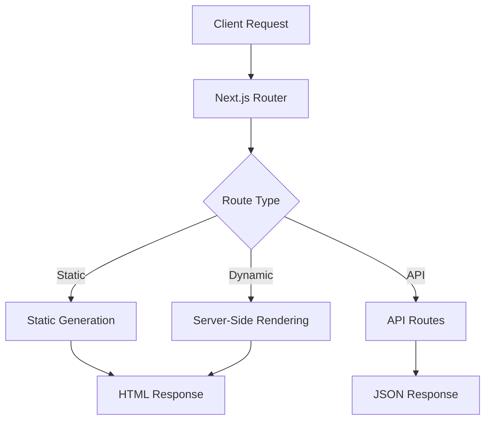

# Getting Started with Next.js 15

Next.js 15 brings exciting new features and improvements to the React ecosystem. In this post, we'll explore the key features and how to get started.

## What's New in Next.js 15

### Enhanced App Router
The App Router in Next.js 15 provides better performance and developer experience:

```javascript
// app/layout.tsx
export default function RootLayout({
  children,
}: {
  children: React.ReactNode
}) {
  return (
    <html lang="en">
      <body>{children}</body>
    </html>
  )
}
```

### Improved Performance
- Better tree-shaking
- Optimized bundling
- Enhanced caching strategies

## Architecture Overview

Here's how a typical Next.js application is structured:



## Getting Started

1. Create a new Next.js project:
   ```bash
   npx create-next-app@latest my-app
   cd my-app
   npm run dev
   ```

2. Start building your components
3. Deploy to Vercel or your preferred platform

Next.js 15 makes it easier than ever to build fast, modern web applications!